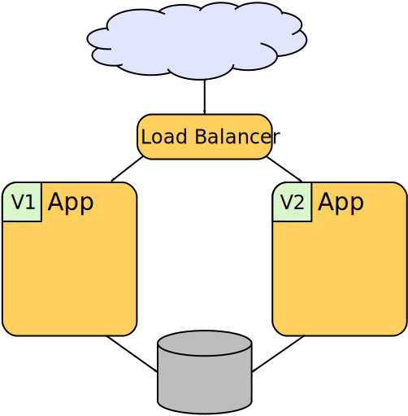

# Microservices

# The good, the bad & the ugly

Notes:

- We will provide the simplest solutions for solving the challenges the cloud qualities pose for us
- We will incrementally introduce the concepts that microservices build on and make the trade offs clear for every step along the way

For trainers:
- If [this MURAL template](https://app.mural.co/template/eb73b727-8f7b-4729-adf4-7d21b46f9f08/de821c9f-8ad3-4b27-86bc-03ccc68fb5b2) was used for Microservice Introduction then you can use the reflection part of the same template to cover the Microservices Reflection.

---

### Monolith (Stateful)

<!-- .element style="height:400px;" -->

| Cloud Qualities |  |
|-|-:|
| Unlimited Scalability | ❌ |
| Seamless failover | ❌ |
| Zero-Downtime deployments | ❌ |
| Frequent deployments possible | ❌ |
| Fine Granular Scalability | ❌ |
<!-- .element style=" border: 1px solid;" -->

---

### Make application stateless

Enables Horizontal Scaling

<!-- .element style="height:400px;" -->

| Pros                                                       | Cons                                                                                                                       |
|------------------------------------------------------------|----------------------------------------------------------------------------------------------------------------------------|
| Easier to deal with varying load       | Harder to deploy, monitor and troubleshoot |
| Enables resilience through redundancy|                                              |
<!-- .element style=" border: 1px solid;" -->

Notes:

- Example for state: SessionId for authentication
- all state must be stored outside of application process (in DB or KV Store)
- all instances share state
- a request from the outside can hit any one of the instances and it must not matter which one it is

---

### Monolith (Stateless)

 | Cloud Qualities |  |
|-|-:|
| Unlimited Scalability | ✔️ |
| Seamless failover | ✔️ |
| Zero-Downtime deployments | ❌ |
| Frequent deployments possible | ❌ |
| Fine Granular Scalability | ❌ |
<!-- .element style=" border: 1px solid;" -->

---

### Zero-Downtime Deployments

Anything that is deployed must be **backwards compatible towards consumers** and **able to run in parallel with older versions of itself**

<!-- .element style="height:400px;" -->

| Pros                                                       | Cons                                                                                                                       |
|------------------------------------------------------------|----------------------------------------------------------------------------------------------------------------------------|
| Deploy anytime! | More effort |
|        | Breaking changes must be applied incrementally |
<!-- .element style=" border: 1px solid;" -->

Notes:

- "you can deploy anytime, your consumers shouldn't notice":
  - This is the only pro, but this is really a game changer... no more weekend or late night deployments under high pressure with rollbacks and retries a weekend later because the "update" or "migration" failed.
You can do it anytime, during office hours, in the middle of the week, and have full control at any point in time.
- "more effort":
  - ensuring compatibility of different versions for a certain amount of time is more work
- "Breaking Changes must be applied incrementally"
  - and will require multiple deployments. See the techniques for Zero Downtime DB and [Zero Downtime API deployments in the cloud native bootcamp](https://github.tools.sap/cloud-native-bootcamp/info/tree/master/challenges#high-availability)

---

### Monolith

#### Stateless + Zero-Downtime

 | Cloud Qualities |  |
|-|-:|
| Unlimited Scalability | ✔️ |
| Seamless failover | ✔️ |
| Zero-Downtime deployments | ✔️ |
| Frequent deployments possible | 〰 |
| Fine Granular Scalability | ❌ |
<!-- .element style=" border: 1px solid;" -->

Notes:

- "Frequent deployments possible"
  - While this is a lot better with Zero-Downtime deployments enabled, there will likely still be blockers to frequent deployment due to organizational or technical restrictions, we will look at how to minimize those in the next 2 slides

---

### Frequent deployments (1/3) - Organizational

Group the different parts of your application (and the people working on them) around business domains, not technical domains

Source: http://martinfowler.com/articles/microservices/images/conways-law.png

<!-- .element style="font-size: 0.3em;" -->

| Pros                                                       | Cons                                                                                                                       |
|------------------------------------------------------------|----------------------------------------------------------------------------------------------------------------------------|
| Better communication & clear cut responsibilities | - |
| Developers don't "step on each others feet" as much | - |
| Leads to reduced "delivery contention"   | - |
<!-- .element style=" border: 1px solid;font-size:30" -->

Notes:

- No sharing of service responsibility between teams, this would negate the above effects.
- What about "code sharing" or a "common framework"? This is a tradeoff...between code reuse and coupling of services (a change in the framework may break a service although its own code has not changed -> you always need to test everything when a change to the framework is made...) Typically you loose at least part of the "independent deployability" quality which should not be put at stake.

---

### Frequent deployments (2/3) - Technical

Make the different parts independent

- All "modules" implement their own business domain from DB to UI
- Nothing is shared between them, not even the DB

<!-- .element style="height:400px;" -->

Notes:

- We have individual DBs (and UIs) for each module because otherwise we would again have dependencies and tight coupling between the different parts
- We call this a "Modular Monolith"
- The Modular Monolith can be a great choice ([shopify](https://engineering.shopify.com/blogs/engineering/deconstructing-monolith-designing-software-maximizes-developer-productivity) is one of the biggest proponents of this setup)

---

### Frequent deployments (3/3) - Technical

<!-- .element style="height:400px;" -->

| Pros                                                       | Cons                                                                                                                       |
|------------------------------------------------------------|----------------------------------------------------------------------------------------------------------------------------|
| Modules independent, can be changed any time      | Transactional consistency only guaranteed within each module |
| Frequent deployments feasible   | Harder to get full picture on overall state/data of the system |
| Low delivery contention (shared code often a blocker)   | Requires a lot of discipline |
| In-process and/or localhost calls blazingly fast   |  |
| Deployment, monitoring and troubleshooting fairly easy | |
<!-- .element style=" border: 1px solid; font-size:30" -->

Notes:

- "Low delivery contention" -> if teams can work on their part independently - (shared code often a blocker)
  - delivery contention = teams waiting for each other to do or finish something before they can deliver
- "Requires a lot of discipline"... if visibility of implementation detail not limited technically

- Other quotes:
  - [Uncle Bob Twitter rant](https://twitter.com/unclebobmartin/status/1157713308801048577)
  - [Uncle Bob Blog Post describing Modular Monolith before it was a thing](https://blog.cleancoder.com/uncle-bob/2014/10/01/CleanMicroserviceArchitecture.html)

---

### "Modular Monolith"

#### Stateless + Zero-Downtime + Modularization around Business Domain (Organizational + Technical)

 | Cloud Qualities |  |
|-|-:|
| Unlimited Scalability | ✔️ |
| Seamless failover | ✔️ |
| Zero-Downtime deployments | ✔️ |
| Frequent deployments possible | ✔️ |
| Fine Granular Scalability | ❌ |
<!-- .element style=" border: 1px solid;" -->

---

### Fast and fine granular scalability?

Split the Monolith...

<!-- .element style="height:400px;" -->

Notes:

The grey boxes resemble the "process boundary".

---

### Each Module now runs in its own process

<!-- .element style="height:200px;" -->

| Pros                                                       | Cons                                                                                                                       |
|------------------------------------------------------------|----------------------------------------------------------------------------------------------------------------------------|
| Modules have independent life cycles  | All communication via Networks |
| Developers don't "step on each others feet" as much | Monitoring and Troubleshooting harder (a lot) |
| Startup times of modules (likely) fast enough for ad-hoc scaling (within seconds)   | Changes across a process boundary are expensive |
| Can deploy any module at any time | The more modules you add, the more complex your system becomes |
| Modules free to choose best technology for their task | Needs additional tools/technology to manage this complexity |

<!-- .element style=" border: 1px solid;font-size:30" -->

Notes:

- "Modules have independent life cycles" ... and can be stopped, started, scaled and broken ;-) individually
- "Developers don't "step on each others feet" as much" ... if they can work on their part independently
- "Can deploy any module at any time"...  we don't have to wait for the monolith to be deployed
- Regarding technology choice: be aware of the necessary learning curve - start with something you know, optimize later

- "All communication via Networks" -> slow and prone to failure
- "Changes across a process boundary are expensive"... you need to change and redeploy x different modules if a change affects x modules logically
- "Needs additional tools/technology to manage this complexity": At some point >= 3-5 services you will likely introduce tooling/technology to help manage the distributed systems complexity and/or the communication of the services (e.g. Message Broker, Service Registry, Resilience Frameworks... ). Every tool/tech itself comes with it's own, sometimes significant, learning curve. This can be a lot to consume if you are doing everything at once... give yourself time to learn...start small....

---

### Smells like Microservices

_"Microservice architecture is an approach to developing a single application as a suite of small services,
each running in its own process
and communicating with lightweight mechanisms, often an HTTP REST API.
These services are built around business capabilities and are **independently deployable** by fully automated deployment machinery.
**There is a bare minimum of centralized management of these services...**"_
([source: Martin Fowler](http://martinfowler.com/articles/microservices.html))

Notes:

- If we change our naming from "Module" to "Service", we now have something that at least "looks like" a microservice application...but we are still missing some important requirements.

---

### _...are independently deployable...there is a bare minimum of centralized management of these services..._

- Must be able to make a change to a microservice and deploy it to production **anytime, without having to change any other service**
- This implies that each service must have it's own development, deployment and release lifecycle, independent of other microservices
- It’s not enough that it's **possible** to do this, it’s that this is **actually how you manage deployments in your system**
- Orchestration Tools are only "painkillers" and you should treat them as such

Notes:

- this is **THE most important property** the services in your application must fulfill...
- This is a simple idea that is nonetheless complex in execution.
- for this to work we need an explicit, well defined and stable contract
- to guarantee independent deployability we must ensure our services are loosely coupled
- Any form of orchestration e.g. "We need to deploy service x before y" or "we have to deploy all the services of our application together" is a serious smell that should be dealt with ASAP.

- Painkiller metaphor: They aren't good for you in the long run, so don't get addicted; Instead, while the pain is temporarily numbed, you should tackle the underlying issues (very likely low cohesion and tight coupling of services)
- Don't succumb to the ["sunk cost fallacy"](https://www.behavioraleconomics.com/resources/mini-encyclopedia-of-be/sunk-cost-fallacy/), if you took a wrong turn, don't throw in additional technology or effort to make it less painful, fix the actual cause... even if it's painful to admit that incorrect decisions have been made and this will make some of the past work obsolete

---

### Microservices (done correctly)

| Cloud Qualities |  |
|-|-:|
| Unlimited Scalability | ✔️ |
| Seamless failover | ✔️ |
| Zero-Downtime deployments | ✔️ |
| Frequent deployments possible | ✔️ |
| Fine Granular Scalability | ✔️ |
<!-- .element style=" border: 1px solid;" -->

---

# What happens if you ignore "Independent Deployability"?

---

### Distributed Monolith (1/4)

_"When all functionality in a system has to be deployed together, we consider
it a monolith."_

_"A distributed monolith is a system that consists of multiple services, but for whatever reason the entire system has to be deployed together."_

[source: Monolith to Microservices - Sam Newman](https://samnewman.io/books/monolith-to-microservices/)

<!-- .element style="height:400px;" -->

Notes:

---

### Distributed Monolith (2/4)

The loss of independent deployability of services is a serious concern

_"...not enough focus was put on information hiding and cohesion of business functionality..."_

_"...leading to highly coupled architectures in which changes ripple across service boundaries, and seemingly innocent changes that appear to be local in scope break other parts of the system."_

[source: Monolith to Microservices - Sam Newman](https://samnewman.io/books/monolith-to-microservices/)

Notes:

---

### Distributed Monolith (3/4)

_"...distributed monoliths have all the disadvantages of a distributed system, and all the disadvantages of a single-process monolith,without having enough upsides of either.
."_

[source: Monolith to Microservices - Sam Newman](https://samnewman.io/books/monolith-to-microservices/)

Notes:

---

### Distributed Monolith (4/4)

| Pros | Cons |
|-------|------|
| Services individually scalable | Huge efforts to orchestrate deployments |
| Teams _may_ be able to work on parts of their services independently | Change in one service will require changes to and/or break X other services |
| Free choice of technology | Little confidence that what you deploy works well (or at all) as a whole |
| - | Frequent deployments hard/impossible |
| - | High Delivery Contention |
| - | Zero Downtime hard |
| - | Application as a whole slow; likely bad uptime |
| - | Network latency/failure |
| - | Deployment, monitoring and troubleshooting hard |
| - | Eventual consistency and distributed data |
<!-- .element style=" border: 1px solid;font-size:35" -->

Notes:

- "Huge efforts to orchestrate deployments" -> what version of what service is compatible with what version of any other service? How can they find each other? In which order do I need to deploy the services so I don't break anything?
- "Little confidence that what you deploy works well (or at all) as a whole": It's not feasible to test all combinations of services all the time (the individual parts must be stable and non-breaking otherwise you are lost...)
- High Delivery Contention -> Teams are waiting on each other to deploy/deliver
- "Zero Downtime hard" -> because each service needs to find and access the "correct" version of the service it depends on

---

# Digression: Microservice Anti-patterns

---

### Anti-pattern: Tight coupling of services

Smell:

- You have to orchestrate deployments or things will break
  - We always deploy all services together once every x days/hours/years
  - Before Service A can be deployed we must first update Service B or we will break it
  - We have to test all services together before we can deploy them to prod

Notes:

- tight coupling
  - no-more independent deployability, all services must be built, tested and deployed together
- Question:
  - You are getting few of the microservices benefits, why not deploy it as a "modular monolith" then and take advantage of the monoliths benefits and get rid of the distributed cons? You can still pull out parts, that are independent enough and must scale more than the rest, into separate services e.g. using the [strangler pattern](https://dzone.com/articles/monolith-to-microservices-using-the-strangler-patt).

---

### Anti-pattern: Chatty Services

- Smell:
  - Application as a whole is slow although services in isolation may be fast
  - Uptime of the overall application is bad
- Indicator:
  - Each call from a consumer to Service A requires x calls to Service B which calls Service C which calls Service X...

Notes:

- ...the called service also might need to call other services itself (low cohesion -  the parts or data that belong(s) together are separated)

---

### Anti-pattern: Chatty Services

<!-- .element style="height:400px;" -->
- SLA for each service: max 50ms response time, 99% uptime
- Assuming 25ms network lag

-> Serving one external call takes 300ms and has a (best case) uptime of 97%

Notes:

- ["Avoiding Microservice Megadisasters"](https://www.youtube.com/watch?v=gfh-VCTwMw8) watch the video, it makes a good story to tell or point participants to
- response time is time the services logic needs, not including the time spent waiting for their services to return
- Assumption on uptime is that no resilience measures are in place

---

### Anti-pattern: Chatty Services

- What if a called service doesn't answer (in time)?
- How to avoid cascading failures / latency?
- How to avoid flooding a server with requests while it's restarting after a crash?

Notes:

- Flooding: Say a server was temporarily unavailable or had crashed for whatever reason.
  Immediately hitting it with all the requests which have piled up during the downtime will likely crash it again

---

### Anti-pattern: Chatty Services

Should Service A and Service B be separated at all?

<!-- .element style="height:300px;" -->

Notes:

- After all they are so reliant on each other that they will likely have similar scaling requirements. Bringing them into the same process would increase performance and uptime immensely.
- This could also mean that like with "feature envy" functionality from Service B should maybe actually live in Service A. If there is nothing else left after that move, then Service B simply becomes obsolete.
- There are other solutions to this problem (async, caching), but they significantly increase the complexity

---

### Recommendations

- Start with few, large, coarse-grained services
- Split up as you gain experience and once logical component boundaries have stabilized
- Consider Domain-Driven-Design and/or the [Strangler Pattern](https://dzone.com/articles/monolith-to-microservices-using-the-strangler-patt)

- Ask yourself: "How many services can we handle?" Give yourself enough time to learn and practice (in production) with fewer services

Notes:

- "Split up as you gain experience"
  - "logical component boundaries" -> what code/entity/logic/process belongs to which component
  - Only split if clearly required to gain technical or business benefits
  - Do NOT create additional microservices just to have more or to "give every team x microservices to work on"
- "Ask yourself: "How many services can we handle?" -> be aware of the complexity and learning curve that each additional service adds!

---

### Key Take aways

- Microservices may (or may not) be a good solution for the challenges your product is facing
- Even done correctly they introduce significant complexity and problems - be aware of the trade-offs you are making
- Choosing the correct granularity for your services is key

- If you do it wrong, you will suffer greatly....

---

### Advertisement :-)

You will need additional tools/techniques to mitigate some of the downsides that microservices bring
e.g.:

- Eventual consistency and async
- Resilience Patterns
- Zero Downtime Database/API migration
- etc.

You should take part in the [cloud-native-bootcamp](https://pages.github.tools.sap/cloud-curriculum/boot-restart/) which is a perfect follow up training to this one.

---

### Questions?
