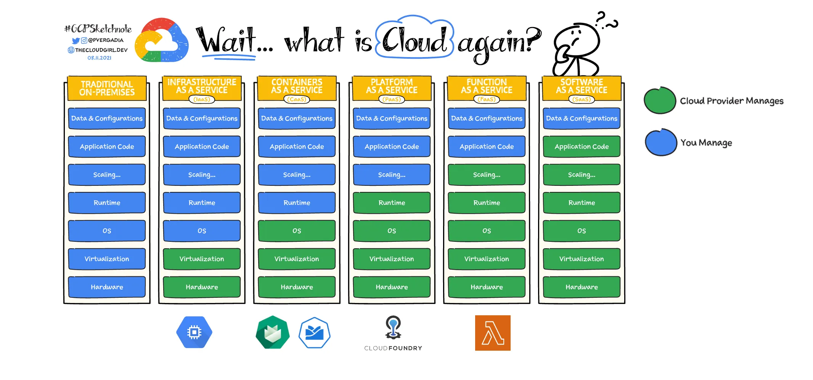

# Cloud Platforms Comparison

---

<!-- .element class="img-l" -->

Notes:

- From Left to right you have less maintenance effort but also less control.
- Examples
    - Traditional On-Premise: This is what SAP used to have
    - Infrastructure as a Service: Hyperscalers (AWS, Microsoft Azure, Google Cloud, Digital Ocean, ...)
    - Containers as a Service: (Managed) K8s platform: GKE, Kyma (which is built on top of Gardener)
    - Platform as a Service: Cloud Foundry, Google App Engine, ...
    - Function as a Service: AWS Lambda, Google Cloud Functions, Azure Functions, ...
- Source: https://cloud.google.com/learn/paas-vs-iaas-vs-saas?hl=en

---

### When to use Containers/Platforms as a Service

- Stateful Applications
- Applications with a long startup time
- Predictable high traffic
- Long-running tasks/computations

---

### When to use Functions as a Service

- Small applications/features that will likely stay that way
- (Short-lived) background processing tasks
- PoCs

---

# Questions?
