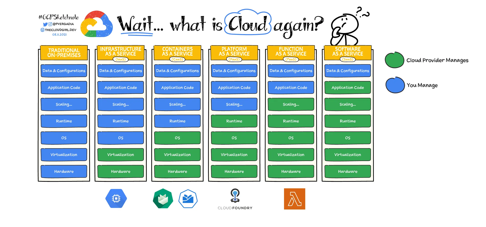
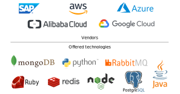

# Cloud Platform Fundamentals

---

### Cloud Computing Platforms

_a category of cloud computing services that provides a platform allowing customers to develop, run, and manage applications without the complexity of building and maintaining the infrastructure_

source: [Wikipedia](https://en.wikipedia.org/wiki/Platform_as_a_service)

---

### From Traditional Development to PaaS

- Providers/Vendors ensure scalability, availability, security, backups, ...

---

### Cloud Service Models

Decide how much to manage yourself versus the service provider

<!-- .element class="img-l" -->

Notes:

From Left to right you have less maintenance effort but also less control.

**Infrastructure as a Service (IaaS)**
- Provides virtualized computing (virtual machines), storage and networking resources on-demand
- Users are responsible for administering the operating system, data, applications, middleware, and runtimes
- Suitable for migrating applications from on-premises data centers to the cloud with minimal changes
- Examples: AWS EC2, Microsoft Azure, Google Compute Engine, DigitalOcean Droplets, ...

**Containers as a Service (CaaS)**
- Provides a platform for managing and deploying containerized applications
- Makes it easier to orchestrate containers, manage their lifecycles, and handle dependencies
- Includes tools and services for monitoring, logging, and securing containers
- Allows for automatic scaling of containerized applications based on demand
- Examples: Kyma (which is built on top of Gardener), Google Kubernetes Engine (GKE), Amazon Elastic Kubernetes Service (EKS), ...

**Platform as a Service (PaaS)**
- Focus on developing, running, and managing applications without dealing with infrastructure
- Provides a framework with the necessary technical stack available on the cloud
- Includes runtime libraries, tools, applications and services for application development, testing, and deployment
- Examples: Cloud Foundry, AWS Elastic Beanstalk, Google App Engine, Heroku, Azure App Service, ...

**Function as a Service (FaaS)**
- Serverless computing model
- Run individual functions or pieces of code in response to events without managing servers
- Automatically scales based on the number of incoming requests
- Charges based on actual execution time and resources consumed
- Examples: AWS Lambda, Google Cloud Functions, Azure Functions, ...

**Software as a Service (SaaS)**
- Delivers software applications over the internet on a subscription basis
- Accessible regardless of hosting location, operating system, or programming language
- Choose vendors based on security, privacy, compliance, reliability, performance, support, vendor lock-in, and roadmap
- Examples: SAP Cloud ERP, SAP Build Apps, Gmail, Facebook, Office365, ChatGPT, JIRA Cloud, ...

Source: https://cloud.google.com/learn/paas-vs-iaas-vs-saas?hl=en

---

### Cloud Platforms

Pick the tools and technology that matches your business requirements and skills best!
([within certain boundaries](https://sap.sharepoint.com/teams/NorthStarArchitectureIntegrationKernelServices/Shared%20Documents/General/North%20Star%20Architecture%20Strategy%20Papers/2022/North_Star_Architecture_2022.pdf?cid=476bf941-53b3-4bfc-a6d0-e3455d12e0d3))

Notes:

- Top: there's several vendors out there - the list is not complete!

- Bottom: You can pick from a shedload of technologies: programming languages / runtimes, data bases and other storages, message queues, ... - again, the list is not complete!

- Link: North star architecture - this is what SAP came up with to give guidance on technology. Although in theory you have an "infinite" number of choices, it probably makes sense to check for some "good defaults" first - keeping in mind sustainability and operability at a large scale
    - [North Star Architecture Amendment/Update](https://sap.sharepoint.com/teams/NorthStarArchitectureIntegrationKernelServices/Shared%20Documents/General/North%20Star%20Architecture%20Strategy%20Papers/2022/North_Star_Architecture_2022.pdf?cid=476bf941-53b3-4bfc-a6d0-e3455d12e0d3)

---

### Comparing CF and K8S

 

<table style="width: 90%; font-size: 22px;">
  <colgroup>
    <col style="width: 14%;">
    <col style="width: 43%;">
    <col style="width: 43%;">
  </colgroup>
  <thead>
    <tr>
      <th></th>
      <th>Cloud Foundry</th>
      <th>Kubernetes</th>
    </tr>
  </thead>
  <tbody>
    <tr>
      <td style="vertical-align: top;">Definition</td>
      <td>Open-source PaaS for deploying and managing apps</td>
      <td>Open-source container orchestration platform (CaaS)</td>
    </tr>
    <tr>
      <td style="vertical-align: top;">Architecture</td>
      <td>Application-centric</td>
      <td>Container-centric</td>
    </tr>
    <tr>
      <td style="vertical-align: top;">Design</td>
      <td>Fixed set of components designed to work together</td>
      <td>Flexible and extensible system of open-source components</td>
    </tr>
    <tr>
      <td style="vertical-align: top;">Deployment Model</td>
      <td>Uses built-in container runtimes (e.g., Diego or Garden). Deployment process involves fewer steps.</td>
      <td>Supports a wide range of container runtimes. Deployment more complex.</td>
    </tr>
    <tr>
      <td style="vertical-align: top;">Scaling</td>
      <td>Autoscaling based on workloads</td>
      <td>Supports autoscaling but requires more manual control</td>
    </tr>
    <tr>
      <td style="vertical-align: top;">Characteristics</td>
      <td>
        <ul>
            <li>Applications</li>
            <li>Services</li>
            <li>Service Bindings</li>
            <li>Much higher level of abstraction</li>
        </ul>
      </td>
      <td>
        <ul>
            <li>Declarative definition of desired state</li>
            <li>Self-healing</li>
            <li>Optimizes usage of resources</li>
            <li>Different rollout strategies</li>
        </ul>
    </tr>
    <tr>
      <td style="vertical-align: top;">Security</td>
      <td>Privileged workloads are not allowed</td>
      <td>Allow running of privileged workloads</td>
    </tr>
    <tr>
      <td style="vertical-align: top;">Learning Curve</td>
      <td>Easier for developers familiar with PaaS</td>
      <td>Steeper learning curve for beginners</td>
    </tr>
    <tr>
      <td style="vertical-align: top;">Use Cases</td>
      <td>Developing and deploying centralized app development environments hosting a large number of apps</td>
      <td>Handling containerized workloads that require greater flexibility across multiple cloud environments</td>
    </tr>
</table>

Notes:

- source: https://phoenixnap.com/kb/cloud-foundry-vs-kubernetes

---

# Questions?
