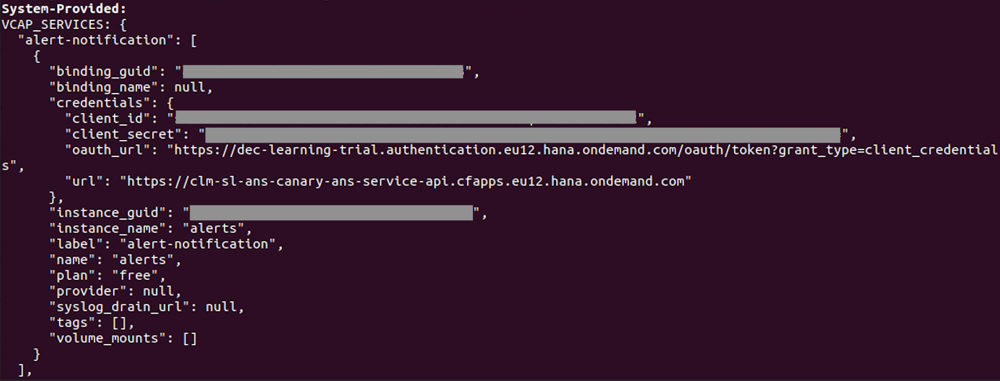

# Alerting (Cloud FoundryKubernetes)

<!-- TrackingCookie-->










## 🎯 Learning Objectives

In this module you will learn

- how to use alerting service on SAP BTP
- how to send alert notifications based on errors in your application

##  🤔 Wait, but why?

When something goes wrong on your application, you may want to get notified in _real-time_. Alerting on cloud platforms allows DevOps teams to respond to any service degradation quickly and automatically. More important, teams can detect failures in early stage in development and avoid broken changes in production.

## 💻 Exercise

In this exercise you will deploy two microservices to SAP BTP, and trigger automatic email notification in case of a specific exception. 

<!-- Prerequisites-->











#### 🚇 Infrastructure


- A [Cloud Foundry Space](https://pages.github.tools.sap/cloud-curriculum/materials/all/cf-spaces/spaces-java/){target=_blank}
- [CF client V8](https://github.com/cloudfoundry/cli/wiki/V8-CLI-Installation-Guide){target=_blank}

- Access to a Kubernetes Cluster

    If you don't have a cluster already, see the first step of the [Kubernetes topic](../../cloud-platforms/kubernetes-java/#1-kubernetes-cluster-access){target=_blank} to find out how to get a cluster and configure `kubectl`.


### 🚀 Getting Started











    You should now have three maven projects in the IDE:

    - parent-distributed-logging
    - greetings
    - users

### 🔍 Introduction

We provide two microservices: `greetings` and `users`. Both expose a simple REST interface. The `greetings` service calls the `users` service to retrieve the necessary information.

### 1 - Deploy the apps


1. In the root directory of the cloned project build the apps by running the following command:
    ```shell
    mvn package
    ```

1. In the root directory open the file `vars.yaml` and replace the `<YOUR C/D/I-NUMBER>` placeholder with your actual C/D/I-number in with the letter being lowercase.

    If you are not using a Cloud Foundry trial account you will also need to adapt the value for `domain` in the `vars.yaml`.

1. Make sure your Cloud Foundry CLI client is logged in and targeting the correct space.

    ??? example "Need help?"
        Use the `cf login` command with `-a` option. After providing your user name and password, you can pick the organization and space to interact with.
        ```shell
        cf login -a <your_API_endpoint>
        ```

1. Run the following command to deploy both applications

    ```shell
    cf push --vars-file vars.yaml
    ```


To get you started quickly we provide the necessary `.yaml`-files in the directory `deployment/apps`. It may be shown as part of the `parent-distributed-logging` project, depending on your IDE.

1. To retrieve Cluster and Project Name run the following command:
    ```shell
    kubectl cluster-info
    ```
    It should print a message similar to the following, with `<SUBDOMAIN>` being replaced :
    ```
    CoreDNS is running at https://api.<SUBDOMAIN>.kyma.ondemand.com/api/v1/namespaces/kube-system/services/kube-dns:dns/proxy
    ```

    ??? error "Getting an error from kubectl?"
        If kubectl is not connected, please see the first exercise of the [Kubernetes topic](../../cloud-platforms/kubernetes-java/#1-accessing-the-cluster){target=_blank} to find out how to get a cluster and configure `kubectl`.

1. Run the shell script `fill_placeholders.sh` with the arguments:
    1. Your c/d/i-number (with the letter being lowercase)
    1. The name of your Subdomain

    Your terminal command should look similar to the following:
    ```shell
    ./fill_placeholders.sh i012345 my-subdomain
    ```

    --8<--- "snippets/shell-script-on-windows.md"

1. Use the provided shell script with your (lowercase) c/d/i-number to create and push docker images for the applications:
    ```shell
    ./push_images.sh <your c/d/i-number>
    ```

1. Run the following command to deploy the both applications to your cluster:
    ```shell
    kubectl apply -f deployment/apps
    ```


### 2 - Generate Some Traffic


1. Determine the route of the `greetings` app with `cf apps`.
1. Open it in a browser with the path `/api/v1/greetings/1` appended, i.e. `https://greetings-<YOUR C/D/I-NUMBER>.cfapps.eu12.hana.ondemand.com/api/v1/greetings/1`


1. Run
    ```shell
    kubectl get ingress
    ```

1. Copy the link (`HOSTS` column) and enter it in your web-browser with the following path appended: `/api/v1/greetings/1`, i.e. `https://app.<SUBDOMAIN>.kyma.ondemand.com/api/v1/greetings/1`


    You should see a nice greeting for **Juan**.

1. In the greetings tab, navigate to the following path: `/api/v1/greetings/99`.

    You should see a greeting for **User**.

1. As the `users` service can not find an user for id 99, it logged some messages in the backend. Find out the related logs.


    ??? example "Need help?"
        Use command `cf logs users --recent`. You can find some logs emitted by the `users` service.
        ```log
        2024-01-31T07:11:54.82+0000 [APP/PROC/WEB/0] OUT {"msg":"No user found for id 99","component_id":"c5cebb26-5ab6-4ab8-8596-9d751ca9fa8e","level":"WARN","written_ts":"1706685114825976689","logger":"com.sap.cc.user.UserController","component_name":"users","thread":"http-nio-8080-exec-8","organization_name":"dev-learning-trial","type":"log","space_name":"I327002","organization_id":"359db1cb-0e89-46fb-961c-c0365d95844b","correlation_id":"3676095b-ee72-4152-704b-8153a8cbbbb2","written_at":"2024-01-31T07:11:54.825Z","space_id":"ecf0968b-afd8-4aa7-809a-25121c848583","request_id":"1ed3ac9a-a9e0-4e86-44a9-2fda805f747c","container_id":"10.0.201.13"}
        ```


    ??? example "Need help?"
        Use command `kubectl logs <users pod>`. You can find some logs emitted by the `users` service.
        ```log
        {"msg":"No user found for id 99","level":"WARN","written_ts":"1716769717746116716","logger":"com.sap.cc.user.UserController","w3c_traceparent":"00-9a74213238850bfc625e30821b76b216-ec4fa13656bcb228-01","thread":"http-nio-8081-exec-4","type":"log","correlation_id":"ff915cb6-c6ac-4373-a353-75e5c3e13ea2","written_at":"2024-05-27T00:28:37.746Z"}
        ```



### 3 - Create alerting service

This "user not found" issue normally shouldn't occur. If it still occurs in the future, you, the team that owns the service, would like to get notified by email.

The [SAP BTP Alert Notification](https://help.sap.com/docs/alert-notification/sap-alert-notification-for-sap-btp/what-is-sap-alert-notification-service-for-sap-btp){target=blank} service can help send notifications through various channels, such as email, Microsoft Teams or Slack. You will configure the service to send an email based on a custom event type `app error`. 

***Note:*** The `Alert Notification` service has already been entitled in our trial account. But if you are using your own BTP account, please check [service setup](https://help.sap.com/docs/alert-notification/sap-alert-notification-for-sap-btp/initial-setup){target=blank} before you continue.

1. Create an `Alert Notification` service which contains:

    1. an action of type `EMAIL`;
    1. a condition that triggers when `eventType EQUALS app-error`;
    1. a subscription that binds the `condition` to the `action`.

    
    ??? example "Need help?"
        You can create the service by using either [cockpit](https://canary.cockpit.btp.int.sap/cockpit/#/globalaccount/cloudCurriculum/subaccount/5545bfd2-7df6-4a02-99a9-ecfa153f11cd/spaces){target=blank} or the command line `cf create-service ...`. For example:

        ```sh
        cf create-service alert-notification free alerts -c alert-config.json
        ```

        Here's an example of a config json file you can use to create the service:

        ```json
        {
            "configuration": {        
                "actions": [{
                    "type": "EMAIL",
                    "name": "mail",
                    "state": "ENABLED",
                    "properties": {
                        "destination": <your email>,
                        "useHtml": "false",
                        "subjectTemplate": "💩 D'oh! {subject}",
                        "payloadTemplate": "something went wrong. {body}"
                    }
                }],
                "conditions": [{
                    "name": "on-app-error",
                    "mandatory": false,
                    "propertyKey": "eventType",
                    "predicate": "EQUALS",
                    "propertyValue": "app-error",
                    "labels": [],
                    "description": ""
                }],
                "subscriptions": [{
                    "name": "test",
                    "conditions": [ "on-app-error" ],
                    "actions": [ "mail" ],
                    "state": "ENABLED"
                }]
            }
        }       
        ```


    ??? example "Need help?"
        You can create the BTP service in Kyma environment by using either [Kyma dashboard](https://help.sap.com/docs/btp/sap-business-technology-platform/using-sap-btp-services-in-kyma-environment){target=blank} or the command line `kubectl`. For example:

        ```sh
        kubectl apply -f service-instance.yaml
        ```

        Here's an example of the yaml file you can use to create the service. Change the placeholder `<your email>` to your SAP email address.

        ```yaml
        apiVersion: services.cloud.sap.com/v1
        kind: ServiceInstance
        metadata:
          name: alert-service
          namespace: default
        spec:
          serviceOfferingName: alert-notification
          servicePlanName: standard
          externalName: alert-service
          parameters:
            configuration:
              actions:
                - type: EMAIL
                  name: mail
                  state: ENABLED
                  properties:
                    destination: <your email>
                    useHtml: "false"
                    subjectTemplate: 💩 D'oh! {subject}
                    payloadTemplate: something went wrong. {body}
              conditions:
                - name: on-app-error
                  mandatory: false
                  propertyKey: eventType
                  predicate: EQUALS
                  propertyValue: app-error
                  labels: []
                  description: ""
              subscriptions:
                - name: test
                  conditions:
                    - on-app-error
                  actions:
                    - mail
                  state: ENABLED
        ```


1. Make sure you confirm the email action:

    You will receive an email after the previous step. Use the link inside to confirm that you'd like to activate the "send email" action.


1. Bind the application:

    Add another entry in your `manifest.yml` file to bind the `users` app to the `alerts` service.

    ??? example "Need help?"

        Add an entry `alerts` in the `services` list:

        ```yaml
            applications:
            - name: users
              ...
              services:
              - alerts
            - name: greetings
              ...
        ```


1. Bind the alert service:

    BTP Service Binding provides access details for an existing service instance. You need to create a binding to consume the alert server later in your application.

    ??? example "Need help?"

        Here's an example of the yaml file you can use to create the service binding.

        ```yaml
        apiVersion: services.cloud.sap.com/v1
        kind: ServiceBinding
        metadata:
          name: alert-binding
          namespace: default
        spec:
          serviceInstanceName: alert-service
          externalName: alert-binding
          secretName: alert-secret
        ```




1. Run the following command to deploy both applications.

    ```shell
    cf push --vars-file vars.yaml
    ```

1. Inspect the environment.

    Use `cf env` to inspect the environment of `users`.

    

    You should see the details for the alerts service and find some URLs and credentials - it's oauth-based. Note down the values for `client_id`, `client_secret`, `oauth_url` and `url` in the `credentials` section. You will need them later.


1. Inspect the secret.

    The service binding creates a Kubernetes secret which stores the details of the alert service. Run the following command to see the credentials.

    ```sh
    kubectl get secret alert-secret -o yaml
    ```

    Note the values for `client_id`, `client_secret`, `oauth_url` and `url`. They are base64 encoded. Decode them to plain text. You will need them later.



### 4 - Send email notification

Returning to the application, when a "user not found" error is detected, you should send an event of type `app error` to the alert notification service. This service will then send an email notification to inform the team.

1. Find the code block which handles "user not found" exception.

    ??? example "Need help?"
        Navigate to the `catch` block in the `UserController.findUserById` method in the `users` app.

1. Retrieve token from the OAuth server.

    To send request to the alert notification server, you must retrieve a token from the OAuth server at first. Remember the properties from `cf env``Kubernetes secret` in the previous step? You will need them now.

    The http request to retrieve token is something like this:

    ```http
    POST <oauth_url> HTTP/1.1
    Authorization: <client_id>:<client_secret>
    Content-Type: application/x-www-form-urlencoded
    ```

    ??? example "Need help?"
        You can use RestTemplate from Spring Framework to handle the http traffic, or any other library you prefer.

        ```java
        RestTemplate restTemplate = new RestTemplate();
        
        HttpHeaders headers = new HttpHeaders();
        headers.setBasicAuth("<client-id-from-cfenv>", "<client-secret-from-cfenv>");
        headers.add("Content-Type", "application/x-www-form-urlencoded");
        HttpEntity<String> tokenRequest = new HttpEntity<String>(headers);
        
        ResponseEntity<String> tokenResponse = restTemplate.exchange("<oauth-url-from-cfenv>", HttpMethod.POST, tokenRequest, String.class);
        String token = new ObjectMapper().readTree(tokenResponse.getBody()).get("access_token").asText();
        ```
        For now it's ok if you hard code the credentials that you found in the `cf env`. But of course if you want to do things right, you should better read it from the environment.

1. Send event to the alert notification server.

    You will send the event to the so-called ["Producer API"](https://api.sap.com/api/cf_producer_api/path/postResourceEvent){target=blank} endpoint. Once the event is received by the alert notification server, it is delivered to each channel you have already defined - email, Slack, webhook, etc.

    Make sure you use the correct `event type` which you defined in the `condition` in your alert notification service (="app-error").

    The http request is something like this:

    ```http
    POST https://clm-sl-ans-canary-ans-service-api.cfapps.eu12.hana.ondemand.com/cf/producer/v1/resource-events HTTP/1.1
    Authorization: Bearer <token-from-previous-step>
    Content-Type: application/json

    {
        "eventType": "app-error",
        "eventTimestamp": 1706782395,
        "resource": {
            "resourceName": "users",
            "resourceType": "app",
            "tags": {
                "env": "prod"
            }
        },
        "severity": "FATAL",
        "category": "ALERT",
        "subject": "User not found - potential attack",
        "body": "Someone tried to access a user that does not exist.",
        "tags": {}
    }  
    ```

    ??? example "Need help?"
        Putting it together, you can place the code in the `catch` block.

        ```java
        Executors.newSingleThreadExecutor().execute(() -> {
            RestTemplate restTemplate = new RestTemplate();
            
            //retrieve token from oauth server
            //token = ...
            
            HttpHeaders headers = new HttpHeaders();
            headers.setBearerAuth("<token>");
            headers.add("Content-Type", "application/json");
            HttpEntity<String> request = new HttpEntity<>("<json_event_as_payload>", headers);
            
            restTemplate.exchange(<url_from_cf_env>, HttpMethod.POST, request, String.class);
        });
        ```

        You probably have to catch some Exceptions from the code sample 🙈 - enjoy!


1. Build the new applications.

    ```sh
    mvn package
    ```

1. Deploy both applications.

    ```sh
    cf push --vars-file vars.yaml
    ```


1. Build the docker image and deploy to Kubernetes.

    ```shell
    ./push_images.sh <your c/d/i-number>
    ```



1. Try it out.

    Provoke the error - if everything is working as expected, you'll almost instantly get an email with a funny subject 😁.

### 5 🦄 Stretch Goals

1. Built-in alerts

    The SAP Alert Notification Service also allows to send notifications based on system events.

    Have a look at their [documentation](https://help.sap.com/docs/alert-notification/sap-alert-notification-for-sap-btp/application-events){target=_blank} and try e.g. to create an alert that will send a notification when your app gets stopped or crashed.

2. Availability Service

    Use SAP [Availability Service](https://pages.github.tools.sap/observability/availabilityservice/){target=_blank} to monitor the availability of your app.

    Have a look at the [tutorials](https://wiki.one.int.sap/wiki/display/hcpka/Tutorials){target=_blank} and try to define an evaluation that will send a notification if your app is not available.

### 6 - Reflection

In this example, we send our alert from a specific error in our code. This is just for demonstrating how it works. In "real life", you should implement such an alerting mechanism in a central place and not spread it all over. 

If you have an own logger or a wrapper around the logger you are using, this could be a potential place.

Other good places are high-level `catch` handlers of your application, e.g. a central handler that will catch all errors that are not caught on the lower levels, and be translated into an `HTTP 500 Internal Server Error` response.

Additionally, consider: the particular error we caught and alerted for, is somewhat a "client error" (from the `users` service point-of-view), so whether this is something to send an alert on, is at least worth a team discussion.

Last not least, a meaningful / better alternative can also be to define the alerting based on application logs outside the application and in the log monitoring tool, e.g. Kibana - if the monitoring tool you are using has the capability. This has the advantage that you can define the alerting strategy cross-services, and for "tricky" things like `HTTP 4xx Client Error` logs, or logs of the category `WARNING`, you can define more sophisticated strategies such as "send an alert only when a certain threshold is exceeded for this log category".







## 🙌 Congratulations! Submit your solution.












## 🏁 Summary

Good job! In this exercise you

- [x] setup alerting service on SAP BTP
- [x] sent an alert based on application errors


## 📚 Recommended Reading

- [Cloud Scale Readiness in Action with Site Reliability Engineering](https://video.sap.com/media/t/1_yl1n2frx){target=_blank}
- [SAP BTP Observability](https://pages.github.tools.sap/observability/){target=_blank}

## 🔗 Related Topics

- Monitoring: [Cloud Foundry](https://pages.github.tools.sap/cloud-curriculum/materials/all/monitoring/cloud-foundry-java/){target=_blank} | [Kubernetes](https://pages.github.tools.sap/cloud-curriculum/materials/all/monitoring/kubernetes-java/){target=_blank}
