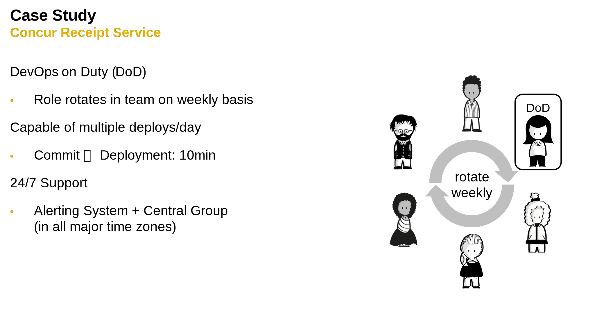

# Fast Innovation

<!-- TrackingCookie-->

  




## 🤔 Wait, but why?

Cloud Customers expect a constant stream of updates, not big bang releases every x months. The challenging part is keeping your offerings stable, while constantly releasing changes to your customers.

## 🎯 Learning Objectives

In this module you will learn about:

- Continuous Delivery
- Release Toggles
- DevOps & DORA

## 🧠 Theory

Consume the following materials:

1. Continuous Delivery general concepts: [slides](https://pages.github.tools.sap/cloud-curriculum/materials/leaders/continuous-delivery/slides/fundamentals){target=_blank} ([with speaker notes](https://pages.github.tools.sap/cloud-curriculum/materials/leaders/continuous-delivery/slides/fundamentals?showNotes=true){target=_blank}) or [recording](https://video.sap.com/media/t/1_i4rrjtv6){target=_blank}

1. DevOps Research and Assessment (DORA):
    1. learn about the key [metrics](https://dorametrics.org/how-to-calculate-dora-metrics/){target=_blank},
    1. and which [capabilities](https://dora.dev/research/dora-core-v2.0.0-detail.png){target=_blank} influence these

<!-- TODO: DevOps intro and misconceptions -->

## 🏆 Case Studies

1. Read the [X post](https://x.com/JackEllis/status/1770096046237999263){target=_blank} or the [2023 annual letter (pages 6-8)](https://assets.ctfassets.net/fzn2n1nzq965/1gMd12owbzJaSe4Y560OEJ/0e7a27759e1b3070c5179ded5b94f525/Stripe_2023_annual_letter_enGB.pdf){target=_blank} to learn how Stripe engineers for reliability, which allows them to deploy changes to their core API services 400 times per day.

1. Read or watch the story on how CALM achieved a DevOps culture and Daily Deliveries: [Wiki](https://wiki.one.int.sap/wiki/display/CXSDEV/Guidance+for+CALM+Engineering+-+Engineering+Excellence+by+Continuous+Delivery+to+Production%2C+Daily){target=_blank} or [recording (60min + Q&A)](https://video.sap.com/media/t/1_1l39oatu/145787301){target=_blank}.
SAP Cloud Application Lifecycle Management (CALM) is the fastest growing Cloud Native application by SAP with 6500+ customers (August 2024).

<!--
1. SAP Concur has established a ***DevOps on duty*** concept:
{style="width100%}
-->

<!-- - SAP4Me
- MACH2 -->

## 🪞 Reflections

1. Who is responsible for the pipeline in your product?
1. What skills are required?
1. What impact does a "bad" microservices design" have in this context?
1. What are the downsides of using Toggles?
1. How long should Toggles exist in the code?
1. How do development and operations collaborate in your team(s)?

## 💻 Technical Exercises

1. **Mandatory:** Set up a minimal CI/CD pipeline to establish Continuous Delivery with GitHub Actions using
    [Java](https://pages.github.tools.sap/cloud-curriculum/materials/leaders/continuous-delivery/cloud-foundry-java/#exercise){target=_blank},
    [Node.js](https://pages.github.tools.sap/cloud-curriculum/materials/leaders/continuous-delivery/cloud-foundry-nodejs/#exercise){target=_blank}, or
    [Python](https://pages.github.tools.sap/cloud-curriculum/materials/leaders/continuous-delivery/cloud-foundry-python/#exercise){target=_blank}

## ✏️ Non-Technical Exercises

1. Share what the DORA metrics are for your product.
    1. Are there any beyond this?
    1. Any obstacles in adopting the metrics?

## 🔗 Related Topics 

- [DORA Learning & Community Hub](https://sap.sharepoint.com/sites/126802/SitePages/DORA.aspx){target=_blank}
- [DORA: how to get started at SAP](https://pages.github.tools.sap/hyperspace/DevOps-Insights/01_dora/overview/){target=_blank}

## 📚 Recommended Reading

- Accelerate [e-book](https://ebookcentral.proquest.com/lib/sap/detail.action?docID=5316852&query=accelerate%20jez){target=_blank}
- [2023 Accelerate State of DevOps Report](https://dora.dev/publications/){target=_blank}
- [DevOps Handbook](https://ebookcentral.proquest.com/lib/sap/detail.action?docID=4717635&query=DevOps%20Handbook){target=_blank}
