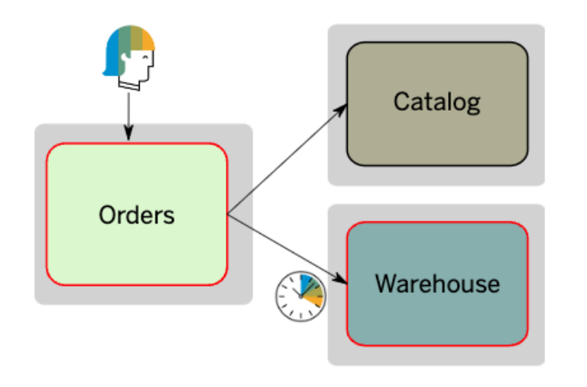

# High Availability

<!-- TrackingCookie-->

  




## 🤔 Wait, but why?

## 🎯 Learning Objectives

In this module you will learn how high availability will be achieved through:

- Resilience Patterns & Testing
- Zero Downtime Deployment
- Zero Downtime DB Migrations
- Observability 

## 🧠 Theory

Get on [overview](./resources/high-availability-concepts.pdf){target=_blank} on the Cloud Native and DevOps concepts that help to achieve High Availability.

Understand the general concepts of Logging in Distributed Systems: [slides](https://pages.github.tools.sap/cloud-curriculum/materials/leaders/distributed-logging/slides/fundamentals){target=_blank} ([with speaker notes](https://pages.github.tools.sap/cloud-curriculum/materials/leaders/distributed-logging/slides/fundamentals/?showNotes=true){target=_blank}) or [recording](https://video.sap.com/media/t/1_ewlr7qdc){target=_blank}

- [Observability](https://video.sap.com/media/t/1_j2p6y13s){target=_blank}
- [Chaos Engineering](https://video.sap.com/media/t/1_otweg4bl){target=_blank}

## 🏆 Case Studies

- Netflix introduced Chaos Engineering with inventing [Chaos Monkey](https://medium.com/@shambhavishandilya/netflixs-chaos-monkey-2380874637ab){target=_blank} as a resilience test for their productive landscape.

- SAP BTP High Availability and Disaster Recovery: [Concepts and Key Services Insight](https://sap.sharepoint.com/:p:/t/BTPPMContentRepository/Ec5Tf5rnegpHjguJRCyQNYIBL1hqopR4f9ywXk7e1Mv8Iw){target=_blank}

- SAP Integration Service [Multi Availability Zones Q&A](https://workzone.one.int.sap/site#workzone-home&/wiki/show/O6i5n5ngQeh7zuZpW5BgcK){target=_blank}

<!-- add. case studies. But may be to technical or too much.  
- ISBN Applying team topologies to Cloud Ops [recording](https://video.sap.com/media/t/1_etz27f09/145787301){target=_blank}
   -->

## 🪞 Reflections

- Why is Observability so important in the Cloud?
- Which metrics are helpful and how to set the thresholds right?
- What can make it harder to do a migration in the zero-downtime way?
- If each service has 99% availability, what is the system availability?
  { style="width: 40% ; border-radius:15px" }

 

## 💻 Technical Exercises

Share how you create transparency for your product or service. 

## ✏️ Non-Technical Exercises

Share how your Organization lives DevOps. 

## 🔗 Related Topics

- [Principles of Chaos Engineering](https://principlesofchaos.org/){target=_blank}
