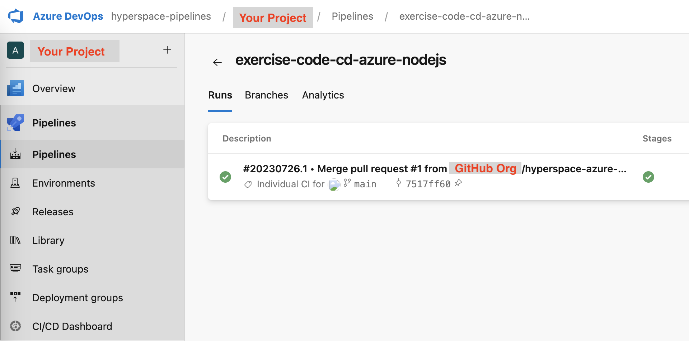
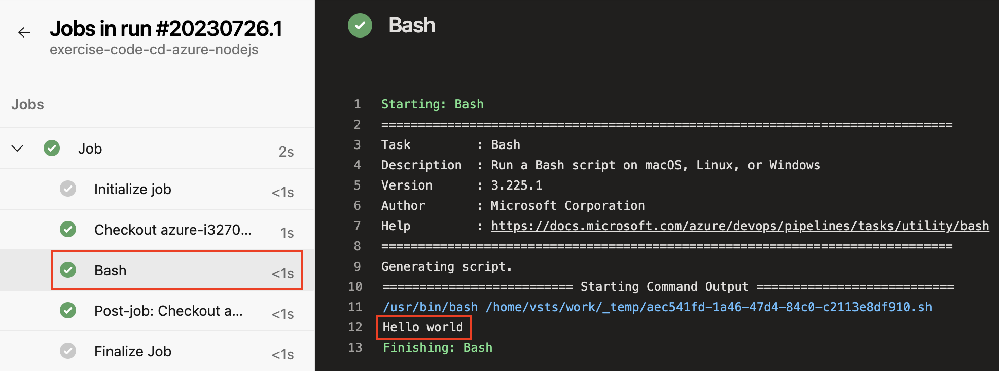
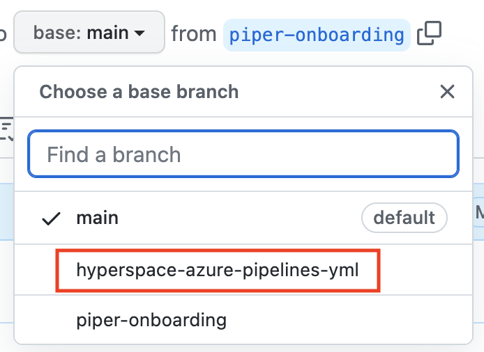

# Continuous Delivery (Azure Pipelines + Cloud FoundryKubernetes)

<!-- TrackingCookie-->






















!!! hint "New Learning Module"
    This is a _brand new_ learning module and not yet findable through the navigation/outline!

    - Find the outline with _all other modules_ [here](https://pages.github.tools.sap/cloud-curriculum/materials)
    - Any _feedback on this module is much appreciated_ - use the ★ rating buttons on this page!
    - Find _more learning offerings_, including classroom trainings on our [Sharepoint page](https://sap.sharepoint.com/sites/126802/SitePages/Cloud-Engineering-&-DevOps.aspx)
    - Anything else? Contact us at cloud-native@sap.com

## 🎯 Learning Objectives

In this module you will learn what Continuous Delivery is and how to

- set up a minimal CI/CD pipeline
- create a pipeline in Azure Pipelines through Hyperspace Onboarding
- start and monitor the pipeline in Azure Pipelines
- externalize the pipeline with Piper's template

## 🧠 Theory

>Continuous Delivery is a software development discipline where you build software in such a way that the software can be released to production at any time. - [Martin Fowler](https://martinfowler.com/bliki/ContinuousDelivery.html)

  - General Concepts: [slides](../slides/fundamentals){target=_blank}   ([with speaker notes](../slides/fundamentals?showNotes=true){target=_blank}) or [recording](https://video.sap.com/media/t/1_i4rrjtv6){target=_blank}
  - Hyperspace and Azure Pipelines: [slides](../slides/hyperspace-azure){target=_blank} ([with speaker notes](../slides/hyperspace-azure?showNotes=true){target=_blank}) 

## 💻 Exercise

In this exercise you will build a CI/CD pipeline with Hyperspace Onboarding and Azure Pipelines.

<!-- Prerequisites-->












#### 🚇 Infrastructure


- A [Cloud Foundry Space](../../cf-spaces/spaces-java/){target=blank}

- A [Cloud Foundry Space](../../cf-spaces/spaces-nodejs/){target=blank}

- Access to a Kubernetes Cluster.
  If you don't have a cluster already, see the first steps of the [Kubernetes topic](../../cloud-platforms/kubernetes-java/#0-get-a-cluster){target=_blank} to find out how to get a cluster and configure `kubectl`.


### 🚀 Getting Started

To work with Hyperspace, you need a dedicated `Github Organization`, so you are going to create this first, and then you'll fork the repository with the application code underneath it:

1. [Create a new Organization](https://github.tools.sap/organizations/new) on GitHub called `azure-<your-user-id>`.
1. Click `Next`.
1. No need to add team members, so click `Skip this step`.
1. Go to the [GitHub repository](https://github.tools.sap/cloud-curriculum/exercise-code-cd-azure-javahttps://github.tools.sap/cloud-curriculum/exercise-code-cd-azure-nodejs) and click on `Fork` in the top right corner.
1. Choose the newly created organization as target.

You now should be able to find a copy of the repository in the organization you created above, e.g. `https://github.tools.sap/<your-org>/exercise-code-cd-azure-java``https://github.tools.sap/<your-org>/exercise-code-cd-azure-nodejs`.

To enable deployment to Cloud FoundryKubernetes, please:

1. Switch to `main` branch in your forked repository

1. Open the `manifest.yml` file
1. Replace `<YOUR c/d/i-number>` with your actual c/d/i-number (with the letter in lowercase)

1. Change the variable `path: target/greetings.jar` to `path: greetings.jar`

1. If you are using your own Cloud Foundry account (not the one from [Required Infrastructure](#required-infrastructure)), please change the url in `route` accordingly

1. Open the `greetings.yaml` file
1. Replace `<CLUSTER>` and `<PROJECT>` with your values provided by Gardener (with the letter in lowercase)


1. Commit the changes

### 🔍 Code Introduction

We have a simple service that has just an endpoint that responds with "Hello World" on some URL. It doesn't require a database, so we can focus more on the pipeline as such and don't need to hassle too much with required infrastructure for our automation.

If you want to dig a bit into the code, you could check the following files:


- `com.sap.cc.greeting.GreetingController.java` (in `src/main`): will receive the HTTP request, invoke the `GreetingService` to get the actual greeting text, and then send the HTTP response with it.
- `com.sap.cc.greeting.GreetingService.java` (in `src/main`): will construct the actual greeting text - and you may notice actually it is capable of adjusting the greeting dynamically.

- `lib/application.js`: will receive the HTTP request, invoke the `greeting-service` to get the actual greeting text, and then send the HTTP response with it.
- `lib/service/greeting-service.js`: will construct the actual greeting text - and you may notice actually it is capable of adjusting the greeting dynamically.


### 1 - Hyperspace Onboarding

In the following exercises we will create a pipeline in Azure Pipelines through Hyperspace Onboarding.

??? hint "Hyperspace Onboarding vs. Azure Pipelines"
    - `Hyperspace Onboarding` is the entry point for development teams to initialize the pipeline from scratch; it connects to different tools and services in SAP, and provides necessary Azure DevOps resources to host the pipeline.
    - `Azure Pipelines` is a service offering of Azure DevOps, a Microsoft hosted cloud platform. Development teams can create, manage and monitor CI/CD pipelines in Azure Pipelines.

#### 1.1 Create Hyperspace Group

1. Open the [Hyperspace Onboarding](https://hyperspace.tools.sap/pipelines) site (***VPN required***)
1. Click `Create new Group`
1. Provide `Group name`, `Group description`

    

1. Click `Create Group`



#### 1.2 Create Hyperspace Pipeline

1. Click the `Add Pipeline` button in your group
1. Click the `Create with Template` button
1. Set the `Orchestrator` filter to `Azure Pipelines` and the `Deployment` filter to `Cloud Foundry`


1. Select the `Java` template that you see after the filters are applied (note that there are other templates also called `Java`)
    

1. Select the `Node.js` template that you see after the filters are applied (note that there are other templates also called `Node.js`)
    


1. Enter `Pipeline name` and `Pipeline description`
1. Click `Create with Template`

#### 1.3 Configure Hyperspace Pipeline
There are a lot of systems we could configure, to keep things simple we will only set up `GitHub`, `BTP CF` and `Azure Pipelines` in this exercise.

#### 1.3.1 Configure GitHub

1. Click on the `GitHub` tile
1. Click `Add new credentials`
1. Click `Connect with GitHub` at the bottom of the dialog

1. (For Hyperspace Onboarding first-time users only) Click `Authorize hyper-pipe`

    

1. Pick `Lookup existing GitHub repository` 
1. Select the GitHub organization you created above
1. In `Find existing GitHub repository`, select the repository you forked


#### 1.3.2 Configure BTP CF

1. Click on the `BTP CF` tile
1. For `Acceptance Space`, check the `Enable this deployment stage` box
1. Enter the `Organization` and `Space` for your Cloud Foundry account

    

    !!! hint "Cloud Foundry account"
        If you completed [Required Infrastructure](#required-infrastructure) in the exercise, you can provide the Cloud Foundry information accordingly. It is also possible to use your own Cloud Foundry account (API Endpoint, Org, Space, Credential) if you would like to deploy to your own space.

1. Click `Add new credentials`
1. Enter your Cloud Foundry `username`, `password` and `API endpoint`
1. Click `Add Credentials`

!!! hint "Acceptance Tests Only"
    In this exercise, we will not run Performance tests or deploy to a productive environment, so please do ***NOT*** toggle on `Enable this deployment stage` for `Performance Space` and `Release Space`.

#### 1.3.3 Configure Azure Pipelines
1. Click on the `Azure Pipelines` tile 
1. Click `Add new credentials`

    !!! error "Azure DevOps permission"
        In case you have not yet requested permission to access Azure Portal, follow the steps in this [article](https://itsupportportal.services.sap/itsupport?id=kb_article_view&sys_kb_id=a723d3f6db961550064a5a3bd39619b6) to request access

1. Follow the links in the dialog to create a new Azure DevOps token and grant necessary permissions

    

1. Paste the token into the dialog
1. Click `Add Credentials`

#### 1.3.4 Security Code Scans

At SAP, Software Security is a corporate requirement and therefore, we aim to follow the Secure Software Development and Operations Lifecycle(SDOL). According to [SDOL-009](https://wiki.one.int.sap/wiki/display/PSSEC/SDOL-009), all proprietary code as well as open source software must be scanned and the findings must be audited regularly. In order to help us perform the scans, we will setup the following:


##### 1.3.4.1 Configure Fortify Scans

Fortify is the recommended Static Application Security Testing(SAST) tool for scanning Java projects.

Note: If you are a first time user to Fortify, register yourself using the [Fortify Self-Service](https://selfservice.fortify.tools.sap/) before proceeding to the next steps.

1. Choose the `Fortify` tile.
1. Give a `Fortify project name` of your choice.
1. Choose `Add credentials`. 

 

In the pop-up that appears, follow the steps given:
    - Go to Token Management in Fortify Production to generate a new token of type `PiperToken` and paste the `encoded token` in the `Encoded Fortify Token` field.
    - Enter your I/D number in the User ID field.
    - Select the scope of your credentials and give it a name.
	- Choose 'Add Credentials'.
 

Analyzing the results of these scans is not in the scope of this exercise. Further details for scan result analysis can be found in this [Audit Guide](https://github.wdf.sap.corp/pages/Security-Testing/doc/fortify-doc/consuming/).

Similarly, the BlackDuck scans for OpenSource Vulnerability Management can be configured.


##### 1.3.4.1 Configure Checkmarx Scans

Checkmarx is the recommended Static Application Security Testing(SAST) tool for scanning Node.js projects.

Note: You need a technical account that is added to a team in Checkmarx to complete the configuration. Follow the instructions in Hyperspace to request the technical account and add it to Checkmarx.

1. Choose the `Checkmarx SAST` tile
1. Provide `Checkmarx Team Name`
1. Click `Add credentials`
1. Provide `Technical Account Name` and `Technical Account Password`
1. Click `Add credentials`



#### 1.3.5 Skip Other Configuration

Since we are working on a demo project, we will skip the following: 

1. Select the `PPMS` tile and check `I don't have an SCV, yet. I will maintain the SCV in the pipeline config manually.`
1. Select the `SonarQube` tile and check `I want to skip this step for now. I will configure it at a later point in time.`




1. Select the `Mend` tile and check `I want to skip this step for now. I will configure it at a later point in time.`


#### 1.3.6 Finalize Pipeline

1. Below the tiles, click the `Finalize Pipeline` button
1. Wait until the status of pipeline becomes `PUBLISHED`, and all the tiles are marked as completed with green check marks


    

    



#### 1.2 Create Hyperspace Pipeline

1. Click the `Add Pipeline` button in your group
1. Click the `Build / Extend Pipeline` button
1. Provide `Pipeline name` and `Pipeline description`

1. Set `Build Tool` to `docker`, and `Language` to `Java`

1. Set `Build Tool` to `docker`, and `Language` to `Node.js`

1. Click `Build / Extend Pipeline`

#### 1.3 Configure Hyperspace Pipeline

In the Service Configuration page, we can add services to the pipeline. Note that `Hashicorp Vault` service has been added by default. This is used to store the credentials to the pipeline.

#### 1.3.1 Add Services

1. Click `Add` button next to `Services`
1. Select `Azure Pipelines` tile
1. Select `GitHub - github.tools.sap` tile
1. Click `Add 2 Services` button

#### 1.3.2 GitHub

1. Select service `GitHub - github.tools.sap`
1. Click `Add new credentials` button; provide `Credential name`; click `Connect with Github`

    

1. (For Hyperspace Onboarding first-time users only) Click `Authorize hyper-pipe`

    

1. Select `Lookup existing GitHub repository`
1. Select the GitHub organization you created above
1. In `Find existing GitHub repository`, select the repository you forked

    

1. Click `Save changes` button

#### 1.3.3 Azure Pipelines

1. Select service `Azure Pipelines`
1. Click `Add new credentials`

    !!! error "Azure DevOps permission"
        In case you have not yet requested permission to access Azure Portal, follow the steps in this [article](https://itsupportportal.services.sap/itsupport?id=kb_article_view&sys_kb_id=a723d3f6db961550064a5a3bd39619b6) to request access

1. Follow the links in the dialog to create a new Azure DevOps token and grant necessary permissions

    

1. Paste the token into the dialog
1. Click `Add Credentials`
1. Click `Save changes` button

#### 1.3.4 Apply changes

1. Click `Apply changes` button at the bottom of left side panel
1. Wait till the changes are applied with green check marks
1. Focus on the `Azure Pipelines` service
    - The service has an extra red dot, which indicates it contains a pending task (GitHub Pull Request)
    - Notice the two links in the detail page - one links to the GitHub Pull Request, and another links to the Azure Pipelines entry created by Hyperspace Onboarding

    



#### 1.4 Inspect Azure Pipelines

1. Click the link of `Azure DevOps Pipeline` which will lead you to Azure Pipelines
1. Note that a new pipeline has been created
    - Hyperspace Onboarding creates all pipelines in the `hyperspace-pipeline` organization in Azure
    - Project name in Azure should correspond to the name of your GitHub organization name i.e. `azure-<your-user-id>`
    - Pipeline name in Azure should correspond to the name of your GitHub repository
    - The pipeline has _not_ been triggered to run


    

    


    Do not close the tab in browser. We will come back later

#### 1.5 Inspect GitHub Pull Request

1. Go back to Hyperspace Onboarding in your browser
1. Click the link of the Pull Request which will lead you to the GitHub repository


    Hyperspace Onboarding created a pull request in your GitHub repository.

    

    The pull request contains two files necessary for configuring `Azure Pipelines` - `azure-pipelines.yml` and `.pipeline/config.yml`

    The changes are on the `hyperspace` branch

    Hyperspace Onboarding created a pull request in your GitHub repository.

    



### 2 - Azure Pipelines

Let's learn the basic concepts of `Azure Pipelines`.

#### 2.1 Hello World

1. Click the tab `Files changed` in GitHub Pull Request
1. Notice that Hyperspace Onboarding creates a new file `azure-pipelines.yml` in the `hyperspace-azure-pipelines-yml` branch

    

    - `azure-pipelines.yml` is the pipeline definition file for `Azure Pipelines`. It is located at the root of your repository
    - You can define pipeline tasks and properties in `azure-pipelines.yml`. Take an example of the sample code:

        ```yaml
        trigger:
        - main
        ```
        It indicates that pipeline will be triggered to run whenever an update is pushed to the `main` branch

        ```yaml
        - task: Bash@3
            inputs:
            targetType: 'inline'
            script: |
                # Write your commands here
                echo 'Hello world'
        ```
        It indicates that we can run shell script with Bash in the pipeline (printing out `Hello world` in this case) by providing the script directly in the YAML file

    ??? info "Azure Pipelines"
        Here is the overview of key concepts and components that make up a pipeline. You can find more information [here](https://learn.microsoft.com/en-us/azure/devops/pipelines/get-started/key-pipelines-concepts?view=azure-devops).

        

#### 2.2 Run pipeline

Now let's run pipeline, and see how it works.

1. Click the tab `Conversation` in GitHub Pull Request
1. Click the button `Merge pull request`, then `Confirm merge`, then `Delete branch`
1. Switch to the tab of `Azure DevOps Pipeline` in your browser
1. Wait a little while, or refresh the page
1. Notice the pipeline was triggered automatically and run successfully

    

#### 2.3 Inspect pipeline

1. Click the link to the current pipeline build

    

1. Click the link to Job

    

1. Click the task `Bash`

    Notice that `Hello world` is printed out in the console

    

#### 2.4 One step further
Now let's change the pipeline, and use it to build and test our exercise project.

1. Go to GitHub repository tab in your browser
1. Click the tab `Code`
1. Click the file `azure-pipelines.yml`

    

1. Click the icon of pencil to enter the Edit mode
1. Replace the contents of the existing script section (which currently contains `echo Hello World`) with the following:

    ```yaml
    
    - script: mvn verify
    
      script: |
        npm ci
        npm test
    
    ```


1. Add another step to help validate if all expected artifacts have been built:

    ```sh
    - script: ls ./target
      displayName: 'Validate'
    ```


1. Click the `Commit changes` button and commit directly to the `main` branch

#### 2.5 Inspect pipeline

1. Switch to the tab of `Azure DevOps Pipeline` in your browser
1. Notice that a new build was triggered


1. Open the job detail page. You should find testing results in the console.

    


1. Open the job detail and click into the step `Build & Test`. 
    
    You should find the test and build results in the console.

1. Click into the step `Validate`

    You should see that a `greetings.jar` was generated.

    


### 3 - Build and Deploy with Piper

We now have some basic experience with `Azure Pipelines` after creating a pipeline step by step. In the following exercises we will re-visit the pipeline created by [1 - Hyperspace Onboarding](#1-hyperspace-onboarding), and learn how to leverage it to create a fully functional pipeline.

!!! info "Hyperspace Onboarding and Piper"
    Creating a pipeline which meets all of the [SAP Product Standard Requirements](https://wiki.one.int.sap/wiki/display/pssl/Requirements) is not an easy task. Just think of all the mandatory parts before release, such as code scans, security, compliance, etc. Hyperspace Onboarding simplifies the pipeline creation by providing ready-made pipeline templates for development teams to re-use. These templates are based on [Piper general purpose pipeline](https://github.wdf.sap.corp/pages/ContinuousDelivery/piper-doc/stages/gpp/overview/).

#### 3.1 Modify Hyperspace Onboarding pipeline

We will add more services from Hyperspace Onboarding, and change the pipeline a little bit.

#### 3.1.1 Add services

1. Switch to the `Hyperspace Onboarding` tab in your browser
1. Click `Add` button next to `Services`
1. Select `Piper`, `Kubernetes` and `Staging Service - External`

    

1. Click `Add 3 Services` button

#### 3.1.2 Piper

1. Select service `Piper`
1. Click `Save changes` button

#### 3.1.3 Staging Service - External

1. Select service `Staging Service - External`
1. Click `Save changes` button

#### 3.1.4 Kubernetes

1. Select service `Kubernetes`
1. Toggle on `Enable Acceptance Stage`
1. Select `kubectl` as the deployment tool
1. Input `./greetings.yaml` in `Path to Kubernetes manifest` input box
1. Input Kubernetes namespace of your Gardener cluster
1. Click `Add new credentials`, and input the content of the `Kubeconfig` file provided by Gardener
1. Click `Save changes` button

#### 1.3.8 Apply changes

1. Click `Apply changes` button at the bottom of left side panel
1. Wait till the changes are applied with green check marks
1. Notice that `Piper` and `Azure Pipelines` have extra red dots, which indicate they create Pull Requests in your Github repository.

    

#### 3.2 Inspect Piper's ready-made pipeline

1. Focus on the `Azure Pipelines` service
1. Click the link of the Pull Request which leads you to GitHub


1. Check the contents of files created by Hyperspace Onboarding

1. Switch to the `hyperspace-azure-pipelines-yml` branch
1. Check new contents of the `azure-pipelines.yml` file created by Hyperspace Onboarding


    - `azure-pipelines.yml` defines where the Piper's templates come from, and the general pipeline properties like triggering conditions, schedules, etc.


1. Switch to `Hyperspace Onboarding` tab in your browser
1. Focus on the `Piper` service
1. Click the link of the Pull Request which leads you to GitHub
1. Check the contents of file created by Hyperspace Onboarding


    - `.pipeline/config.yml` holds parameters for pipeline tasks to consume, e.g. information of your GitHub repository, the Cloud Foundry deployment account, etc.

#### 3.3 Merge the pull request

Usually the file `azure-pipelines.yml` and `.pipeline/config.yml` are used together. Since they are located in different Pull Requests, we are going to combine them together and merge to `main` branch in one shot.

1. Switch to the `add piper config.yml` Pull Request tab in your browser
1. Click `Edit` button

    

1. Change `base` from `main` to `hyperspace-azure-pipelines-yml`

    

1. Click button `Change base`
1. Click the button `Merge pull request`, then `Confirm merge`, then `Delete branch`
1. Switch to the `Configure azure-pipelines.yml` Pull Request tab in your browser
1. Click the button `Merge pull request`, then `Confirm merge`, then `Delete branch`

    The changes will be merged into the `main` branch

#### 3.4 Check pipeline results

1. Go to [Azure Pipelines](https://dev.azure.com/hyperspace-pipelines/).
1. Navigate to your pipeline.
    
    You should see the pipeline has been triggered automatically.

1. Check the running status of each task in your pipeline and see if the pipeline completed or not

    Your pipeline will stop at the `Manual Confirmation stage` and wait for your input. This is the default behavior from Piper's template. This manual step gives you the control to decide if you would like to deploy to the productive environment.

1. Abort the pipeline execution in the `Manual Confirmation stage`

    As we didn't set up a productive environment during Hyperspace Onboarding, the pipeline will run into some errors otherwise.

#### 3.5 Check deployment status


Navigate to the route you specified in `manifest.yml` (`greetings-<YOUR c/d/i-number>.cfapps.eu12.hana.ondemand.com`) in your web browser and append `/hello`.

Navigate to the Ingress host you specified in `greetings.yaml` (`app.ingress.<CLUSTER>.<PROJECT>.shoot.canary.k8s-hana.ondemand.com`) in your web browser and append `/hello`.


You will see the message `Hello World`.

### 4 - Reflection 

Congratulations! You've successfully created and operated a CD pipeline for a small service.

Now, here are a few questions that may help you `reflect` a bit.

??? info "Who should take care of the pipeline?"
    - A pipeline requires technical skills, so generally, developers/engineers are qualified candidates for this.
    - Furthermore, the pipeline is a counterpart to the application/microservice that it automates the delivery process for. If the people responsible for the pipeline are too far away from the people taking care of the app/service (organizationally or location-wise), this can negatively impact the quality and efficiency of the pipeline, and lead to developers not feeling responsible or accountable for the successful delivery/deployment of their service.
    - However, while the required skills include coding, in particular scripting, it is not only coding. It is also heavy w.r.t tools, technology, configuration, and about policies & regulations. Cognitive load should also be considered.
    - Therefore, the idealistic situation where the developers of the app/service are also jointly and fully responsible for the pipeline can often not be achieved, or at least not over night.
    - If there is a central team, it can help create and take care of the pipeline, especially at the beginning. Then the app/service team will gradually pick up more knowledge, so that they can become more and more independent. Later, the central enablement team then becomes less of a bottleneck.
  
??? info "What are the challenges that microservice architecture brings to Continuous Delivery?"
    In typical enterprise solutions, there is more than one microservice.

    - If the microservices are tightly coupled, it will be very hard to make the pipelines really independent. For example, in the pipeline for service A, do you also need to deploy the required service B? Which version of it is required, as this doesn't come from your team? We need to make sure that some changes to one service won't break the other services!
    - So make sure your microservices are loosely coupled. `Contract testing` might be a good way of ensuring cross-compatibility. Otherwise you better fall back to having single big pipeline for all services, where you can test them all together in integration - that then gives up a bit on team autonomy and high speed of innovation, which are some key benefits of the microservice architecture.
    - If it's sort-of coupled, it might be an option to actively track & maintain the dependency graph, to ensure a right deployment order, version combinations and pipeline orchestration. Some tools like `Deploy with Confidence` can help you with that - however keep an eye on it. It is rather walking around the problem of the tight coupling instead of fixing it by cleaning up your microservice architecture.

## 🙌 Congratulations! Submit your solution.



















## 🏁 Summary

Good job!

In this module, you have learned how to set up a simple CD pipeline. You gained fundamental knowledge of `Azure Pipelines` and how to create a Continuous Delivery solution with Hyperspace.

You made the pipeline listen for new commits and run in case there are any. Finally, your application can be deployed without manual intervention.

## 📚 Recommended Reading

- Martin Fowler: [Continuous Integration](https://martinfowler.com/articles/continuousIntegration.html) and [Continuous Delivery](https://martinfowler.com/bliki/ContinuousDelivery.html)
- [Hyperspace Development Procedures](https://pages.github.tools.sap/hyperspace/academy/bestpractice/)
- [Azure Pipelines Learning Material from Microsoft](https://learn.microsoft.com/en-us/azure/devops/pipelines/create-first-pipeline?view=azure-devops)
- [GitHub Docs - About webhooks](https://docs.github.com/en/developers/webhooks-and-events/about-webhooks)

## 🔗 Related Topics

- [cron at Wikipedia](https://en.wikipedia.org/wiki/Cron)
- [Hyperspace - SAP Pipeline Onboarding](https://hyperspace.tools.sap/)
- [Github Actions@SAP(Beta)](https://pages.github.tools.sap/github/features-and-usecases/features/actions/status)
- [Piper](https://github.wdf.sap.corp/pages/ContinuousDelivery/piper-doc/) (_VPN connection required_)
- [SAP Product Standard Software Lifecycle](https://wiki.one.int.sap/wiki/display/pssl/Product+Standard+Software+Lifecycle)
