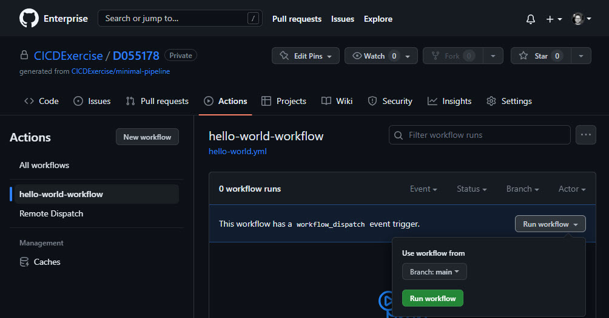
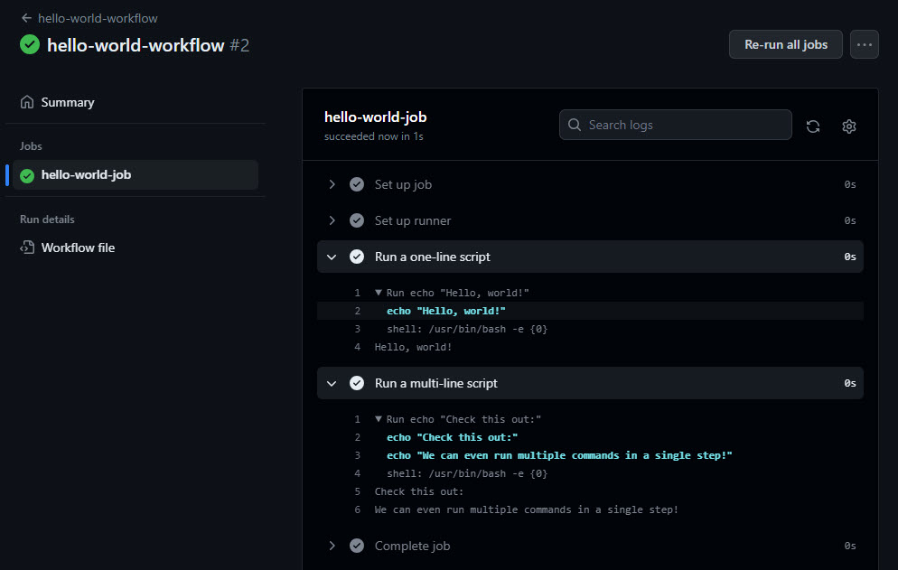

# Continuous Delivery (Cloud FoundryKubernetes)

<!-- TrackingCookie-->

































## 🎯 Learning Objectives

In this module you will learn what Continuous Delivery is, and how to setup a minimal CI/CD pipeline using GitHub Actions workflows. More specifically, how to:

  - create a workflow that can be triggered manually
  - create a workflow which runs whenever a Pull-Request is created or updated (PR-Voting)
  - create a workflow which deploys the application
  - access secrets from inside the workflows

## 🧠 Theory

>Continuous Delivery is a software development discipline where you build software in such a way that the software can be released to production at any time. - [Martin Fowler](https://martinfowler.com/bliki/ContinuousDelivery.html){target=_blank}

  - General Concepts: [slides](../slides/fundamentals){target=_blank} ([with speaker notes](../slides/fundamentals?showNotes=true){target=_blank}) or [recording](https://video.sap.com/media/t/1_i4rrjtv6){target=_blank}
  - Build a basic pipeline with Github Actions: [slides](https://pages.github.tools.sap/EngineeringCulture/ase/AllLanguages/github-actions-slides/index.html){target=_blank} ([with speaker notes](https://pages.github.tools.sap/EngineeringCulture/ase/AllLanguages/github-actions-slides/index.html?showNotes=true){target=_blank}) or [recording](https://video.sap.com/media/t/1_4ebyk5uh){target=_blank}


## 💻 Exercise
In this exercise you will build a CI/CD pipeline with GitHub actions

<!-- Prerequisites-->






































#### 🚇 Infrastructure



- A [Cloud Foundry Space](https://pages.github.tools.sap/cloud-curriculum/materials/cf-spaces/spaces-java/){target=blank}
- Create Repo in Exercise Org (CICDExercise)
    - Access the [CICD Onboarding App](https://cicd-gha.cfapps.sap.hana.ondemand.com/?language=java&exercise=cicd&deployment=cf){target=_blank}.

- A [Cloud Foundry Space](https://pages.github.tools.sap/cloud-curriculum/materials/cf-spaces/spaces-nodejs/){target=blank}
- Create Repo in Exercise Org (CICDExercise)
    - Access the [CICD Onboarding App](https://cicd-gha.cfapps.sap.hana.ondemand.com/?language=nodejs&exercise=cicd&deployment=cf){target=_blank}.

- A [Cloud Foundry Space](https://pages.github.tools.sap/cloud-curriculum/materials/cf-spaces/spaces-python/){target=blank}
- Create Repo in Exercise Org (CICDExercise)
    - Access the [CICD Onboarding App](https://cicd-gha.cfapps.sap.hana.ondemand.com/?language=python&exercise=cicd&deployment=cf){target=_blank}.




- A Kubernetes Cluster: check section ["1 - Kubernetes Cluster Access"](../../cloud-platforms/kubernetes-java/#1-kubernetes-cluster-access){target=_blank} of the Kubernetes topic to find out how to get a cluster and configure `kubectl`.
- Create Repo in Exercise Org (CICDExercise)
    - Access the [CICD Onboarding App](https://cicd-gha.cfapps.sap.hana.ondemand.com/?language=java&exercise=cicd&deploymentk8s){target=_blank}.

- A Kubernetes Cluster: check section ["1 - Kubernetes Cluster Access"](../../cloud-platforms/kubernetes-nodejs/#1-kubernetes-cluster-access){target=_blank} of the Kubernetes topic to find out how to get a cluster and configure `kubectl`.
- Create Repo in Exercise Org (CICDExercise)
    - Access the [CICD Onboarding App](https://cicd-gha.cfapps.sap.hana.ondemand.com/?language=nodejs&exercise=cicd&deployment=k8s){target=_blank}.

- A Kubernetes Cluster: check section ["1 - Kubernetes Cluster Access"](../../cloud-platforms/kubernetes-python/#1-kubernetes-cluster-access){target=_blank} of the Kubernetes topic to find out how to get a cluster and configure `kubectl`.
- Create Repo in Exercise Org (CICDExercise)
    - Access the [CICD Onboarding App](https://cicd-gha.cfapps.sap.hana.ondemand.com/?language=python&exercise=cicd&deployment=k8s){target=_blank}.


    - Make sure the selected `Language`, `Cloud Platform`, and `Exercise` options are correct.
    - Click the "Create Repo I12345" button to create a new repository in organization `CICDExercise`.
    - The link to the repository should be `https://github.tools.sap/CICDExercise/<YOUR D/I NUMBER>` as shown in the app
    !!! warning "Repository cleanup"
            We will periodically clean up the repositories (two weeks after creation). This means you have to start from scratch if you take longer than two weeks to complete the exercise.

### Getting Started


1. In a terminal run the following command to clone the repository you created above:
    ```bash
    git clone https://github.tools.sap/CICDExercise/<your-D/I-NUMBER>.git cicd-java
    ```





1. Import the project into your IDE:

    === "Spring Tool Suite"
        1. Go to `File > Import...`
        1. select `Maven > Existing Maven Projects` and click `Next`.
        1. click `Browse`
        1. navigate to the folder where you checked out the project (**cicd-java**) and click `Open`
        1. click `Finish`

    === "IntelliJ"
        1. From the main menu, choose `File > Open...` .
        1. Navigate to the folder where you checked out the project (**cicd-java**) and click `OK`


1. In a terminal run the following command to clone the repository you created above:
    ```bash
    git clone https://github.tools.sap/CICDExercise/<your-D/I-NUMBER>.git cicd-nodejs
    ```





1. Open the folder `cicd-nodejs` in your IDE.


1. In a terminal run the following command to clone the repository you created above:
    ```bash
    git clone https://github.tools.sap/CICDExercise/<your-D/I-NUMBER>.git cicd-python
    ```











1. Open the folder `cicd-python` in your IDE.



!!!hint "Tests"
    The tests are failing at the moment - we will fix that later

### 1 - GitHub Actions Workflows

Let's create our first workflow in GitHub Actions.

#### 1.1 Create Hello World Workflow

1. Create a file named `hello-world.yml` in the folder `.github/workflows`.

1. Copy the following snippet into the file you just created

    ```yaml
    name: hello-world-workflow

    on:            
      workflow_dispatch:

    jobs:    
      hello-world-job:
        runs-on: solinas

        steps:
          - name: Run a one-line script
            run: echo "Hello, world!"

          - name: Run a multi-line script
            run: |
              echo "Check this out:"
              echo "We can even run multiple commands in a single step!"
    ```

    ??? info "Snippet Walkthrough"

        | Element         | Explanation |
        |--------------|-----------|
        | `on:` | Controls what type of events trigger the workflow. Here we use `workflow_dispatch`, which enables you to manually trigger a workflow without relying on a specific event (like a push or a pull request). |
        | `jobs:`      | A workflow consists of one or more jobs that can run in sequence or in parallel  |
        | `hello-world-job:` | This workflow contains a single job called "hello-world-job". Note that the `-job` and `-workflow` postfixes are only added for clarity in this exercise, this is not a common convention. |
        | `runs-on: solinas` | The runs-on key specifies the type of runner that the job should be executed on. We use the label `solinas` here which targets the SUGAR service. |
        | `steps:` | Steps represent a sequence of tasks that will be executed as part of the job |
        | `run:` | Runs a single line command/script using the runners shell |
        | `|` | Lets us specify command/scripts on multiple lines |

1. Commit the `hello-world.yml` file
1. Push your changes to the `main` branch.

#### 1.2 Trigger the Workflow

1. Access your repository at `https://github.tools.sap/CICDExercise/<YOUR D/I NUMBER>`
1. Navigate to the "Actions" tab in your repository.
1. Click on the `hello-world-workflow` in the menu on the left.

    Note that it is not running, as we've configured it to be manually triggered via `workflow_dispatch`.

1. Trigger the `hello-world-workflow` by clicking the `Run workflow` dropdown on the right followed by the `Run workflow` button that then appears.
    


#### 1.3 Inspect the Workflow

1. Click on the active workflow that appears in the main window after triggering the workflow. (If it does not appear within 30s you may want to refresh the page)
1. Click on the `hello-world-job` in order to observe it as it runs.

    Note that it might take a few minutes for the job to be picked up by an available runner

1. Expand the `Run a one-line script` and `Run a multi-line script` steps to examine that the outputs are as expected
    

### 2 - Continuous Integration

One principle of Continuous Integration is that every commit gets verified so that it does not break anything, so let's create a workflow that runs the unit tests for new pull requests targeting the main branch.

#### 2.1 Create "PR-Voting" Workflow

1. Create a new workflow file named `pr-voting.yml` in `.github/workflows`.

1. Give the workflow the name `pr-voting`.

1. Configure the workflow so it is triggered when there are pushes to a `pull_request` branch which has `main` as the merge target.

    ??? example "Need help?"
        This snippet would trigger on pull requests targeting a branch called `example`
        ```yaml
        on:
          pull_request:
            branches:
            - example
        ```

1. Add a job called `pr-voting` which `runs-on` `solinas`.
1. Add a step called `Code check out` to check out the code of the current repo. Use the action named `actions/checkout@v3` for this.

    ??? example "Need help?"
        This snippet would use the action called `myaction/name@v1`
        ```yaml
        - name: NameOfThisStep
          uses: myaction/name@v1
        ```



1. Add a step to install Java using the snippet below

      ```yaml
      - name: Set up JDK
        uses: actions/setup-java@v1
        with:
          java-version: 17
      ```
      Note that we are passing in parameters via the `with:` element, in this case specifying the `java-version`.

1. Add a step called `Set up Maven` to install Maven using the action named `stCarolas/setup-maven@v4.2` and setting the `maven-version` to `3.9.3`

1. Add a `run` step called `Run Tests` which executes
    ```bash
    mvn test -B -Dorg.slf4j.simpleLogger.log.org.apache.maven.cli.transfer.Slf4jMavenTransferListener=warn
    ```


1. Add the following step to install Node 22. (replace the version)
        ```yaml
        - name: Set up Node
          uses: actions/setup-node@v4
          with:
            node-version: <NODE-VERSION>
        ```
1. Add a multiline `run` step called `Install Dependencies and Run Tests` which executes
    ```bash
    set -o pipefail
    npm ci && npm test
    ```

    ??? info "Pipefail "
        `set -o pipefail`: Without pipefail the steps return status would simply be the result of the last executed command (in this case `npm test`). So even if `npm ci` fails, as long as the `npm test` command is successful, the pipeline would be marked as successful overall.


1. Add the following step to install Python 3.12. (replace the version)
        ```yaml
        - name: Set up Python
          uses: actions/setup-python@v5
          with:
            python-version: '3.12'
        ```
1. Add a multiline `run` step called `Install Dependencies and Run Tests` which executes
    ```bash
    set -o pipefail
    python -m pip install --upgrade pip && pip install -r requirements.txt && pytest test
    ```

    ??? info "Pipefail "
        `set -o pipefail`: Without pipefail the steps return status would simply be the result of the last executed command (in this case `pytest test`). So even if e.g. `pip install` fails, as long as the `pytest test` command is successful, the pipeline would be marked as successful overall.


1. Commit and push the changes to `main`.

Our workflow is now waiting for new pull requests to be created.

#### 2.2 Observe a (rightfully) failing pipeline

Before we fix the failing test, we want to ensure the pipeline fails if there is an error in our code.

1. Switch to a new local branch called `fix`
    ```sh
    git checkout -b fix
    ```

1. Add the string `Here is a change in order to be able to create a PR later` to the end of the `README.md` file in the root folder.

    We have to do this, as GitHub won't let us create a pull request if it does not see any difference between the PR branch (`fix`) and the target branch (`main`)

1. Commit the change.

1. Push the `fix` branch
    ```sh
    git push origin fix:fix
    ```

1. Create a pull-request from `fix` to `main`

1. Navigate to the "Actions" tab in your repository

1. Ensure the `pr-voting` workflow appears in the workflows list on the left

1. Check that the workflow started automatically, triggered by creation of the PR.

1. Ensure that the workflow failed during the execution of the tests.

#### 2.3 Make it pass

Let's fix the test.


1. Correct the failing test in `GreetingControllerTest.java` (change the response from `Hi` to `Hello`).

1. Correct the failing test in `test/application.test.ts` (change the response from `Hi` to `Hello`).

1. Correct the failing test in `test/test_app.py` (change the response from `Hi` to `Hello`).


1. Commit the changes and push them
    ```sh
    git push origin fix:fix
    ```

1. Verify the `pr-voting` workflow started again. This time it should pass.

1. Merge the pull request into `main` in order to fix the bug, and delete the `fix` branch afterwards.

1. Switch back to your `main` branch again, and pull the changes
    ```sh
    git checkout main
    git pull
    ```

### 3 - Continuous Deployment

So far you have built a Continuous Integration pipeline. To have a Continuous Deployment pipeline, deployment must be automated as well.

#### 3.1 Personalize the deployment files
Before we create the workflow, please personalize your deployment target


1. Open the file `manifest.yml` and replace `<YOUR c/d/i-number>` with your actual c/d/i-number (with the letter in lowercase), but don't push the changes just yet.

Open the file `greetings.yaml` and:

1. Replace `<YOUR c/d/i-number>` with your actual c/d/i-number (with the letter in lowercase).
1. Replace all instances of `<SUBDOMAIN>` with the subdomain of your Kyma cluster.

    ??? tip "Don't know what your subdomain is?"
        You can determine the subdomain by running the following command:
            ```shell
            kubectl cluster-info
            ```
        It should print a message containing the following, with `<SUBDOMAIN>` being replaced:
            ```
            Kubernetes control plane is running at https://api.<SUBDOMAIN>.kyma.ondemand.com
            ```
        If it is not connected, please see the first exercise of the [Kubernetes topic](../../cloud-platforms/kubernetes-java/#1-accessing-the-cluster){target=_blank} to find out how to configure `kubectl` and `krew`.





#### 3.2 Add Secrets to Github

We need to create two `secrets` in GitHub for our workflows to use

1. Go to your GitHub repository (`https://github.tools.sap/CICDExercise/<YOUR D/I NUMBER>`).
1. Go to the "Settings" tab
1. In the left sidebar select `Secrets and variables`
1. Click the green `New repository secret` button on the right of your screen.
1. Enter `CF_USERNAME` as name
1. Enter `DL_564AF14D7BCF842F5A00004E@exchange.sap.corp` as secret
1. Click `Add secret`
1. Repeat steps 4 to 7 for the `CF_PASSWORD`, which should contain the value `c_fhAz8Ko8UAxlrgZBb`

!!!warn "Provided Credentials"
    **Do NOT use the credentials above for anything but this exercise, and only for trial spaces - You have been warned**



#### 3.2 Prepare Infrastructure

**Create Technical Cluster User:**

We need to create a technical user and get a kubeconfig file for it so the pipeline can connect to our cluster.

1. Run `kubectl cluster-info` to make sure you have access your cluster from your local machine
1. Run the command `kubectl apply -f service-account.yaml` to create a service account, including a secret
1. Run the snippet below in your projects folder to generate a config file and save it to `pipeline-kubeconfig.yaml` (Substitute `<SUBDOMAIN>` with your subdomain)
    ```sh
    ./create-kubeconfig.sh <SUBDOMAIN> >> pipeline-kubeconfig.yaml
    ```
The script will create a config file which is valid for 2 hours (=7200s), the short validity period improves security.

??? Note "Why not just use my personal user?"
    When accessing the cluster locally you are authenticated via an OIDC flow which uses your SAP credentials. This flow will not work from within a Github Actions instance though.

    In the steps above we first created a [Kubernetes Service Account](https://kubernetes.io/docs/concepts/security/service-accounts/){target=_blank} as a "technical pipeline user", and then created a short-lived `pipeline-kubeconfig.yaml` based on that technical user to give our Github Actions runner instance access the cluster.

!!! danger "Security issue!"
    As described in [this tutorial](https://developers.sap.com/tutorials/kyma-create-service-account.html){ target=_blank}, this approach is a potential security issue. Please refer to a security expert on how to access the cluster in a secure manner.

**Add Secrets to Github:**

We need to create three `secrets` in GitHub for our workflows to use

1. Go to your GitHub repository (`https://github.tools.sap/CICDExercise/<YOUR D/I NUMBER>`).
1. Go to the "Settings" tab
1. In the left sidebar select `Secrets and variables`
1. Click the green `New repository secret` button on the right of your screen.
1. Enter `REGISTRY_USERNAME` as name
1. Enter `claude` as secret
1. Click `Add secret`.
2. Repeat steps 4-7 for the `REGISTRY_PASSWORD`, which should contain the value `your password`
3. Repeat steps 4-7 for the `KUBECONFIG`.
    1. Open the `pipeline-kubeconfig.yaml` file, you created earlier, in an editor
    2. Copy the **contents** of the `pipeline-kubeconfig.yaml` file into the secret as its value.

!!!warn "Provided Credentials"
    **Do NOT use the credentials above for anything but this exercise, and only for trial spaces - You have been warned**



#### 3.3 Create the deployment workflow

We will create a new workflow which will test and deploy the application whenever there is a push/merge into `main`.

1. Create a new workflow file, called `deploy-to-prod.yml` in `.github/workflows`.

1. Copy the contents of the `pr-voting.yml` workflow into `deploy-to-prod.yml`.

    We will be re-using the existing steps and add additional steps for building and deploying underneath.

1. Change the name of the workflow to `deploy-to-prod`

1. Change the name of the `job` to `deploy-to-prod` as well. Be mindful w.r.t. proper indentation.

1. Change the trigger. It should run every time there are pushes to the `main` branch.

    ??? example "Need help?"
        This snippet would trigger on pushes to the `example` branch
        ```yaml
        on:
          push:
            branches:
            - example
        ```


1. Rename the `Run tests` step to `Build` and replace the `mvn test ...` in the `run` element with `mvn package ...`.

    This will create the jar file we need for deploying the app. Don't worry, the tests will be run as part of the `package` build target, so we aren't giving up our safety net.





1. Add a `run` step called `Build`, which runs the `npm run build` command, below the existing steps.


1. Set up the Cloud Foundry CLI on your runner, using the action `vchrisb/setup-cf@v1` in a step called `Set up CF`.

    ??? example "Need help?"
        ```yaml
        - name: Set up CF
          uses: vchrisb/setup-cf@v1
          with:
              api: https://api.cf.eu12.hana.ondemand.com
              username: {{ "${{ secrets.CF_USERNAME }}" }}
              password: {{ "${{ secrets.CF_PASSWORD }}" }}
              org: dev-learning-trial
              space: <YOUR D/I NUMBER>
        ```

1. Add a run step called `Deploy`, which runs the command `cf push greetings` to push your app.



**Add Docker Image Build Steps**

1. Add a new step called `Set up Docker Buildx` using the action `docker/setup-buildx-action@v3` which installs required docker tools

1. Create a multiline `run` step called `Docker Build and Push` that
    1. Logs in to the Docker registry via
        ```sh
        docker login -u {{'${{ secrets.REGISTRY_USERNAME }} -p ${{ secrets.REGISTRY_PASSWORD }}'}} cc-ms-k8s-training.common.repositories.cloud.sap
        ```
    1. Builds and pushes the image to the registry using (substitute `<YOUR c/d/i-number>`)
        ```sh
        docker buildx build --platform linux/amd64 -t cc-ms-k8s-training.common.repositories.cloud.sap/cd-<YOUR c/d/i-number> --push .
        ```

**Add Deploy Steps**

1. Create a step called `Install kubectl` using the action `azure/setup-kubectl@v3` to install kubectl

1. Create a multi-line `run` step called `Deploy`, that

    1. Creates a `kubeconfig.yaml` with the content of your `KUBECONFIG` secret
      ```sh
      echo "{{ "${{ secrets.KUBECONFIG }}" }}" > kubeconfig.yaml
      ```
    1. points the `KUBECONFIG` environment variable to the `kubeconfig.yaml` file
      ```sh
      export KUBECONFIG=kubeconfig.yaml
      ```
    1. deploys the app
      ```sh
      kubectl apply -f greetings.yaml
      ```



#### 3.4 Push, observe and test

1. Commit the changes and push (directly) to `main`.

    The new `deploy-to-prod.yml` workflow should be triggered immediately.

1. Observe it and make sure it passes


1. In your web browser, navigate to the `/hello` route of your application: `https://greetings-<YOUR c/d/i-number>.cfapps.eu12.hana.ondemand.com/hello`(We assume you used our exercise trial spaces, if you deployed elsewhere the URL will be different).


    ??? warning "Async kubectl"
        The `kubectl apply` command is an asynchronous command. Therefore, the pipeline run will likely be finished before the deployment is done.

1. In your web browser, navigate to the `/hello` route of your application: `https://greetings.<SUBDOMAIN>.kyma.ondemand.com/hello`.


### 4 - Reflection
Recollect what you learned and learn about potential issues with the [reflection points](../slides/reflection){target=_blank}.









## 🙌 Congratulations! Submit your solution.


You have completed the exercise!

1. Run the tests 🧪 to verify your implementation

1. Commit your code. Make sure you pushed the latest changes to your remote repository.
If you signed-up for your [Cloud Native Developer Journey](https://sap.sharepoint.com/sites/126802/SitePages/Cloud-Native-Developer-Journey.aspx){target=_blank}, it's now time to push your code. This is a mandatory step, so we can update your progress and check the results.

<!-- REVISE: Create a snippet for the selection? -->


1. Visit the [CICD app](https://cicd-gha.cfapps.sap.hana.ondemand.com/?language=java&exercise=cicd&deployment=cf){target=_blank}.


1. Visit the [CICD app](https://cicd-gha.cfapps.sap.hana.ondemand.com/?language=java&exercise=cicd&deployment=k8s){target=_blank}.





1. Visit the [CICD app](https://cicd-gha.cfapps.sap.hana.ondemand.com/?language=nodejs&exercise=cicd&deployment=cf){target=_blank}.


1. Visit the [CICD app](https://cicd-gha.cfapps.sap.hana.ondemand.com/?language=nodejs&exercise=cicd&deployment=k8s){target=_blank}.





1. Visit the [CICD app](https://cicd-gha.cfapps.sap.hana.ondemand.com/?language=python&exercise=cicd&deployment=cf){target=_blank}.


1. Visit the [CICD app](https://cicd-gha.cfapps.sap.hana.ondemand.com/?language=python&exercise=cicd&deployment=k8s){target=_blank}.


1. Make sure the selected `Language`, `Cloud Platform`, and `Exercise` options are correct.
1. Click on `Submit Solution`.


## 🏁 Summary

Good job!
In this module you learned how to set up a simple CD pipeline with Github Actions.
You ensured that pull requests are verified and made the pipeline deploy your application without the need for manual intervention whenever there are changes to the `main` branch.

## 📚 Recommended Reading

- [Martin Fowler - Continuous Integration](https://martinfowler.com/articles/continuousIntegration.html){target=_blank}
- [GitHub Actions documentation](https://docs.github.com/en/actions){target=_blank}

## 🔗 Related Topics

- [Github Actions@SAP(Beta)](https://pages.github.tools.sap/github/features-and-usecases/features/actions/status){target=_blank}
- [Hyperspace - SAP Pipeline Onboarding](https://hyperspace.tools.sap/){target=_blank}
- <a href="https://github.wdf.sap.corp/pages/ContinuousDelivery/piper-doc/" target="_blank">Piper</a> (_VPN connection required_)
- Solinas: Sugar - GitHub Actions Runners provided by SAP internally
    - [Explanation](https://pages.github.tools.sap/github/features-and-usecases/features/actions/runners)
    - [Onboarding Docs](https://wiki.one.int.sap/wiki/display/DevFw/SUGAR#SUGAR-HowToRegister-ForAndUseTheService)
