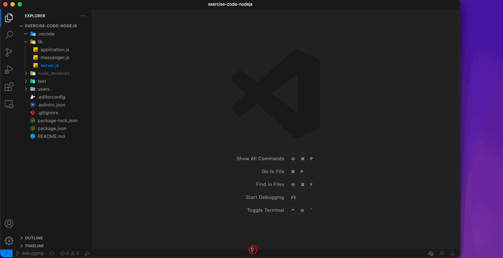
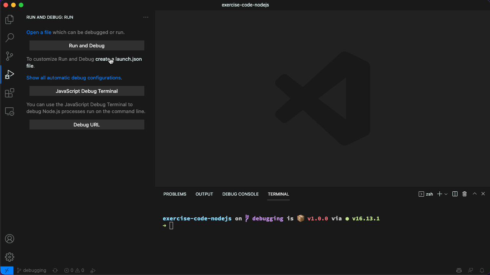
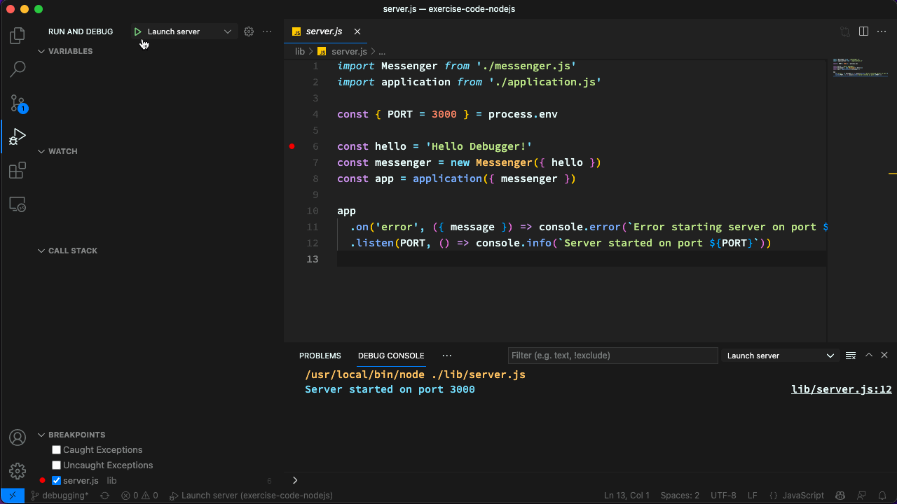

# 🔮 Debugging

<!-- TrackingCookie-->

  


## 🎯 Learning Objectives

In this exercise you will learn how to debug [Node.js](https://nodejs.org/en/){target=_blank} programs in [Visual Studio Code](https://code.visualstudio.com/){target=_blank}

## 💻 Exercise

<!-- ### 🧰 Prerequisites-->




### 🚀 Getting Started







### 1 - Start and Stop the Debugger 📟

There are several ways to start a debugging session in VS Code.

#### JavaScript Debug Terminal

1. Open a new **Terminal**

1. Once the Terminal has opened, click the **Launch Profile** button next to the *New Terminal* button in the upper right corner, and select **JavaScript Debug Terminal**

1. Run `npm start` (this will itself invoke `ts-node src/index.ts`) in the newly opened *JavaScript Debug Terminal* to start the server and attach the debugger to it.

1. Enter **Ctrl+C** to stop the server and debugger for now.

    

#### Launch configurations

1. In the **Activity bar** on the left side of the screen click on the  **Run and Debug** icon.

1. Click on **create a launch.json file**

1. Select environment: **Node.js**

    This will create a `launch.json` file in the folder `.vscode`.

1. Replace the contents of the `launch.json` with the following
    ```json
    {
      "version": "0.2.0",
      "configurations": [
        {
          "type": "node",
          "request": "launch",
          "name": "Launch server",
          "skipFiles": [
            "<node_internals>/**"
          ],
          "runtimeArgs": [
            "-r",
            "ts-node/register"
          ],
          "args": [
            "${workspaceFolder}/src/index.ts"
          ],
        }
      ]
    }
    ```

    If you are on windows, please ensure you adapt the `program` parameter as specified in the comment on the corresponding line.

    !!! info "Walkthrough"

        - `runtimeArgs`: Passed to node to register the ts-node to handle the TypeScript files.
        - `args`: Tells VS Code which file to run, the index.ts in our case

1. Make sure the `Launch server` configuration is selected in the **Launch** dropdown and press the *Start Debugging* button.

     This will start the server and attach the debugger to it.

1. Stop the debugger for now by clicking on the **Stop** icon.

    

### 2 - Set some Breakpoints 🚩

1. Open the file `src/index.ts` in the editor.

1. Put a breakpoint in line `6` (`const hello = 'Hello Debugger!'`), by clicking left of the line number.

1. Start the server and attach the debugger to it with whatever method you prefer.

    The debugger will stop at the breakpoint.

1. Use `Step Into` and `Step Over` to step through the code when starting the server.

    Notice the `Variables` and `Call Stack` panels.

    You can also define `Watch` expressions.

    

### 3 - Debug an Issue 🛑

Something seems to be wrong with the server.

We have configured a `hello` message `'Hello Debugger!'` in the `src/index.ts` file.

But if we hit the [`/hello`](http://localhost:3000/hello){target=_blank} endpoint we get a `'Hello World!'` message.

Let's debug what is wrong.

1. Start the server and attach the debugger to it with whatever method you prefer.

1. Put a breakpoint in line `9` (`const hello = messenger.getHello()`), of `src/lib/application.ts`.

1. Hit the [`/hello`](http://localhost:3000/hello){target=_blank} endpoint, start debugging, and fix the issue so that the server returns the `'Hello Debugger!'` message.

!!! info "Responses from the server"

    Keep in mind that while debugging, the server will not send responses to the client until you resume the program execution.

### 🏁 Summary

Nice job! 🥳 You have successfully learned how to debug [Node.js](https://nodejs.org/en/){target=_blank} applications in [Visual Studio Code](https://code.visualstudio.com/){target=_blank}.

## 📚 Recommended Readings

- [Debugging in Visual Studio Code](https://code.visualstudio.com/docs/editor/debugging){target=_blank}
