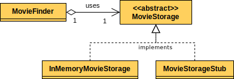

# Decoupling & Test Isolation

<!-- TrackingCookie-->

  




## 🎯 Learning Objectives

In this exercise you will learn...

- how to decouple your code by using the Dependency Inversion Principle (DIP) and Dependency Injection (DI)
- how to isolate your tests
- how to use [Sinon](https://sinonjs.org/){target=_blank} for basic stubbing

## 🧠 Theory

>"Keeping the tests running very fast is a design challenge. It’s one of the design constraints that well heeled craftsmen put upon themselves." (source: [Robert C. Martin](https://blog.cleancoder.com/uncle-bob/2014/09/03/TestTime.html){target=_blank})

  - General Concepts: [slides](https://pages.github.tools.sap/EngineeringCulture/ase/AllLanguages/decouplingAndTestIsolation-slides/index.html?tags=typescript){target=_blank} ([with speaker notes](https://pages.github.tools.sap/EngineeringCulture/ase/AllLanguages/decouplingAndTestIsolation-slides/index.html?tags=typescript&showNotes=true){target=_blank}) or watch the [recording](https://video.sap.com/media/t/1_1byzfwro){target=_blank}
  - Node.js specific step-by-step guide: [slides](https://pages.github.tools.sap/EngineeringCulture/ase/AllLanguages/decouplingAndTestIsolation-slides/index.html?tags=typescript#/1){target=_blank} ([with speaker notes](https://pages.github.tools.sap/EngineeringCulture/ase/AllLanguages/decouplingAndTestIsolation-slides/index.html?tags=typescript&showNotes=true/#/1){target=_blank}) or watch the [recording](https://video.sap.com/media/t/1_fasmema3){target=_blank}

## 💻 Exercise

In the following exercises we will tackle the dependencies of the class `MovieFinder`.
Step by step we will adjust the dependency of this class to make it more loosely coupled.
By isolating the unit tests from external dependencies, we will be able to test the core functionality of `MovieFinder` in isolation.

<!-- Prerequisites-->




### 🚀 Getting Started









    The tests should be passing ✅

    Make sure that the tests are passing after each exercise step.

### 🔍 Code Introduction

The main entity of the code is a `movie` object.
It consists of the fields `title`, `director` and `rating`:

```typescript
{
  title: 'The Godfather',
  director: 'Francis Ford Coppola',
  rating: 9.1
}
```

The movie entities can be persisted to an in-memory storage using the class `InMemoryMovieStorage`.
It provides basic CRUD operations for the movie entities.

Finally we have the `MovieFinder` class, which is responsible for finding and retrieving movies from the storage, e.g. filtered by `title` or `director`.

The exercise will focus on the `MovieFinder` class and the corresponding tests.


### 0 - Analyze the Dependencies

Analyze the code at hand and figure out where we might have tight coupling between two modules.

How does the coupling there affect...

- Modularity: How easy is it to exchange the depended-on component with another component?
- Testability: Are we able to test this piece of code in an isolated manner? No? Why?

Note down your answers, e.g. add comments in the code where you see the issues and remove them as soon as you overcome them in the next minutes.

In this exercise we are going to apply decoupling techniques to loosen the coupling, in order to make the code more flexible to potential future changes.
Another major motivation for decoupling is test-isolation; We want to be able to test every unit of code independently from other units, so that we can easily localize errors.

### 1. Implement Dependency Inversion Principle (DIP)

The **Dependency Inversion Principle** states that:

>1. High-level modules should not depend on low-level modules.
    Both should depend on the abstraction.
>1. Abstractions should not depend on details.
    Details should depend on the abstraction. (source: [Wikipedia](https://en.wikipedia.org/wiki/Dependency_inversion_principle){target=_blank})

Let's understand this principle in the context of our code.

The `MovieFinder` class directly uses the concrete `InMemoryMovieStorage` class, therefore it is tightly coupled.

In our scenario, the `MovieFinder` class is the high-level module, since it's depending on another module (`InMemoryMovieStorage`).
According to DIP we should make it depend on an abstraction.

#### 1.1 Create an Abstraction of `InMemoryMovieStorage`

The `InMemoryMovieStorage` class provides basic CRUD operations for the movie entities. 
To implement this functionality it uses a `Map`, which is just an implementation detail.
Hence we could let other storage classes implement these operations to feature a new storage type, e.g. persisting data to an actual database.

??? info "Why an abstraction?"
    Besides gaining the ability to plug in other storage types to our application e.g. a database, another main advantage that is gained is **better testability and test isolation**.
    By hiding the implementation behind an interface we are free to create and inject new implementations in our test.

    

    The above class diagram illustrates the creation of a new implementation for the `MovieStorage` interface called `MovieStorageStub`.
    The methods in the stub can be implemented freely to return values (or throw exceptions) that serve our test cases.

1. Let's create an interface `MovieStorage` in file `src/lib/movie-storage.ts`:

    ```typescript
    import type { Movie, StoredMovie } from './in-memory-movie-storage'

    export interface MovieStorage {
      create: (movie: Movie) => Promise<string>
      read: (id: string) => Promise<StoredMovie>
      readAll: () => Promise<StoredMovie[]>
      update: (id: string, movie: Partial<Movie>) => Promise<void>
      delete: (id: string) => Promise<void>
      deleteAll: () => Promise<void>
    }
    ```

    !!! info "Interfaces vs. Abstract classes"
        Instead of an `interface` we could also use an `abstract class` here, as we did in the Refactoring module. Usually, you would use an abstract class if you have common code that should be inherited by every "child class". In this case though, we just want the classes implementing the interface to fulfill a certain "contract", the classes must take care of the implementation details themselves.

    Also make sure to `import` and `export` the `MovieStorage`class in `src/index.ts`.

    ```typescript
    import InMemoryMovieStorage from './lib/in-memory-movie-storage'
    import MovieFinder from './lib/movie-finder'

    export type { MovieStorage } from './lib/movie-storage'
    export { InMemoryMovieStorage, MovieFinder }
    ```

1. Go to the class `InMemoryMovieStorage` in `src/lib/in-memory-movie-storage.ts` and make it **implement** the `MovieStorage` interface:

    ??? example "Need help?"

        ```typescript
        import type Animal from './animal'

        export default class Dog implements Animal {
          // ...
        }
        ```

### 2. Isolate the `MovieFinder` test

The tests in file `test/movie-finder.test.ts` rely upon the proper functioning of the `MovieStorage` implementation, and consequently of the `InMemoryMovieStorage`.

Due to the fact that we use the `InMemoryMovieStorage` directly in the `MovieFinder` test:

- If there are some regressions in `InMemoryMovieStorage`, the tests for `MovieFinder` will probably fail as well.

How can we isolate our test class from the functionality of the dependencies of the productive class?

#### 2.1 Write a Stub for `MovieStorage`

It would be nice if we had an implementation of `MovieStorage` that could just provide us with the values that we need in order to test the core functionality of `MovieFinder` independently.

Since we've created an abstraction (`MovieStorage`) in the previous exercise, we can now create our own implementation of it, just for testing.

1. Create a file `movie-storage-stub.ts` in the `test` folder.

1. Prepare the test data `STORED_MOVIES` in `test/movies.ts` and export it:
    ```typescript
    import type { Movie, StoredMovie } from '../src/lib/in-memory-movie-storage'

    const STORED_MOVIES: StoredMovie[] = [{ id: '1', ...THE_GODFATHER }, { id: '2', ...THE_SHAWSHANK_REDEMPTION }]

    export { THE_GODFATHER, THE_SHAWSHANK_REDEMPTION, MOVIES, STORED_MOVIES }
    ```

1. Implement the required methods for the `MovieStorage` interface:

    ```typescript
    /* eslint-disable @typescript-eslint/no-unused-vars */
    import type { Movie, StoredMovie } from '../src/lib/in-memory-movie-storage'
    import { MovieStorage } from '../src/lib/movie-storage'
    import { STORED_MOVIES } from './movies'

    export default class MovieStorageStub implements MovieStorage {
      async create(movie: Movie): Promise<string> {
        throw new Error('Not implemented!')
      }

      async read(id: string): Promise<StoredMovie> {
        throw new Error('Not implemented!')
      }

      async readAll(): Promise<StoredMovie[]> {
        return STORED_MOVIES
      }

      async update(id: string, movie: Partial<Movie>): Promise<void> {
        throw new Error('Not implemented!')
      }

      async delete(id: string): Promise<void> {
        throw new Error('Not implemented!')
      }

      async deleteAll(): Promise<void> {
        throw new Error('Not implemented!')
      }
    }
    ```

#### 2.2 Inject the MovieStorageStub

1. In the `MovieFinder` class create a setter method for the private `movieStorage` instance field, you might also have to add a type to `private movieStorage: MovieStorage`:

    ```typescript
    setMovieStorage (movieStorage: MovieStorage) {
      this.movieStorage = movieStorage
    }
    ```

1. In the `MovieFinder` test `beforeEach` hook remove the existing code for creating movies and use the setter method to pass a new instance of `MovieStorageStub` to the `movieFinder`.

    ```typescript
    import MovieStorageStub from './movie-storage-stub'

    // ...

      beforeEach(() => {
        movieFinder = new MovieFinder()
        movieFinder.setMovieStorage(new MovieStorageStub())
      })
    ```

#### 2.3 Adjust the test cases
In the `MovieFinder` test, we can replace the test data `MOVIES` to `STORED_MOVIES`, and remove the existing code for ignoring movie id.

### 3. Use Dependency Injection (DI)

In the previous exercise we already injected the dependency (`MovieStorageStub`) using ***Setter Injection***.

In this particular exercise we want to use ***Constructor Injection***.

By using Constructor Injection for `MovieFinder`, we explicitly specify that for an instantiation of that class the dependency is a required property.

1. Update the constructor of the `MovieFinder` class to take an instance of `MovieStorage` as a constructor parameter and assign it's value to the class' private instance field `this.movieStorage = movieStorage` (instead of creating a new instance as it is currently implemented). Also make sure to remove the unused `InMemoryMovieStorage` import:

    ??? example "Need help?"

        ```typescript
        export default class MovieFinder {
          private movieStorage: MovieStorage

          constructor(movieStorage: MovieStorage) {
            this.movieStorage = movieStorage
          }

          // ...
        }
        ```

1. In the `MovieFinder` test use Constructor Injection to instantiate `MovieFinder` and pass in the `MovieStorageStub` as the dependency.

    ```typescript
    beforeEach(() => {
      movieFinder = new MovieFinder(new MovieStorageStub())
    })
    ```

### 4. Use Sinon

We used the `MovieStorageStub` to provide canned answers to the calls towards the `MovieStorage`.

Using [Sinon](https://sinonjs.org/){target=_blank} we won't have to write [test doubles](https://martinfowler.com/bliki/TestDouble.html){target=_blank} manually.

Within our test class we can create test doubles with Sinon and instruct them to behave as we wish.

!!! warning "Mocking Frameworks - Use Responsibly"
    Unfortunately Mocking Frameworks can be used to hide the pain that comes from major code/design issues. So before you use any "advanced" features (e.g. mocking of modules, expectAtLeast/Most(x)) **ask yourself why testing this particular part of your code might be so hard**. Likely it is caused by issues in your code/design that you should fix instead. If you try to hide the problem it will continue to fester and become worse as the code ages.

#### 4.1 Add Sinon to the Project

Let's install Sinon as a dev dependency:

```shell
npm i -D ts-sinon
```

!!! info "`ts-sinon` vs. `sinon` and `@types/sinon`"
    [`ts-sinon`](https://github.com/ttarnowski/ts-sinon){target=_blank} is a `sinon` extension providing functions to stub interfaces in addition to Javascript `objects`/`classes`.

#### 4.2 Create and Inject the Stub

  In the `MovieFinder` test import sinon and create a new stub instance and inject it into the `MovieFinder`.

  ```typescript
  import type { MovieStorage } from '../src/index'
  import { MovieFinder } from '../src/index'
  import { stubInterface } from 'ts-sinon'

  const movieStorageStub = stubInterface<MovieStorage>()
  ```

We can now delete the `MovieStorageStub` (file `test/movie-storage-stub.ts`) as it should not be used anymore.
 
#### 4.3 Tell the Mock How to Behave

1. We can use `stub.method.returns(value)` to mock the `movieStorageStub`'s behavior. We only need to define the behavior for `readAll`.

    ```typescript
    movieStorageStub.readAll.returns(Promise.resolve(STORED_MOVIES))
    ```

    We could also use a shorthand when creating the stub instance:

    ```typescript
    const movieStorageStub = stubInterface<MovieStorage>({
      readAll: Promise.resolve(STORED_MOVIES)
    })
    ```

    !!! hint "Stub API"
        Have a look at the [Sinon documentation](https://sinonjs.org/releases/v12/stubs/){target=_blank} for more details on the stub API.

1. Run your tests.
    They should be passing.
2. Even when the tests are passing the coverage may be affected. Remove the getter and setter function in MovieFinder and verify the coverage.

## 🙌 Congratulations! Submit your solution.






## 🏁 Summary

Congratulations!
You have successfully decoupled a class and its dependency.
Now you're able to use different implementations more flexibly.
Also it is easier to test the functionality of `MovieFinder` since we can isolate it easily from its dependencies.

## 🦄 Stretch Goals

Ask yourself: Are you satisfied with the final structure of your code? In this exercise, we solely focused on the `MovieFinder`. We created an interface `MovieStorage`, but the interfaces `Movie` and `StoredMovie` are still defined in `src/lib/in-memory-movie-storage.ts`, which feels a little bit odd.

1. Move them out
1. import and re-export them in `src/index.ts`
1. adjust the affected files.

## 📚 Recommended Reading

- [Martin Fowler - Reducing Coupling](https://martinfowler.com/ieeeSoftware/coupling.pdf){target=_blank}
- [Inversion of Control (IoC) example](https://www.tutorialsteacher.com/ioc){target=_blank}

## 🔗 Related Topics

- [Martin Fowler - Test Doubles](https://martinfowler.com/bliki/TestDouble.html){target=_blank}
