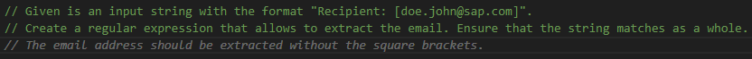
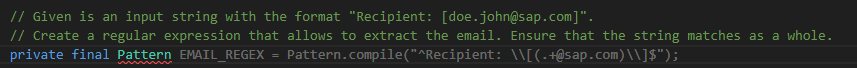

# GenAI Tooling

<!-- TrackingCookie-->

  


## 🎯 Learning Objectives

In this exercise you will learn how to leverage GitHub Copilot or [SAP AI Launchpad](https://sapit-core-playground-vole.ai-launchpad.prod.eu-central-1.aws.apps.ml.hana.ondemand.com/aic/index.html#/generativeaihub?workspace=sap-genai-xl&resourceGroup=default&/g/prompteditor
){target=_blank} to solve a programming challenge.

## 🧠 Theory

- General Concepts: [slides](../slides/fundamentals?tags=java){target=_blank} ([with speaker notes](../slides/fundamentals/?tags=java&showNotes=true){target=_blank}) or [recording](https://video.sap.com/media/t/1_3te40ki6){target=_blank}
## 💻 Exercise

In the following exercise we will use GitHub Copilot to craft a regex, that builds a user object from a string.
Unit tests covering the scenario and validating output are provided.

<!-- Prerequisites-->




### 🚀 Getting Started




    === "VS Code"
        1. Open the folder where you checked out the project (**genai-tooling-java**) in VS Code.

### 🔍 Code Introduction

In the starting point, you can find the `User` class with a corresponding `UserBuilder` class.

- The `UserBuilder` class provides a method called `createUserWithId` that takes a string as input and returns a `User` object.
- The input string has the following format: `"Lastname, Firstname (UserId)"` (e.g. `"Doe, John (I012345)"`), where the `UserId` can start with `D` or `I` (both lower and upper case are possible).

Unit tests for the `UserBuilder` class, which are currently failing, are provided. Let's start from there!

### 1 - Find the correct regex using GenAI

1. Use Copilot or the [SAP AI Launchpad](https://sapit-core-playground-vole.ai-launchpad.prod.eu-central-1.aws.apps.ml.hana.ondemand.com/aic/index.html#/generativeaihub?workspace=sap-genai-xl&resourceGroup=default&/g/prompteditor){target=_blank} to craft a working regex for the `USER_ID_REGEX` field of the `UserBuilder` class, in order to fix the failing tests.

    !!! info "Solve this exercise using only LLMs"
        The regex needed here is not too hard to figure out on your own, especially if you already have some experience using regular expressions. Nevertheless, try to solve this exercise using only LLMs.

    !!! tip "Prompt Engineering hints"
        === "SAP AI Launchpad"
            Since the SAP AI Launchpad expects you to converse with the LLM, you need to engineer a prompt telling the GenAI exactly what you want it to do, and what information you expect to receive from it.

            It is important to note that the SAP AI Launchpad lacks the IDE context that Copilot automatically has. Therefore, you need to be very **specific** and **precise** when formulating a prompt.

            You may even need to include some snippets from the exercise code to provide more context to the LLM.

            Example

            ```
            As a Java developer given is the following class:

            public class EmailParser {
                private final Pattern EMAIL_REGEX = Pattern.compile("<TODO>");

                public String parseEmailFromString(final String inputString) {

                  final Matcher matcher = EMAIL_REGEX.matcher(inputString);
                  if (!matcher.matches()) {
                    return "";
                  }
                  return new User(matcher.group(1));
                }
            }

            Replace <TODO> with a regular expression that does the following:
            - Match an input string in the form of "Recipient: [EmailAddress]"
            - EmailAddress is a placeholder for an actual string value
            - It is important that the input string as a whole is matched, no partial matches
            - The expected result, when applying the regular expression is that the value for EmailAddress is extracted

            Example input: "Recipient: [doe.john@sap.com]"
            Expected output: "doe.john@sap.com"
            ```

            As you can see from the example you have to be **very** precise and detailed with formulating your prompt in order to add enough context for the LLM to understand what it is supposed to do.

        === "Copilot"
            You can prompt Copilot to suggest code by starting to write and allowing it some time to generate suggestions.

            Another approach is to write a comment explaining the desired behavior or task you want Copilot to assist with.

            Example using a similar scenario 

            ```
            // Given is an input string with the format "Recipient: [doe.john@sap.com]".
            // Create a regular expression that allows to extract the email. Ensure that the string matches as a whole.
            ```

            It is possible that Copilot instead of offering a solution, wants to add another comment.
            

            In case that happens you need to nudge Copilot by using "leading words", which means start typing code you expect Copilot to pick up on.
            


1. Verify that all tests pass after making the change.

### 2 - Extend the behavior

In this step, we want to add a new feature to the `UserBuilder` class.

!!! info "Use the given property and method names"
    It is important that you use the property and method names we list in the following steps.  
    After submitting your solution, we automatically execute smoke tests that rely on these names.  
    When using the [SAP AI Launchpad](https://sapit-core-playground-vole.ai-launchpad.prod.eu-central-1.aws.apps.ml.hana.ondemand.com/aic/index.html#/generativeaihub?workspace=sap-genai-xl&resourceGroup=default&/g/prompteditor){target=_blank} to solve this exercise, please ensure to not blindly copy&paste the code the LLM gives you.

The new method called `createUserWithIdAndName` should allow us to parse the `firstName` and `lastName` from the input string using a new regular expression.

1. Adjust the `User` class to include the string properties `firstName` and `lastName`. Also create getter, setter and constructor methods.
1. Add new tests including assertions for the `userId`, `firstName` and `lastName` properties. Ensure that the returned `User` object has the `firstName` and `lastName` properties, in addition to the `userId`.
1. Create the new method `createUserWithIdAndName` in the `UserBuilder` class.
1. Use Copilot or the [SAP AI Launchpad](https://sapit-core-playground-vole.ai-launchpad.prod.eu-central-1.aws.apps.ml.hana.ondemand.com/aic/index.html#/generativeaihub?workspace=sap-genai-xl&resourceGroup=default&/g/prompteditor){target=_blank} to create a new regex pattern. The pattern should now extract all relevant fields from a string in the format described above (`"Lastname, Firstname (UserId)"`, where the UserId can start with `D` or `I`; don't forget the case insensitivity of the `UserId`).
1. Verify that all tests pass after making the above changes.

## 🙌 Congratulations! Submit your solution.





## 🏁 Summary

Good job!
In this exercise you wrote code with the help of GenAI and made sure it worked using some tests.

## 🦄 Stretch Goal

We want to know when `User` object instances were created.

- Add a new `String` property to the `User` class named `createdAt`. Also add getter and setter methods and extend the existing `firstName`, `lastName`, `userId` constructor.
- Update the existing test cases asserting that `createdAt` was set and is not `null`.
- Enhance the `createUserWithIdAndName` method in the `UserBuilder` class. When a new `User` instance is created, set the value of `createdAt` to the current date and time formatted the following way: "Thu Nov 23 2023 - 14:28" (representing Thursday, November 23rd 2023 at 2:28PM).
    - Ensure that `Locale.ENGLISH` is used when formatting the date.
    - Does it make sense to format the date in a separate `private` method?

!!! info "Remember to use GenAI"
    As with the previous steps use either GitHub Copilot or the [SAP AI Launchpad](https://sapit-core-playground-vole.ai-launchpad.prod.eu-central-1.aws.apps.ml.hana.ondemand.com/aic/index.html#/generativeaihub?workspace=sap-genai-xl&resourceGroup=default&/g/prompteditor){target=_blank} to provide you with a code snippet formatting the current date and time.

## 📚 Recommended Reading
- [Set up GitHub Copilot](https://sap.sharepoint.com/teams/AIPairProgrammingwithGitHubCopilot/SitePages/Setting-up-Copilot.aspx){target=_blank}
- [Use GitHub Copilot](https://sap.sharepoint.com/teams/AIPairProgrammingwithGitHubCopilot/SitePages/Using-Copilot.aspx){target=_blank}
- [GitHub Copilot Do's & Don'ts](https://sap.sharepoint.com/teams/AIPairProgrammingwithGitHubCopilot/SitePages/Do-s-and-Don'ts.aspx){target=_blank}
- [How to start using GitHub Copilot Chat](https://video.sap.com/media/t/1_z4r8xyob){target=_blank}
- [Generative AI Experience Lab](https://sap.sharepoint.com/sites/205734/SitePages/SAP-GenAI-Experience-Lab-(XL)-Service-Packages-%26-Onboarding.aspx?csf=1&web=1&e=4fOLqO){target=_blank}
- [Learning and Community Hub - Artificial Intelligence](https://sap.sharepoint.com/sites/126802/SitePages/AI-Learning.aspx){target=_blank}
- [SAP AI strategy paper](https://dam.sap.com/mac/app/e/pdf/preview/embed/GNP4Qze?ltr=a){target=_blank}
- [Youtube - Pragmatic techniques to get the most out of GitHub Copilot](https://www.youtube.com/watch?v=CwAzIpc4AnA){target=_blank}
- [Youtube - Get Started with the Future of Coding: GitHub Copilot](https://www.youtube.com/watch?v=Fi3AJZZregI){target=_blank}


## 🔗 Related Topic
[Pair Programming with GitHub Copilot](../../ase-mindset/pair-programming-java/){target=_blank}
<!-- TODO? link prompt engineering exercise once available -->

