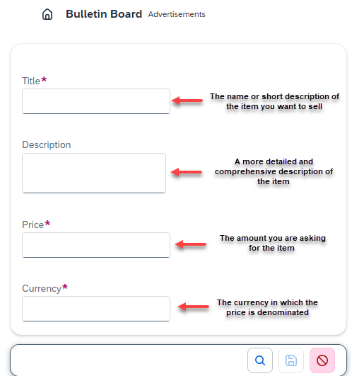

# Prompt Engineering

<!-- TrackingCookie-->

  


## 🎯 Learning Objectives

In this exercise you will learn

- how to engineer a prompt to facilitate an integration of a Node.js web application with the [BTP service proxy for third-party LLM APIs](https://github.tools.sap/I057149/azure-openai-service#readme){target=_blank}

## 🧠 Theory

TODO 
- General concepts: [slides](https://pages.github.tools.sap/EngineeringCulture/ase/AllLanguages/httpRest-slides/index.html){target=_blank} ([with speaker notes](https://pages.github.tools.sap/EngineeringCulture/ase/AllLanguages/httpRest-slides/index.html?showNotes=true){target=_blank}) or [recording](https://video.sap.com/media/t/1_nz6b500z){target=_blank}

## 💻 Exercise

The goal is to engineer a prompt used by a web application implemented in Node.js to query information from a Large Language Model (LLM).
This integration with an LLM leverages gen AI capabilities to implement a customer-facing use case.

The specific use case presented in this exercise is to add an auto-fill feature to a bulletin board application used for creating advertisements. The auto-fill feature enables users of the web UI to have information such as description, price, and currency automatically suggested through the use of a LLM.

Before integrating a prompt into the given application, we'll practice some prompt engineering techniques using the [Playground for Large Language Models](https://ai-playground.cfapps.sap.hana.ondemand.com/index.html){target=_blank}.

We'll start by formulating the information we expect from the LLM and continue iterating and evolving our prompt until we arrive at a level of detail that we think is suitable to implement the use case.

<!-- Prerequisites-->




### 🚀 Getting Started





### 🔍 Code Introduction

Since we want to focus on the prompt engineering aspect of implementing a gen AI-supported use case and integrating an LLM into an existing product, you will be provided with a web application that resembles part of a bulletin board app. This application allows users to post classified ads.

Please note that the provided application has been slimmed down to not detract from the exercise objective and does not provide a fully working bulletin board experience.

That being said, here is what's given

- a web application written in Node.js with a UI built on UI5
- `src/lib/application.ts` provides an endpoint layer to be called when the auto-fill button on the UI is clicked
- the folder `src/lib/llm` provides an implementation of a service client used to integrate with the [BTP service proxy for third-party LLM APIs](https://github.tools.sap/I057149/azure-openai-service#readme){target=_blank}
- the folder `src/lib/oauth` provides a service client used for authentication
- the `.env.local` file in the project root folder contains configuration properties used by the LLM and OAuth service clients to connect to the BTP service proxy
- the UI can be accessed by default at `http://localhost:3000` when the application is started

    !!! warning "No changes to the provided Node.js code are required"
        The provided web application is functional and requires no changes to the Node.js code or configuration, except for the modifications specified in the exercise instructions.

    !!! danger "Never commit a .env file in a real project"
        The given `.env.local` contains sensible information and is used for training purposes only. Make sure to add `.env` files to `.gitignore` in a real project in order to not expose credentials accidentally.
		

### 1 - Getting the application to start

First execute the command `npm test` to transpile the code and execute the provided unit tests. The tests won't pass.

As the error message `Error: ENOENT: no such file or directory, open 'src/lib/llm/prompt.txt'` tells us, the file called `prompt.txt` in the `llm` folder is missing.

The file `src/lib/llm/prompt.txt` is the file in which we will save our engineered prompt that is used to retrieve information from the LLM.

Create the empty file in the resource directory `src/lib/llm` and execute `npm test` again. After this the tests should be green.

### 2 - Start the app and have a look

Now that the app builds you can start it using `npm start` or start it.

Take a look around and familiarize yourself with the UI, which you can reach under `http://localhost:3000`.



Please review the following information that can be entered:

- Title: The name or short description of the item you want to sell
- Description: A more detailed and comprehensive description of the item
- Price: The amount you are asking for the item
- Currency: The currency in which the price is denominated

As far as functions go:

- The magnifying glass button is used to trigger the auto-fill feature, which automatically populates certain fields
- The Save button is intentionally disabled since it is not applicable for this exercise
- The Cancel button clears all input fields, removing any data entered


    !!! warning "Trying to use the auto-fill function will result in an error since you have not yet specified an actual prompt that can be processed by the application."


### 3 - Engineering a prompt

To start engineering a prompt we'll use the [Playground for Large Language Models](https://ai-playground.cfapps.sap.hana.ondemand.com/index.html){target=_blank}.

Please note that the LLM integration in the provided bulletin board app uses the `gpt-35-turbo` model. Therefore we recommend utilizing this model to refine your prompt as well.

To get going let's define what you need to implement the auto-fill feature:

- The prompt should retrieve the following item information:
	- Description
	- Price
	- Currency  
  
- The prompt should consist of two parts:
	- System prompt: This part defines what needs to be fetched
	- User prompt: This part represents input from the user
		- Title

- The prompt should return a `JSON` object in the following format
	```json
	{
		"description": "The Description",
		"price": 123,
		"currency": "The Currency"
	}
	```

Write your first prompt and add it to the `prompt.txt` file, which you created earlier.


??? example "Need help?"
	Here is an example prompt using a book store as an example:
	```console
	Given is a book title delimited by <>.
	Return the author and a short summary of the book.
	Format the response in json using the following keys: "author", "summary".

	<The Lord of the Rings>
	```
	A response to a prompt like this then could like the following:
	```json
	{
		"author": "J.R.R. Tolkien",
		"summary": "The Lord of the Rings is a high fantasy novel that follows the journey of a group of characters as they attempt to destroy a powerful ring and defeat the Dark Lord Sauron. Set in the fictional world of Middle-earth, the book explores themes of friendship, heroism, and the struggle between good and evil."
	}
	```

??? info "Hallucinations"
	When asking an LLM for information about a topic, there is a real possibility that the LLM may hallucinate and provide factually incorrect answers.  
	To minimize hallucinations, it is advisable to request data that is highly likely to be available to the LLM.  
	For instance, in the context of the previous example involving a bookstore, asking the LLM about a recently released book will likely result in hallucinations, as the LLM does not yet have access to that information and may therefore fabricate it.  
	It is important to note that an LLM's answer can be very convincing even when it is entirely false. Therefore, it is always wise to "**trust, but verify**" the information provided by the LLM.

### 4 - Iterate and Evolve

Are you satisfied with the prompt you have created, or is there room for improvement?

What about the description, is it too long? Does it contain inaccurate or false information?  
Is the price appropriate for the item you are attempting to sell?

To improve the prompt used in the bulletin board application, you can apply additional prompt engineering techniques to iterate and refine it.

### 4.1 Be specific and precise

When designing a prompt to retrieve information about a specific topic, it is helpful to provide a precise description of the required information.  

- Specify a maximum length for the description.

- Have the LLM return the currency in the [ISO 4217](https://en.wikipedia.org/wiki/ISO_4217){target=_blank} format (3 letter abbreviation, for example EUR instead of Euro).

Example:
```console
Given is a book title delimited by <>.
Return the author and a short summary of the book.
Ensure that the summary consists of 2 short sentences at most.
Write the summary as if it was published in a book report of a newspaper.
The authors name should have the format of Lastname, Firstname.

<The Lord of the Rings>
```
### 4.2 Setting a Context and Role

Often, it can be helpful to refine a prompt by setting up a context in which the LLM agent should answer the question.  
Additionally, specifying the role assumed by the LLM agent can further ensure that the answers are closely related to your expectations.

- Apply this principle to your prompt and see if it changes anything of the returned information.   

For example, you can have the Language Model assume multiple roles, such as a retailer, to influence the price, or a technical writer, to pivot the item description in a more technical direction.  
By doing so, you can explore how different perspectives can impact the information generated by the LLM.

```console
As a librarian, you have been assigned the task of updating
the library's catalogue by adding information to the existing books.
...
```

### 4.3 One-Shot/Few-Shot Prompting

One-Shot or Few-Shot prompting is a technique where you provide examples of what you expect in your answer.  
These examples serve as a form of in-context learning for the LLM and can help steer the output in the right direction. 

- Enhance your prompt by giving an example of the desired information

Example:
```console
Given is a book title delimited by <>.
Return the author and a short summary of the book.

For example:
For the book "The Hitchhiker's Guide to the Galaxy" the following information is correct
Author: Adams, Douglas
Summary: The plot of "The Hitchhiker's Guide to the Galaxy" follows events in the life of Arthur Dent, a man who lives on Earth in England. He is whisked off into an adventure in space by his friend Ford Prefect (who is from another planet) who tells him that Earth is about to be destroyed.

<The Lord of the Rings>
```

### 4.4 Restrictions and Boundaries

To further mitigate hallucinations, one approach is to establish clear limits and boundaries on the data utilization of an LLM.  
While not guaranteed, it can encourage the LLM to retrieve data from trusted sources.

- Restrict the data retrieval for the LLM to existing and useful sources

Example:
```console
Given is a book title delimited by <>.
Return the author and a short summary of the book.
Only use information from bookstores, Amazon and other retail shops as sources.

<The Lord of the Rings>
```

### 4.5 Ask the LLM for Help

You can use the LLM's capabilities to help you refine your prompt.  
It can help to start with a simple prompt expressing what it is you want to do and have the LLM suggest improvements.  
Then building on these improvements do multiple iterations until you arrive at a level you think is right.

Question
```console
I want to write a prompt that returns the author and a short, concise summary of a given book title.
What is a prompt that enables me to do this?
```

Potential answer
```console
Sure! Here's a prompt that you can use to retrieve the author and a short summary of a given book title:

Given a book title, return the author and a concise summary of the book.

**Prompt**
Book Title: {book_title}

**Examples**
Input: "To Kill a Mockingbird"
Output: 
Author: Harper Lee
Summary: "To Kill a Mockingbird" is a classic novel written by Harper Lee. Set in the 1930s in a small town in Alabama, the story revolves around racial injustice and the moral growth of the young protagonist, Scout Finch.

Input: "1984"
Output: 
Author: George Orwell
Summary: "1984" is a dystopian novel written by George Orwell. It portrays a totalitarian society where the government controls every aspect of people's lives, and the protagonist, Winston Smith, rebels against the oppressive regime.

Input: "Pride and Prejudice"
Output: 
Author: Jane Austen
Summary: "Pride and Prejudice" is a beloved novel written by Jane Austen. Set in 19th-century England, the story follows the protagonist, Elizabeth Bennet, as she navigates societal expectations, love, and the complexities of class.

**Note**
- Assume that the book titles provided are well-known and have widely recognized authors.
- The summary should be a concise description of the book's main themes or plot.
- The output format should include the author's name and a short summary of the book.

Feel free to modify the examples or add more details to the prompt as needed.
```

Refinement Possibility
```console
Following is a prompt which needs to be enhanced by returning json including the author and summary. Also the dscription should be max 2 sentences long and the author should have the format Firstname, Lastname.

Rewrite the prompt to incorporate those changes.
...
```

### 5 Use your Prompt

- Save your prompt in the `prompt.txt` file mentioned earlier
- Build the application
	- Ensure the test cases are passing
- Start the application
- Test the application

Your prompt, as specified in `prompt.txt`, will be automatically supplemented with the title of the item entered in the UI when the magnifying glass icon is used to send the request to the application.

!!! warning "Your prompt does not work?"
	In case the prompt caused an error in the application, for example, an error message is displayed in the UI, check the logs to figure out what went wrong.  
	Maybe the returned JSON format is incorrect or includes data that can't be deserialized?"

## 🏁 Summary

Good job!  
During this exercise, you utilized common prompt engineering techniques to design a prompt for a bulletin board web Application integrated with an LLM. This prompt enables the implementation of a feature that automatically populates fields in the UI.

## 🦄 Stretch Goals

If you want to get more hands-on experience with the actual Node.js code, take a look at the `com.sap.bulletinboard.ads.services.llm` package.

1. Use a different LLM instead of `gpt-35-turbo` (see [BTP service proxy for third-party LLM APIs](https://github.tools.sap/I057149/azure-openai-service#readme){target=_blank}
1. Implement new LLM request and response beans (see [Sample Code](https://github.tools.sap/I057149/azure-openai-service/blob/master/samples/getting-started.py){target=_blank} for what might be required)
1. Update the `LiveLLMServiceClient` utilizing the new request and response beans
1. Experiment with prompt `temperature`

## 📚 Gen AI at SAP

- [Generative AI at SAP: TechnologyStrategy](https://dam.sap.com/mac/app/e/pdf/preview/embed/GNP4Qze?ltr=a){target=_blank}
- [Generative AI | Learning Collection](https://sap.sharepoint.com/sites/126802/SitePages/Generative-AI.aspx){target=_blank}
- [Guidance for Large Language Models Engineering](https://sap.sharepoint.com/teams/CPADataManagement/Shared Documents/Forms/AllItems.aspx?id=%2Fteams%2FCPADataManagement%2FShared Documents%2FWG AI%2F20_Docs_and_Material%2FWS_FoundationModels%2FReleased Documents%2FWG_AI_Guidance_LLM_Engineering_1%2E0%2Epdf&parent=%2Fteams%2FCPADataManagement%2FShared Documents%2FWG AI%2F20_Docs_and_Material%2FWS_FoundationModels%2FReleased Documents&p=true&ga=1){target=_blank}

## 🔗 Further Reading

- Prompt Engineering:
	- [Best practices for prompt engineering with OpenAI API](https://help.openai.com/en/articles/6654000-best-practices-for-prompt-engineering-with-openai-api){target=_blank}
	- [Prompt Engineering Guide by DAIR.AI](https://www.promptingguide.ai/){target=_blank}
	- [12 Prompt Engineering Techniques by Cobus Greyling](https://cobusgreyling.medium.com/12-prompt-engineering-techniques-644481c857aa){target=_blank}
