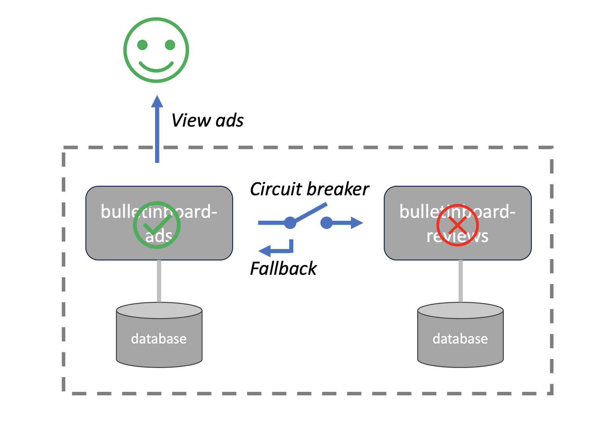
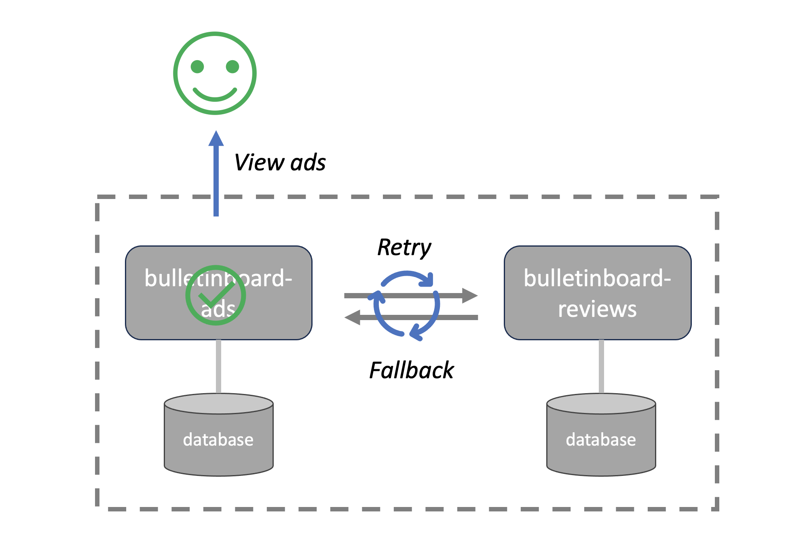

# Resilience Patterns

<!-- TrackingCookie-->

  


## 🎯 Learning Objectives

In this exercise you will learn

- How to use Resilience4J implementation of Circuit Breaker, Retry and Rate Limiter.

## 🤔 Wait, but why?

The microservices architecture allows us to design an application as a collection of small and independent services, each of which is developed and deployed separately. Despite of its agility and flexibility, microservices architecture comes with new challenges.

Since each service has to interact with others, there is an ever-present risk of partial failure. For instance, a single VM or container may crash or fail to respond for a short time, or the network connection between services is not reliable.

Therefore, the resiliency of a microservices-based application — i.e., the ability to recover from certain types of failure and remain functional — heavily depends on how well the app handles inter-service communication. Numerous resiliency patterns have emerged to address this challenge. These include timeout, retry, circuit breaker, fail-fast, etc.

## Exercise

In this exercise, you will try out some patterns to make given services more resilient.

<!-- Prerequisites-->




### 🚀 Getting Started





!!!hint "Monorepo"
    The git repository you are cloning contains two projects ads and reviews. Import/Open them in your IDE separately, especially when using IntelliJ.

### 🔍 Introduction

We provide a `bulletin board` application consisting of two services: `bulletinboard-ads` and `bulletinboard-reviews` in the starting point. User can post new ads or review existing ones by accessing the url of the `bulletinboard-ads` service. When an ads is posted, it will be marked green, orange or red based on rating for that user from the `bulletinboard-reviews` service.

The issue we're facing is that there is a hard dependency from ads to reviews, so if there is an issue with `bulletinboard-reviews`, it will also impact `bulletinboard-ads`.


We are going to mitigate this using resilience patterns.

### 1 - Let's get started

We will now fire up the applications and showcase the issue.

#### 1.1 - Start the Applications

First, we need to start the two service and their databases.

1. For the `bulletinboard-ads` application

    1. Go to the `bulletinboard-ads-java` sub directory.

    1. Then, start the service's database first: `./start-db.sh` (keep the window open!).

    1. After this, run the application

        
        
        
        
        

1. For the `bulletinboard-reviews` Application

    1. Go to the `bulletinboard-reviews-java` sub directory.

    1. Then, start the service's database first: `./start-db.sh` (keep the window open!).

    1. After this, run the application

        
        
        
        
        

1. When both applications have started, check the logs. They should look similar to the sample code below (the one is for `bulletinboard-ads`, you should see a similar one for `bulletinboard-reviews`):

    ```logtalk
    2020-06-17 10:48:13.461 INFO 31472 --- [main] o.s.b.w.embedded.tomcat.TomcatWebServer  : Tomcat started on port(s): 8080 (http) with context path ''
    2020-06-17 10:48:13.474 INFO 31472 --- [main] .l.BulletinboardAdsApplication : Started BulletinboardAdsApplication in 2.031 seconds (JVM running for 2.415)
    ```

#### 1.2 - Create an advertisement

Let's have a first look at the application, and create our first advertisement.

1. Go to the [overview page](http://localhost:8080){target=_blank} and to look at the start page.

1. Use the `+` button to add a new advertisement. This should be successful.

1. Check that the ad shows up on the [overview page](http://localhost:8080){target=_blank} afterwards.

#### 1.3 - Let's break things 😈

As mentioned, the ads service has a hard dependency on the reviews service, so let's break it.

1. Stop the `bulletinboard-reviews` service that you started earlier.

1. Now try to open (or reload) the [overview page](http://localhost:8080){target=_blank}.

1. The page should be empty, your advertisement will not appear.

1. Try to create another advertisement, this will fail, too.

In both cases the issue is caused by the dependency between the services.

### 2 - Circuit Breaker

A circuit breaker will help improve the situation. It is similar to a circuit breaker in an electric circuit, that protects your devices. When something is wrong, the circuit breaker opens the circuit, so that no more current flows.

In software, this means that no subsequent calls will be sent to the other service, so that it is given time to recover.

You can fall back to a meaningful "default" value so that your own logic can somehow proceed, a so-called "meaningful degradation of service".



You are going to implement this now in the `bulletinboard-ads` service - so all the steps below relate to files in `bulletinboard-ads`.

#### 2.1 - Implement Resilience4J

1. Add the resilience library to your `pom.xml`:

    ```xml
    <dependency>
        <groupId>io.github.resilience4j</groupId>
        <artifactId>resilience4j-spring-boot3</artifactId>
        <version>2.2.0</version>
    </dependency>
    ```

1. Define a circuit breaker by adding the annotation to `LiveReviewsServiceClient.getAverageRating`:

    ```java
    @CircuitBreaker(name = "ratings")
    ```

1. Add the resilience configuration in `src/main/resources/application.properties`:

    ```sh
    resilience4j.circuitbreaker.instances.ratings.failure-rate-threshold=50
    resilience4j.circuitbreaker.instances.ratings.minimum-number-of-calls=5
    resilience4j.circuitbreaker.instances.ratings.automatic-transition-from-open-to-half-open-enabled=true
    resilience4j.circuitbreaker.instances.ratings.wait-duration-in-open-state=10s
    resilience4j.circuitbreaker.instances.ratings.permitted-number-of-calls-in-half-open-state=3
    resilience4j.circuitbreaker.instances.ratings.sliding-window-size=10
    resilience4j.circuitbreaker.instances.ratings.sliding-window-type=COUNT_BASED
    ```
    
#### 2.2 - Test your solution

1. Start the `bulletinboard-ads` service, but don't start the `bulletinboard-reviews` service (simulating the service is down). 

1. Open the main page in your browser and reload `bulletinboard-ads` page at least 5 times quickly. 

    After the 5th time you should see the error message changes. The `bulletinboard-reviews` service is now "protected" from subsequent calls, so it has time to recover. The circuit is "open".

    ```log
    WARN 13261 --- [nio-8080-exec-1] .m.m.a.ExceptionHandlerExceptionResolver : Resolved [io.github.resilience4j.circuitbreaker.CallNotPermittedException: CircuitBreaker 'ratings' is OPEN and does not permit further calls]
    ```

1. Try viewing `bulletinboard-ads` page after some seconds.

    you will see that _some_ requests will be allowed through again to probe if the service recovered - the circuit is now "half open".

1. Consider playing with the values in `src/main/resources/application.properties`, and start/stop the `bulletinboard-reviews` service in between the process, to understand the configuration better.

#### 2.3 - Add fallback to rating service

**Not bad, but...**

Allowing the service time to recover in case of issues is nice. However, from an end-user's perspective, the situation hasn't improved much. If our circuit breaker is open, it prevents the slow service from further slowing down the dependent service. But, as mentioned, this isn't a substantial improvement.

Let's make it a bit better by adding a fallback to our circuit breaker.

1. Enhance the annotation in `LiveReviewsServiceClient.getAverageRating`:

    ```java
    @CircuitBreaker(name = "ratings", fallbackMethod = "getAverageRatingFallback")
    ```

1. Implement the fallback method accordingly, you can make it return something like 1.0 or 5.0.

    ??? example "Need Help?"
        ```java
        public Double getAverageRatingFallback(String userEmail, Throwable t) {
            return 5.0;
        }
        ```

#### 2.4 - Test your solution

1. Stop the `bulletinboard-reviews` service, and open the [overview page](http://localhost:8080){target=_blank}. 

    You will see that the `bulletinboard-ads` page is live, and fallback value is presented immediately.

1. Play around with different fallback and configuration values, and re-start the `bulletinboard-reviews` during the process, to understand the behavior a bit better.

As you can see, the fallback takes not only the arguments of your original method (in this case, the email of the user we want to get the reviews for). It also takes an exception class. With this, you can take more fine-grained control over the fallback behavior.

### 3 - Retry

The retry pattern provides resiliency to a system by allowing recovery from transient issues, such as temporary service outages. This particularly makes sense for asynchronous communication, but not only.

In our concrete scenario, our service to service request might fail. Depending on our requirements, it may be better to simply retry x times instead of using a circuit breaker.



#### 3.1 - Implement retry

You are going to implement this now in the `bulletinboard-ads` service - so all the steps below relate to files in `bulletinboard-ads`.

**Make sure** to comment out the changes you did before, i.e. deactivate the already implemented circuit breaker pattern.

1. Define a retry by adding the annotation to `LiveReviewsServiceClient.getAverageRating`:

    ```java
    @Retry(name = "retryRatings", fallbackMethod = "getAverageRatingFallback")
    ```

1. Implement the fallback method accordingly, you can make it return something like 1.0 or 5.0.

    ??? example "Need Help?"
        ```java
        public Double getAverageRatingFallback(Throwable t) {
            return 1.0;
        }
        ```

1. Add the resilience configuration in `src/main/resources/application.properties`:

    ```conf
    resilience4j.retry.instances.retryRatings.maxAttempts=3
    resilience4j.retry.instances.retryRatings.waitDuration=10s
    ```
  
#### 3.2 - Test your solution

1. Start the `bulletinboard-ads` service, but don't start the `bulletinboard-reviews` service (simulating the service is down).

1. Open the [overview page](http://localhost:8080){target=_blank} and reload `bulletinboard-ads` page. It does not fail immediately but try again a bit later.

1. To test the retry mechanism, stop the reviews service and restart it before reaching the max attempts. Adjust the wait duration and the max attempts to give enough time for you to stop and start the reviews service in between retries.

### 4 - Rate Limiter

Rate Limiting is a technique to help your services survive the heavy network traffic and remain high availability and reliability. For examples:

- The `ads` service may get scaled up due to an increasing user base. This increased load, combined with its synchronous communication with the `reviews` service, can overwhelm the `reviews` service.

- A DoS (Denial of Service -> Flooding service with requests) attack could be launched against the `reviews` service.

You can apply rate limiters to the services to control the types of requests you want to limit. Additionally, you can decide how to handle limit surplus, e.g. by building a queue to process them later or by rejecting them with an appropriate response.


#### 4.1 - Implement rate limiter

You are going to implement this now in the `bulletinboard-reviews` service - so all the steps below relate to files in `bulletinboard-reviews`.

**Make sure** to comment out the changes you did before, i.e. deactivate the already implemented circuit breaker and retry pattern.

1. Add the resilience library to your `pom.xml`:

    ```xml
    <dependency>
        <groupId>io.github.resilience4j</groupId>
        <artifactId>resilience4j-spring-boot3</artifactId>
        <version>2.2.0</version>
    </dependency>
    ```

1. Define a rate limiter by adding the annotation to `BulletinboardReviewController.getAllReviews`:

    ```java
    @RateLimiter(name = "avergeRatings")
    ```

1. Add the resilience configuration in `src/main/resources/application.properties`:

    ```conf
    resilience4j.ratelimiter.instances.avergeRatings.limitForPeriod=1
    resilience4j.ratelimiter.instances.avergeRatings.limitRefreshPeriod=5s
    resilience4j.ratelimiter.instances.avergeRatings.timeoutDuration=0s
    ```

    With this configuration, you want to limit the API calling rate to 1 req/5s without waiting.
  
#### 4.2 - Test your solution

1. Start both `bulletinboard-ads` and `bulletinboard-reviews` services. 

1. Open the main page in your browser and reload `bulletinboard-ads` page quickly.

    The `bulletinboard-reviews` service does not permit calls beyond the limit.

    ```log
    2024-01-26T06:50:43.191Z ERROR 19922 --- [nio-9090-exec-3] o.a.c.c.C.[.[.[/].[dispatcherServlet]    : Servlet.service() for servlet [dispatcherServlet] in context with path [] threw exception [Request processing failed: io.github.resilience4j.ratelimiter.RequestNotPermitted: RateLimiter 'avergeRatings' does not permit further calls] with root cause

    io.github.resilience4j.ratelimiter.RequestNotPermitted: RateLimiter 'avergeRatings' does not permit further calls
    ```

    The `bulletinboard-ads` service returns error when accessing the `bulletinboard-reviews` service.

    ```log
    2024-01-26T06:50:43.220Z  WARN 19584 --- [nio-8080-exec-9] .m.m.a.ExceptionHandlerExceptionResolver : Resolved [org.springframework.web.reactive.function.client.WebClientResponseException$InternalServerError: 500 Internal Server Error from GET http://localhost:9090/api/v1/averageRatings/john@example.com]
    ```

1. You can test by setting other rate limiter configuration.

1. Combine Rate Limiter together with the Circuit Breaker and Retry pattern in the `bulletinboard-ads` service.

### 5 - Stretch Goal

Besides Circuit Breaker, Retry and Rate Limiter, there are several other techniques which help improve resilience of microservices. You can check [this tutorial](https://www.baeldung.com/spring-boot-resilience4j){target=blank} and try it by yourself.

So far we haven't added test cases for those new functions. Consider how to test resilience on the unit test level.

### 6 - Reflection

Now, here are a few questions that may help you reflect a bit.

??? info "What's the relation between a circuit breaker and a rate limiter, how are they similar and how are they different?"

    - They are similar in that they can protect services from DoS attacks or other unexpected load peaks.
    - The difference is that the circuit breaker guards the outbound call to another service, while the rate limiter guards the inbound call to the own service.
  
??? info "In what situations are the patterns useful - e.g. only for service-to-service related communication?"

    - The pattern can also be useful for calls to backing services, e.g. some database drivers even have a built-in retry mechanism
    - You could even consider the pattern for the communication between client/browser and server, although in practice that is typically not done, simply for the reason that if there is a general network issue on the user side or even on the entire platform, then having still an acceptable user experience is not feasible. However if you're considering [offline capabilities](https://www.sencha.com/blog/create-web-apps-with-the-capabilities-of-native-apps/){target=blank}, you even get resilience - and scaling like hell - on that end.

??? info "How is resilience impacted by coupling of services?"
    Resilience is highly impacted by coupling of services.

    - If services are more loosely coupled, self-sustained, and communicate asynchronously with one another, they are naturally more resilient.
    - Since services are more self-sustained they need to communicate less.
    - Since they communicate asynchronously, the caller typically is not even interested in the result on the callee side, so a failure on the callee side does not impact the caller.
    - Always aim for decoupling your services as much as you can, cause this gives you not only resilience, but even many more benefits. Have a look at [eventual consistency and async](../decoupling-services/java.md){target=blank} to learn more about it.

??? info "How far should you take the resilience implementation?"

    - Don't implement resilience features everywhere just for the sake of having them. You may end up with "resilience for the resilience" - don't go that far!
    - Sometimes it is possible to mitigate the need for resilience by using simpler techniques, e.g. using batch/bulk instead of single requests, thus lowering the request frequency. Could be a better fit than rate limitation unless there are other reasons for rate limitation.
    - Investments should have a clear business benefit - build resilience where you either already experience problems that cost time and money, or where experiencing them will be so critical even if it happens rarely.
    - Criteria can be: number of failures / error logs from service calls, customer incidents that can be tracked down to failing service calls, or user load and business criticality of a particular service call.

??? info "There are different approaches for the solution - what are the pros and cons?"
    Resilience can be implemented on code or network infrastructure level. For example, some modules in infrastructure can delegate the network calls from your code through a proxy, and the proxy is configured to retry if the call to the target fails. Consider the following aspects when you want to try either solution.

    - If you need dynamic and or business-specific logic for your resilience, e.g. to compose meaningful fallback values, then building that in infrastructure is sometimes not feasible or doesn't make sense from a maintenance perspective - business logic should not leak into infrastructure, especially if the infrastructure is central/shared.
    - On the other hand, business logic and resilience are often separate concerns, so resilience should not obfuscate the business logic - if implementing resilience through infrastructure, this cannot happen as easily as when implementing resilience through code.
    - A compromise can be to put the generic resilience in dedicated packages/modules, even if they are still in code, to encourage re-use and support a clear separation of concerns.

??? info "How to test for resilience?"  

    - In some situations you might consider explicit unit, component or integration tests, however this is often not practical - implementing resilience typically means to enable a service to "deal with unexpected" situations, and in unit, component or integration tests we rather describe expected situations.
    - If you already have load tests, this is a natural fit, check if you can slightly adjust/extend them.
    - Another approach is to leverage approaches like _chaos monkey,_ where you randomly shut down services, databases etc., and verify that the application is still healthy.


<!--
### Further Concepts

Not part of the exercise, we just point people to it...e.g. retry, observability, cache, bulkhead, ...

### Reflection


### Nodejs

## Infrastructure

### Kubernetes

#### How K8s deals with pod/container resilience

#### Istio

### Cloud Foundry
-->

## 🙌 Congratulations! Submit your solution.





## 🏁 Summary

Good job!

In this module, you have learned how to make highly dependent services resilient with Circuit Breaker, Retry and Rate Limiter. You also understood the trade-offs and considerations before you implement the concept in your own project.

## 📚 Recommended Reading

- [Martin Fowler: Circuit Breaker](https://martinfowler.com/bliki/CircuitBreaker.html){target=blank}
- [InfoWorld: How to build resilient microservices](https://www.infoworld.com/article/3310946/how-to-build-resilient-microservices.html){target=blank}
- [Resilience4J documentation](https://resilience4j.readme.io/docs/getting-started){target=blank}
- [Bucket4J-Rate Limitation](https://www.baeldung.com/spring-bucket4j){target=blank}
- [Spring Retry](https://www.baeldung.com/spring-retry){target=blank}
- [Istio resilience patterns for K8s](https://docs.tetrate.io/istio-distro){target=blank}

## 🔗 Related Topics

- [DevOps & Cloud Native: Concepts 101](https://performancemanager5.successfactors.eu/sf/learning?destUrl=https%3A%2F%2Fsap%2eplateau%2ecom%2Flearning%2Fuser%2Fdeeplink%5fredirect%2ejsp%3FlinkId%3DITEM%5fDETAILS%26componentID%3DDEV%5f00002183%5fWBT%26componentTypeID%3DCOURSE%26revisionDate%3D1669283981000%26fromSF%3DY&company=SAP){target=_blank}
- [Decoupling Services](https://pages.github.tools.sap/cloud-curriculum/materials/all/decoupling-services/java/){target=_blank}

