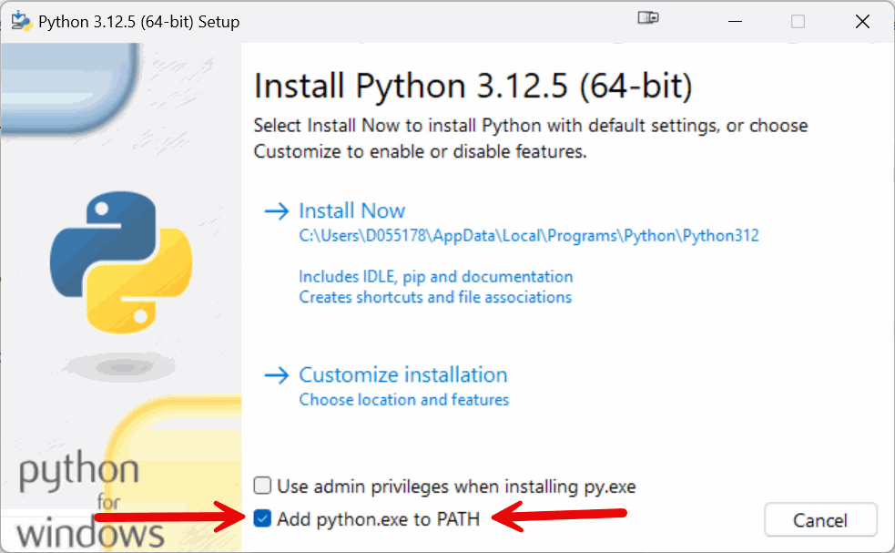

[**Python** 3.12](https://www.python.org/downloads/){target=_blank}

    Download the installer for your OS using the link above, or use brew (MacOS). Make sure to choose the version indicated above, others will not work!

    !!! warning "Windows: Python Installer PATH variables"
        The option to add Python to the path variables is deselected by default. Mark the checkbox on the first screen of the installer, before clicking `Install now`.

        {: width="55%" }