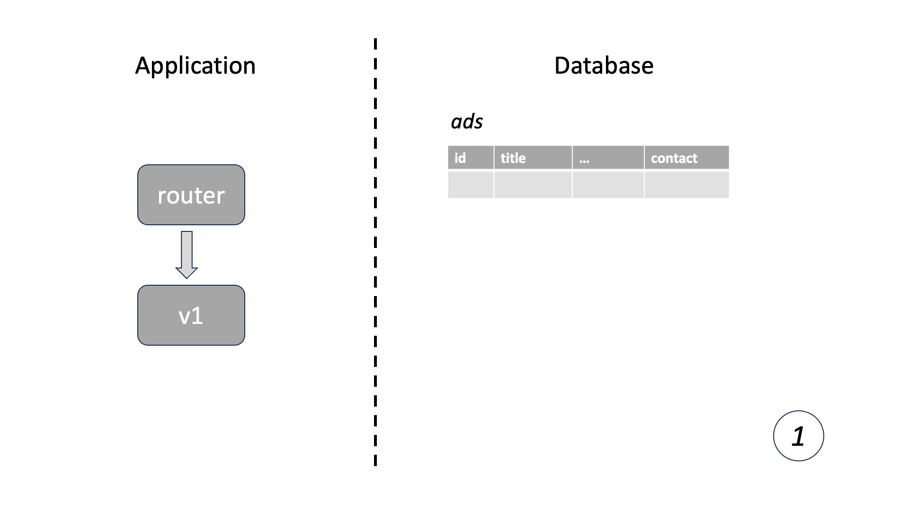
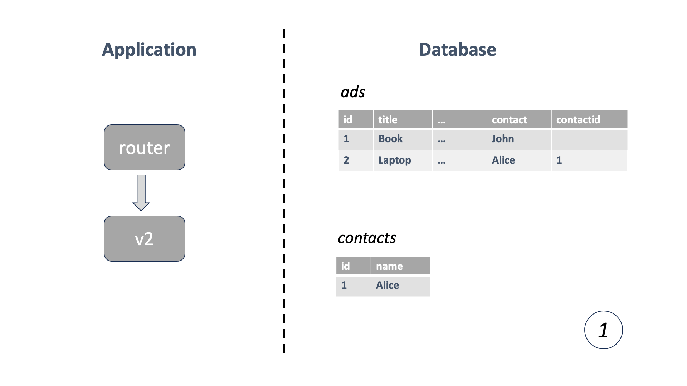
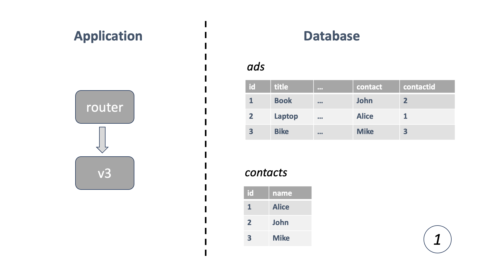
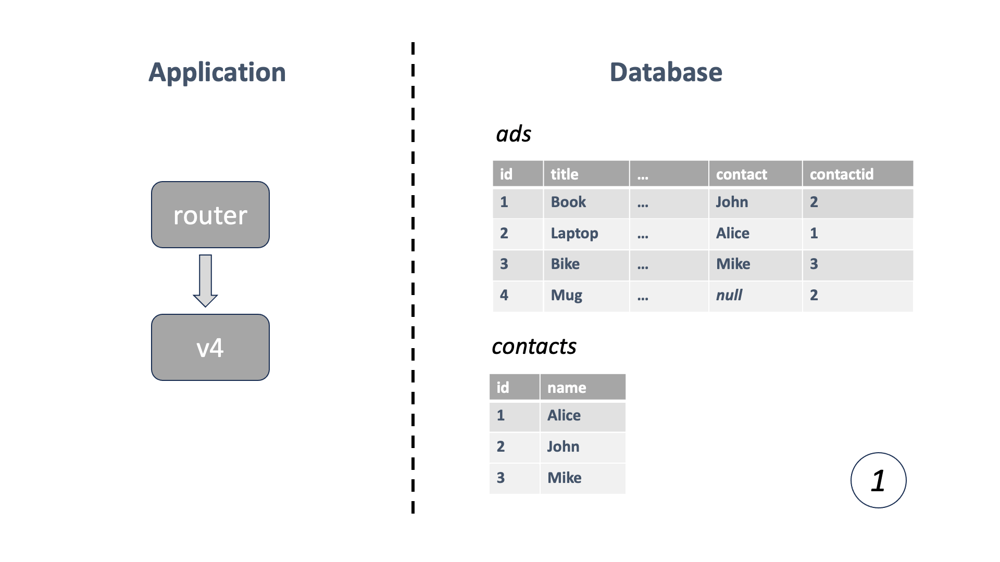

# Zero Downtime Database Migration (Cloud FoundryKubernetes + Java)

<!-- TrackingCookie-->


  




  




## 🎯 Learning Objectives

In this learning module, you will learn

- the problems mitigated by _zero downtime database migration_.
- the reasoning behind _zero downtime database migration_ and its implementation on cloud platforms.
- the factors to ponder over when it's truly necessary to proceed.

## 🤔 Wait, but why?

From time to time, you may find that the database schema you have come up with in the past, does not feel right any more and needs to be adjusted. Having learned [Zero Downtime Deployment](https://pages.github.tools.sap/cloud-curriculum/materials/all/zero-downtime-deployment/cloud-foundry-java/)(https://pages.github.tools.sap/cloud-curriculum/materials/all/zero-downtime-deployment/kubernetes-java/){target=blank}, you want to migrate the database together with your application upgrade without any outage.

But what if your database schema was changed in a _backward incompatible_ way, for example, dropping a table or renaming a column? During zero downtime deployment, both the new and old version of the application will be up and running for a moment. Will the backward incompatible database change blow up the old version? The answer is yes. Then you have to figure out how to apply a backward incompatible database change in a backward compatible way.

## 🧠 Theory

To learn about the theory, view the <a href="https://pages.github.tools.sap/cloud-curriculum/boot-restart/slides/zero-downtime-db-migration.html?showNotes=true" target="_blank">Slides</a> with notes/annotations.

## 💻 Exercise

In the following exercises you are going to change the database schema of the `bulletinboard-ads` application, and practice how to modify the source code and run database migration step by step to make the database change backward compatible.

<!-- Prerequisites-->

{% with
  tools=[
  ],
  beneficial=[
    ('[Cloud Foundry Basics](https://pages.github.tools.sap/cloud-curriculum/materials/all/cloud-platforms/cloud-foundry-java/){target=blank}')
  ],
  required=[
    ('[HTTP REST](https://pages.github.tools.sap/cloud-curriculum/materials/all/http-rest/java/){target=blank}'),
    ('[Persistence](https://pages.github.tools.sap/cloud-curriculum/materials/all/persistence/java/){target=blank}'),
    ('[Zero Downtime Deployment](https://pages.github.tools.sap/cloud-curriculum/materials/all/zero-downtime-deployment/cloud-foundry-java/){target=blank}')
  ]
%}



{% with
  tools=[
  ],
  beneficial=[
    ('[Kubernetes Basics](https://pages.github.tools.sap/cloud-curriculum/materials/all/cloud-platforms/kubernetes-java/){target=blank}')
  ],
  required=[
    ('[HTTP REST](https://pages.github.tools.sap/cloud-curriculum/materials/all/http-rest/java/){target=blank}'),
    ('[Persistence](https://pages.github.tools.sap/cloud-curriculum/materials/all/persistence/java/){target=blank}'),
    ('[Zero Downtime Deployment](https://pages.github.tools.sap/cloud-curriculum/materials/all/zero-downtime-deployment/kubernetes-java/){target=blank}')
  ]
%}




#### 🚇 Infrastructure


- A [Cloud Foundry Space](https://pages.github.tools.sap/cloud-curriculum/materials/all/cf-spaces/spaces-java/){target=blank}
- [**CF client V8**](https://github.com/cloudfoundry/cli/wiki/V8-CLI-Installation-Guide){target=_blank}

- Access to a Kubernetes Cluster

    If you don't have a cluster already, see the first step of the [Kubernetes topic](../../cloud-platforms/kubernetes-java/#1-kubernetes-cluster-access){target=_blank} to find out how to get a cluster and configure `kubectl`.


### 🚀 Getting Started















1. Start the service's database first: `./start-db.sh` (keep the window open!)

1. Then, start the application:

    
    
    
    
    

    You should be able to access the UI at [http://localhost:8080](http://localhost:8080){target=blank}
### 🔍 Code Introduction

The domain is a simple bulletinboard application. You can post something there that you want to advertise, such as a used laptop, and others can look at all the offerings and contact you if they are interested.

- `com.sap.bulletinboard.ads.models.Advertisement` holds all information related to an entity.
- `com.sap.bulletinboard.ads.models.AdvertisementRepository` is the persistence of the advertisements.
- `com.sap.bulletinboard.ads.controllers.AdvertisementController` is the HTTP API endpoint.

In the current version of database schema, the table `ads` contains a column `contact` which can only store the name of the contact. 

```
ads
+----+-------+-------+-----+---------+
| id | title | price | ... | contact |
+----+-------+-------+-----+---------+
```

In order to store more contact related information in the future, e.g. name, email, phone, etc., you will enhance the structures by adding a new table `contacts`, and link the contact from `ads` to the new table.

```
contacts
+----+------+
| id | name |
+----+------+
```


### 1 - Deploy to Cloud Foundry

In this step, you can deploy the initial version (_v1_) of the application to Cloud Foundry.

1. Open the the `manifest.yml`, and replace `<YOUR c/d/i-number>` with your actual c/d/i-number (with the letter in lowercase) for the route.

1. Create database service in Cloud Foundry (database creation may take some time, you can use `cf services` to check the status).

    ```shell
    cf create-service postgresql-db development postgres-bulletinboard-ads
    ```

1. Build and push the application.

    ```shell
    mvn package
    cf push
    ```

Navigate to the route you specified in manifest.yml (`bulletinboard-ads-<YOUR c/d/i-number>.cfapps.eu12.hana.ondemand.com`) in your web browser, for example `https://bulletinboard-ads-d123456.cfapps.eu12.hana.ondemand.com`.


### 1 - Deploy to Kubernetes

In this step, you can deploy the initial version (_v1_) of the application to Kubernetes.

#### 1.1 - Build and push the docker image

We provide a docker image registry at `cc-ms-k8s-training.common.repositories.cloud.sap`, which you can use to store your docker images for this exercise. A registry is needed, because the Kubernetes cluster cannot (and should not) pull images from your machine. To prevent overriding images pushed by other participants, we ask you to put your D/C/I number into the image name in the following instructions.

1. Notice the `Dockerfile` in the root directory of the project. Build the docker image with the following command:

    ```shell
    docker build --platform linux/amd64 -t cc-ms-k8s-training.common.repositories.cloud.sap/bulletinboard-ads-<your D/C/I number>:v1 .
    ```

    !!! warning "Insert your D/C/I number, Apple Silicon, and the build path"
        1. Replace `<your D/C/I number>` with your real D/C/I number in the above command.
        All letters in a tag must be lowercase!
        1. Don't forget the `.` at the end of the command - this tells docker to build the image based on the `Dockerfile` in the current folder. You can also specify a `Dockerfile` with a different name or in other directories [using the `-f` option](https://docs.docker.com/engine/reference/commandline/build/#file){target=_blank}
        1. The option `--platform linux/amd64` is required on Macs with Apple Silicon to make sure the image works on the remote `linux/amd64`-based Kubernetes nodes. The option is redundant for regular, `amd64` based architectures.

1. Log in to the Docker repository with following command:

    ```shell
    docker login -u "claude" -p "cmVmdGtuOjAxOjE3NzgyMjI4ODU6c2d5bGhzak9oNGRZQzRyN1JZVUx0UExwVTBO" cc-ms-k8s-training.common.repositories.cloud.sap
    ```

1. Push the built image to the registry with the following command (with your D/C/I number inserted):

    ```shell
    docker push cc-ms-k8s-training.common.repositories.cloud.sap/bulletinboard-ads-<your D/C/I number>:v1
    ```

#### 1.2 - Deploy the application

We provide Kubernetes deployment YAML files for both database and application. You can find them in the `.k8s` directory.

1. Deploy the database to Kubernetes with the following command:

    ```shell
    kubectl apply -f .k8s/1_bulletinboard-ads-db.yaml
    ```

1. Modify the file `2_bulletinboard-ads.yaml` and replace `image` with the one you pushed in the previous step, for example: `cc-ms-k8s-training.common.repositories.cloud.sap/bulletinboard-ads-<your D/C/I number>:v1`. Also replace `<SUBDOMAIN>` with the value from the [Infrastructure](#infrastructure) step.

1. Deploy the application to kubernetes with the following command:

    ```shell
    kubectl apply -f .k8s/2_bulletinboard-ads.yaml
    ```

1. Check the deployment status by `kubectl get pod,deployment,service,ingress`

Navigate to the host you specified for Ingress (`bulletinboard-ads.<SUBDOMAIN>.kyma.ondemand.com`) in your web browser, for example `https://bulletinboard-ads.<SUBDOMAIN>.kyma.ondemand.com` (replace `<SUBDOMAIN>`).



You will see the user interface of the application. Create some advertisements and see how it works.

### 2 - Change database schema

In order to deploy the new version (_v2_) of the application without breaking down _v1_ during zero downtime deployment, you should focus on `adding` database structures instead of `removing` in the first iteration.

- Create a new database table `contacts` and alter the table `ads` by adding a new column `contact_id`.
- When a new advertisement is created, _v2_ writes to both new and old database structures.
    - fill the old field `ads.contact`
    - create a new entry in the `contacts` table, and fill the new field `ads.contact_id`.
- Reading is still done from the old fields, since only the newly added advertisements have both structures filled.



#### 2.1 Database migration

Tools like [Flyway](https://flywaydb.org/){target=blank} or [Liquibase](https://www.liquibase.org/){target=blank} can help you manage database schema and data migration through different versions of schema. They automatically detect the version of the current database schema, and know which migration scripts are not yet executed. The bulletinboard application uses Flyway in the exercise.

1. Notice the file `/db/migration/V1__Init.sql` in the `/src/main/resources` folder, which defines the initial version of database schema.
1. Create a new file which follows Flyway naming convention, such as `V2__Create_contacts_table.sql` in the `/db/migration/` folder.
1. Write SQL statement to create the `contacts` table.
1. Write SQL statement to add a new column `contact_id` in the `ads` table, and link it to the id in `contacts` table.

    ??? example "Need help?"
        To keep things simple, you can just use column `id` and `name` in the new `contacts` table.
        ```sql
        CREATE TABLE contacts (
	        id BIGSERIAL PRIMARY KEY,
	        name VARCHAR(255)
        );

        ALTER TABLE ads ADD COLUMN contact_id BIGINT CONSTRAINT fk_ads_contacts REFERENCES contacts (id);
        ```

Next time bulletinboard application is started, all migrations with a version greater than the previous one will be applied against the schema.

#### 2.2 Database model

Since you changed the database schema, it is time to reflect them in the domain objects.

1. Create a new file `src/main/java/com/sap/bulletinboard/ads/models/Contact.java` which represents the `contact` entity.

    ??? example "Need help?"
        ```java
        @Entity
        @Table(name = "contacts")
        public class Contact {

            @Id
            @Column(name = "id", nullable = false, updatable = false)
            @GeneratedValue(strategy = GenerationType.IDENTITY)
            private Long id;

            @Column(name = "name")
            private String name;

            public Contact() {
            }

            public Contact(String name) {
                this.name = name;
            }

            public Contact(Long id, String name) {
                this.id = id;
                this.name = name;
            }

            // TODO: generate setters and getters
        }
        ```

1. Similar to the advertisement repository, you also have to define the contact repository which supports finding a contact by the name.

    ??? example "Need help?"
        ```java
        public interface ContactRepository extends JpaRepository<Contact, Long> {
            Contact findByName(String name);
        }
        ```       

1. Navigate to the `Advertisement` entity file `src/main/java/com/sap/bulletinboard/ads/models/Advertisement.java`.
1. Add a new field `contactInfo` and map it to the `ads.contact_id` column.

    ??? example "Need help?"
        Note that `contactInfo` should not be annotated by `@NotNull`. Why is that? During zero downtime deployment, the old version of the application will write to database without filling this field.
        ```java
        @ManyToOne
        @JoinColumn(name = "contact_id")
        private Contact contactInfo;

        // TODO: generate setter and getter
        ```

#### 2.3 Controller

When user creates a new advertisement, an HTTP `POST` request will be sent to backend and then write some data to the database.

1. Navigate to the controller class `src/main/java/com/sap/bulletinboard/ads/controllers/AdvertisementController.java`.
1. Find the `add` method annotated by `@PostMapping`.
1. Modify logic of the code. Both `ads` and `contacts` table should be updated when a new advertisement is created.

    ??? example "Need help?"
        You probably notice that it is better to add the contact info in the DTO class `AdvertisementDto` at first.
        ```java
        public ContactInfo contactInfo = new ContactInfo();

        public static class ContactInfo {
            public Long id;
            public String name;
        }
        ```
        When a new advertisement is created, find the contact id from `contact` table; if contact does not exist yet, create a new record. Then insert the `ads` table with the original advertisement information together with the contact id.
        ```java
    	Contact contact = contactRepository.findByName(advertisement.contact);
    	if (contact == null) {
    		contact = contactRepository.save(new Contact(advertisement.contact));
    	}
		advertisement.contactInfo.id = contact.getId();
		advertisement.contactInfo.name = contact.getName();
        ```
        Then persist the contact info in the `dtoToEntity` method.
        ```
        ad.setContactInfo(new Contact(dto.contactInfo.id, dto.contactInfo.name));
        ```

1. Use the same logic to modify the `update` method annotated by `@PutMapping`.

#### 2.4 Deploy

Deploy the new version of the application to Cloud Foundry without interrupting user's access.

1. Build the new version with `mvn package`.
1. Deploy to Cloud Foundry (`cf push`) with parameter `--strategy rolling`.

Navigate to the url `https://bulletinboard-ads-<YOUR c/d/i-number>.cfapps.eu12.hana.ondemand.com` in your web browser. Verify the behavior of the new version.


Build the new version of the docker image and deploy to Kubernetes.

1. Build the docker image `v2` with the following command:

    ```shell
    docker build --platform linux/amd64 -t cc-ms-k8s-training.common.repositories.cloud.sap/bulletinboard-ads-<your D/C/I number>:v2 .
    ```

1. Push the built image to the registry with the following command (with your D/C/I number inserted):

    ```shell
    docker push cc-ms-k8s-training.common.repositories.cloud.sap/bulletinboard-ads-<your D/C/I number>:v2
    ```

1. Update the image in Kubernetes with the following command:

    ```shell
    kubectl set image deployments/bulletinboard-ads cc-ms-k8s-training.common.repositories.cloud.sap/bulletinboard-ads-<your D/C/I number>:v2
    ```

1. Run command `kubectl get pods` and check the Pod status.

Navigate to the url `https://bulletinboard-ads.<SUBDOMAIN>.kyma.ondemand.com` in your web browser. Verify the behavior of the new version.


### 3 - Database migration

All data will be saved to the new database structure from this point. You can start considering how to migrate the data from the old structure to the new one.

In a traditional development team, maybe a database administrator is required to run some scripts directly against the database. But since you have access to the production environment, you can do it yourself with some changes in your application's source code.

This time you will kick off another round of zero downtime deployment. The new version of the application (_v3_) is almost identical to the previous one (_v2_). The only difference is that _v3_ contains the database migration scripts defined in Flyway. When _v3_ starts up, Flyway scripts will be executed automatically.



#### 3.1 Create migration scripts

1. Create a new SQL file in the `src/main/resources/db/migration/` folder.
1. Write SQL statement to add all the missing contacts in the `contacts` table.
1. Write SQL statement to update `ads` table with the contact id from `contacts` table.

    ??? example "Need help?"
        You can create a new file `V3__Migration_data.sql`.
        ```sql
        INSERT INTO contacts (name)
        SELECT DISTINCT(contact) FROM ads 
        WHERE contact_id IS NULL 
        AND NOT EXISTS (SELECT name FROM contacts WHERE contacts.name = ads.contact);

        UPDATE ads 
        SET contact_id = (SELECT id FROM contacts WHERE contacts.name = ads.contact)
        WHERE ads.contact_id IS null 
        AND EXISTS (SELECT 1 FROM contacts WHERE contacts.name = ads.contact);
        ```

#### 3.2 Deploy


Deploy the new version of the application to Cloud Foundry without interrupting user's access.

1. Build the new version with `mvn package`.
1. Deploy to Cloud Foundry (`cf push`) with parameter `--strategy rolling`.

Navigate to the url `https://bulletinboard-ads-<YOUR c/d/i-number>.cfapps.eu12.hana.ondemand.com` in your web browser. Verify the behavior of the new version.


Build the new version of the docker image and deploy to Kubernetes.

1. Build the docker image `v3` with the following command:

    ```shell
    docker build --platform linux/amd64 -t cc-ms-k8s-training.common.repositories.cloud.sap/bulletinboard-ads-<your D/C/I number>:v3 .
    ```

1. Push the built image to the registry with the following command (with your D/C/I number inserted):

    ```shell
    docker push cc-ms-k8s-training.common.repositories.cloud.sap/bulletinboard-ads-<your D/C/I number>:v3
    ```

1. Update the image in Kubernetes with the following command:

    ```shell
    kubectl set image deployments/bulletinboard-ads cc-ms-k8s-training.common.repositories.cloud.sap/bulletinboard-ads-<your D/C/I number>:v3
    ```

1. Run command `kubectl get pods` and check the Pod status.

Navigate to the url `https://bulletinboard-ads.<SUBDOMAIN>.kyma.ondemand.com` in your web browser. Verify the behavior of the new version.


### 4 - Remove dependency on the old structure

The data is now consistent across `ads` and `contacts` tables. But the old structure `ads.contact` is still being used by both HTTP `READ` and `POST` methods. You need to prepare a new version (_v4_) to remove the dependency on the old structure.



#### 4.1 Database model

1. Navigate to the file `src/main/java/com/sap/bulletinboard/ads/models/Advertisement.java`.
2. Comment out the `@NotBlank` annotation to the field `contact`.

    ??? question "Why not remove `contact` directly?"
        Notice that during zero downtime deployment, the previous version of the application still requires this field to persist the data. On the other hand, the new version removes the dependency on it, so this field could be set to `null`.

#### 4.2 Controller

1. Navigate to the file `src/main/java/com/sap/bulletinboard/ads/controllers/AdvertisementController.java`.
2. Remove the dependency of `contact` in the methods `entityToDto` and `dtoToEntity`.

    ??? example "Need help?"
        You can comment out the line `ad.setContact(dto.contact);` in the `dtoToEntity` method, so `contact` column will be set to `null`.
        
        In the `entityToDto` method, replace `dto.contact = ad.getContact();` with `dto.contact = ad.getContactInfo().getName();`. The contact name will be retrieved from the `contacts` table.

#### 4.3 Deploy


Deploy the new version of the application to Cloud Foundry without interrupting user's access.

1. Build the new version with `mvn package`.
1. Deploy to Cloud Foundry (`cf push`) with parameter `--strategy rolling`.

Navigate to the url `https://bulletinboard-ads-<YOUR c/d/i-number>.cfapps.eu12.hana.ondemand.com` in your web browser. Verify the behavior of the new version.


Build the new version of the docker image and deploy to Kubernetes.

1. Build the docker image `v4` with the following command:

    ```shell
    docker build --platform linux/amd64 -t cc-ms-k8s-training.common.repositories.cloud.sap/bulletinboard-ads-<your D/C/I number>:v4 .
    ```

1. Push the built image to the registry with the following command (with your D/C/I number inserted):

    ```shell
    docker push cc-ms-k8s-training.common.repositories.cloud.sap/bulletinboard-ads-<your D/C/I number>:v4
    ```

1. Update the image in Kubernetes with the following command:

    ```shell
    kubectl set image deployments/bulletinboard-ads cc-ms-k8s-training.common.repositories.cloud.sap/bulletinboard-ads-<your D/C/I number>:v4
    ```

1. Run command `kubectl get pods` and check the Pod status.

Navigate to the url `https://bulletinboard-ads.<SUBDOMAIN>.kyma.ondemand.com` in your web browser. Verify the behavior of the new version.


### 5 - Clean up

The old field `ads.contact` is not used any more. You can consider doing some clean-ups.



1. Create a new Flyway file to drop the column.
1. Remove the field `contact` from the `Advertisement` entity.
1. Deploy the new version with zero downtime.

### 6 - Stretch goals 🦄 

1. Try to remove `contact` from `AdvertisementDto`. But pay attention that the DTO object is used by front-end. You also have to consider how to change the front-end scripts in the `src/main/resources/static` folder.

1. The test cases remain unchanged. Review them and check if you have to add or remove some of them to reflect the changes in both code and database structure.

### 7 - Reflection 🪞

You've come that far - good job. Probably noticed a few caveats that we haven't talked about. Let's reflect about it to become an even better cloud engineer!

??? question "What makes zero-downtime migrations harder?"
    In real world applications, maybe you have less control over the way you interact with the database, especially when it comes to the database schema, it can be challenging.

    - One reason why you have less control can be heavyweight or rigid frameworks and technology.
    - Another reason can be "process" - in particular if the database schema is not "owned" by the dev team responsible for the service, but by a central ops team.
    - Last, not least, if the database is shared and used by other teams/services as well, your options might also be very limited - this often indicates a tight coupling though.

??? question "What are pros and cons of a zero-downtime migration from the team and from the business perspective?"
    - Often, migrations with a downtime are critical and create a lot of stress - if there is an issue or they fail, time to recover is very limited and often during the weekend. A whole release's effort can be ruined, we have witnessed migrations failing during the release downtime and needed to be reverted entirely, cause the problem could not be fixed quick enough.
    - From the business perspective - a downtime is a risk at least and potentially lost customers and money in the worst case. On the other hand, the overall effort of a zero-downtime migration might be higher, especially if the team is not skilled to it. So it is not as simple as "always do it" or "never do it". It is a good advice to practice such a migration in less critical cases to gain experience with the related tools and the engineering discipline.

## 🙌 Congratulations! Submit your solution.













## 🏁 Summary

Good job!

In this module, you have learned how to apply the concept of Zero Downtime Database Migration in a real world scenario. You changed the source code as well as the database schema and deployed the application to cloud platforms. You also understood the trade-offs and considerations before you implement the concept in your own project.

## 📚 Recommended Reading

- [Zero Downtime Deployment with a Database](https://spring.io/blog/2016/05/31/zero-downtime-deployment-with-a-database){target=blank}
- [Performing a Zero-Downtime-Migration - Hands On](https://github.wdf.sap.corp/cloud-native-dev/java-persistence/tree/master/ZeroDownTime){target=blank}
- [Liquibase](https://www.liquibase.org/){target=blank}
- [Flyway](https://flywaydb.org/){target=blank}

## 🔗 Related Topics

- Zero Downtime Deployment: [Cloud Foundry](https://pages.github.tools.sap/cloud-curriculum/materials/all/zero-downtime-deployment/cloud-foundry-java/){target=_blank} | [Kubernetes](https://pages.github.tools.sap/cloud-curriculum/materials/all/zero-downtime-deployment/kubernetes-java/){target=_blank}