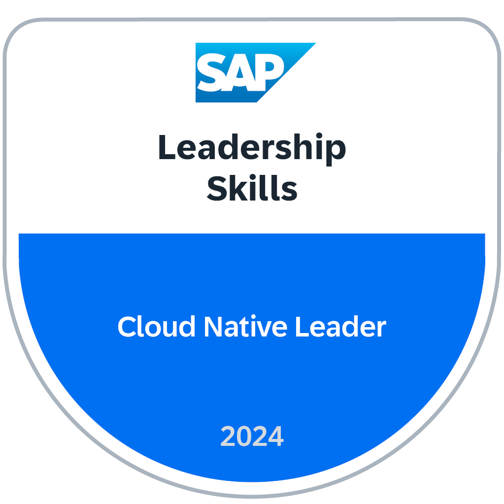

# Welcome



## What Can I Find Here?

As a leader you will find a learning journey that helps you to better understand principles and concepts how to built cloud native products. The main ingredients are

- Software Crafts(wo-)manship
- Cloud Fundamentals
- Cloud Native & DevOps

## Navigation, Content & Prerequisites

This learning journey requires you also to do some basic technical exercises. You can choose between ***Java***, ***Node.js*** and ***Python***.

Please ensure you meet the technical prerequisites either with a local setup or with BTP Business Application Studio. In addition, you need to know language and stack basics before you start with the content.

## Earn Your Badge

We offer this course also as (virtual) classroom. Feel free to register for a [virtual classroom training](https://performancemanager5.successfactors.eu/sf/learning?destUrl=https%3a%2f%2fsap%2eplateau%2ecom%2flearning%2fuser%2fdeeplink%5fredirect%2ejsp%3flinkId%3dITEM%5fDETAILS%26componentID%3dDEV%5f00004851%5fILT%26componentTypeID%3dCOURSE%26revisionDate%3d1705588122000%26fromSF%3dY&company=SAP){target=_blank}. Then you can earn a [Cloud Native Leader Badge](https://www.credly.com/org/sap/badge/leadership-skills-2024-cloud-native-leader){target=\_blank}:

You can run as self-learner as well, in this case we cannot provide a badge because an exchange with peers, reflections and homework sharing is missing in your learning experience.

_Happy learning!_
