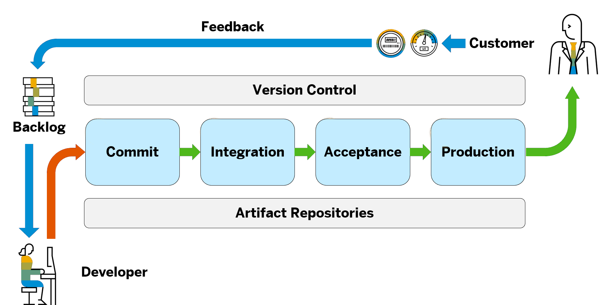
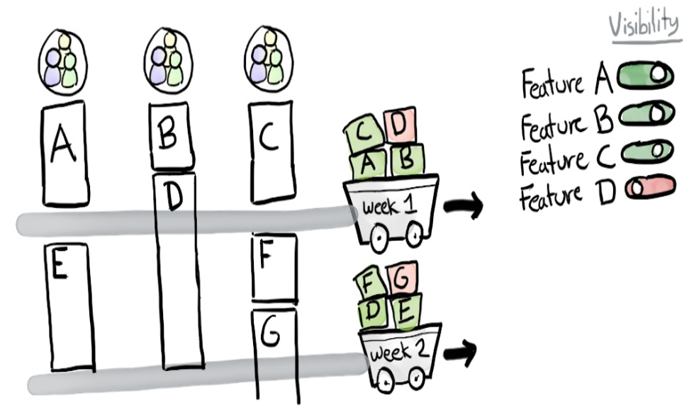

<!-- .slide: data-background-image="/EngineeringCulture/ase/AllLanguages/continuousIntegration-slides/images/TitleImage.jpg" data-background-opacity="0.4" -->

# Continuous Delivery

------

## Motivation

- agile aspect of delivering working software frequently
- deployments usually come with a lot of pain
  - "big bang" deployments
  - error-prone and stressful manual process
  - slower time to market

**How can we improve the deployment process, to enable more frequent deployments?**

➜ **Continuous Integration/Delivery/Deployment**

Notes:

- agile methods recommend to deliver prototypes frequently to demo recent changes/features in order to obtain early user feedback
  - after every sprint (development cycle): product review
  - incorporate feedback in next sprint

- the technique of delivering frequently, fixing bugs fast etc. is a requirement for agile development

- deployments
  - "big bang": changes have accumulated over time, making it harder to merge them in the already existing code base
  - error-prone: the more changes you want to bring to prod, the higher is the risk for errors
  - stressful: usually system changes have to be done on weekends (limited timeframe)
  - a change which is not delivered means that no value or benefit is created. The longer you wait, the more potential value or benefit is lost.

- theoretically, you could establish CI/CD without working in an agile mode. On the other hand, having an agile setup without the technical CI/CD environment set up can become painful in the long run

------

## Continuous What?

- **Continuous Integration (CI)**
  - Members of a team integrate their work frequently
  - Each integration is verified by automated build (including test)
- **Continuous Delivery**
  - Build software in such a way that it *can* be released to production at any time
- **Continuous Deployment**
  - Any commit that passes the automated tests is *automatically* released to production

Notes:

- These terms have a lot in common and are easy to mix up, so here's some clarification
- CI is a pre-condition for Continuous Delivery
- Continuous Deployment takes Continuous Delivery a step further:
  - There's no human intervention and only a failed test will prevent a new change to be deployed to production
  - The quality of your test suite determines the quality of your releases
- Continuous Delivery explanation is a quote from [Martin Fowler](https://martinfowler.com/bliki/ContinuousDelivery.html)<!-- .element target="_blank" -->

- [Further reading](https://www.atlassian.com/continuous-delivery/principles/continuous-integration-vs-delivery-vs-deployment)<!-- .element target="_blank" -->

------

## If It Hurts, Do It More Often

🔗 Source: [Martin Fowler, FrequencyReducesDifficulty](https://martinfowler.com/bliki/FrequencyReducesDifficulty.html)<!-- .element target="_blank" -->

Notes:

- The bigger the time between an activity (such as integration), the bigger the pain
- What is causing this effect?
    1. Tasks become more difficult as the amount increases
    1. Feedback.
    1. Practice and automation.
- Releases become more difficult and impose more risk as the amount of changes increases.
- Shorter feedback loops allow you to make course corrections earlier.
- With any activity we improve as we do it more often. With software there's also the potential for automation.

------

## Benefits of Continuous Delivery

- Reduced Deployment Risk
- Faster Time To Market
- User Feedback
- Lower Costs
- Happier Teams

Notes:

- Reduced Deployment Risk: since the deployed changes are smaller, there's less to go wrong and it's easier to fix a problem if one appears
- Faster Time To Market: traditional phased software delivery consumes up weeks or months. Automating these processes saves you the time and avoids re-work in the phased approach
- User Feedback: the earlier and more frequently you get your software to production the quicker you get feedback to find out how valuable the software is to the customer
- Lower Costs: by investing in build, test, deployment and environment automation, the fixed costs associated with the release process are eliminated
- Happier teams:
  - CD makes releases less painful and reduces stress
  - Product Owners only have to wait e.g. 2 weeks instead of a whole release cycle if something is late => less pressure
  - Developers get early feedback on the features they developed. This is helpful to understand if the features are valuable. Positive feedback can be fulfilling.

------

## Principles & Methods

- **Create a repeatable, reliable process for releasing software (to production)**
- Team is responsible for the delivery process
- If it hurts, do it more frequently, and bring the pain forward
- Automate (almost) everything
- Keep everything in version control
- Build only once
- Done means released (to production)

Notes:

- Create a repeatable, reliable process for releasing software (to production)
  - the aim of CD
  - it should be as simple as pressing a button
    - repeatability and reliability derive from "automate almost everything" and "keep everything in version control" principles
- Team is responsible for the delivery process:
  - in the traditional model you develop the software and "throw it over the wall" to the operations
  - the principle refers to the idea that developers should be involved in the day-to-day operation of their SW-system
  - this brings them into day-to-day contact with the customer which enables an essential feedback loop for improving the quality of the SW
- If it hurts, do it more frequently, and bring the pain forward
  - identify the painful tasks in your process and do them as early and frequently as possible
  - examples could be:
    - integrating new code changes
    - testing the software before release
    - releasing the software to real users, if not applicable to prod-like environment
    - creating application documentation
  - also keep an eye on those tasks to figure out if they can be automated
- Automate (almost) everything:
  - In most cases the list of things that cannot be automated is smaller than the list of things that can be automated
  - automate your build and deployment processes up to the point where it needs specific human direction or decision making
  - don't try to automate all at once. pick the bottleneck of your process and start automating there
- Keep everything in version control:
  - everything you need to build, deploy, test and release the app should be in VCS
  - new team members should be able to checkout the project from VCS and run a single command to build and deploy the app
  - the relevant version should be identifiable for any given build so that in case of failure the source of the failure can be recreated for analyze
- Build only once:
  - do not build artifacts multiple times during a pipeline, rather build them once and store them (artifact repository) for subsequent testing.
- Done means released (to production):
  - a feature is only done when it is delivering value to users (ideal situation/dod)
  - this measure of done is sometimes not practicable e.g. initial release of a SW-system
  - next best option: it's done when it's successfully been showcased (demonstrated and tried by representatives of user community from a production-like environment)

------

## Deployment Pipeline

 <!-- .element class="img-l" -->

Notes:

- The Deployment Pipeline contains a set of Stages:
  - Each stage consists of several steps where different kinds of tests and checks are performed.
  - Commit Stage as central entry stage. Typically contains build, unit tests and static code check steps.
  - Other typical stages: Integration, Acceptance, Performance, Production Deployment
  - Each stage contains a higher level of tests: Unit -> Integration -> Sytem and Scenario tests.
  - Stages are connected via trigger (automatic or manual)
  - Stages contain a set of Jobs ("Unit of Work")
- Built artifacts are stored in the artifact repository every stage has access to
  - Recall "build once"
  - Reproducible builds

------

## Deployment Pipeline Stages

- Only one codeline (main)!
- Provides feedback on each (!) change
- Fix bugs through mainline
- "[Nobody has a higher priority task than fixing the build](https://www.martinfowler.com/articles/continuousIntegration.html#FixBrokenBuildsImmediately)<!-- .element target="_blank" -->" - Kent Beck

Notes:

- The previously shown stages are mere examples. In your projects the amount of stages and their names may be different
- the order of the stages should adhere to the pictured aspects
- Jobs in stages further to the left generally run faster and therefore provide feedback to the developers faster on whether they ran successfully or not
- The environment for the jobs become more and more production like towards the right, e.g.
  - The stage that runs end-to-end tests would be located to the right of the stage that runs the unit tests
- The further the build has progressed (towards the right) the more confidence we have in its production readiness
  - Therefore we are willing to spend more resources on it, which allows the test environments become increasingly production like
- The quote does not mean that everyone on the team has to stop what they are doing in order to fix the build, but it does mean a conscious prioritization of a build fix as an urgent, high priority task. [learn more](https://www.martinfowler.com/articles/continuousIntegration.html)<!-- .element target="_blank" -->

------

## Deployment Pipeline Failures

"Stop the line"

Notes:

- Each change has to go through all stages of the pipeline until a failure occurs or the end is reached
- The pipeline can not be resumed after a failure. The fix needs to go through all stages as well.
- In the pictured scenario the manual trigger of the production stage is pending for v1.2

------

## CI/CD Tools

- [GitHub Actions](https://docs.github.com/en/actions)<!-- .element target="_blank" -->: CI/CD tooling integrated in GitHub.
- [Jenkins](https://www.jenkins.io)<!-- .element target="_blank" -->: Open source, lots of plugins, runs on any machine with JRE.  
Also available as docker image or
- [Jenkins as a Service (JaaS)](https://pages.github.tools.sap/hyperspace/jaas-documentation/)
- [Azure DevOps](https://azure.microsoft.com/de-de/services/devops/#overview)<!-- .element target="_blank" -->: Microsoft tool, integrated with source code management,  
artifact repositories and planning tools.
- [GitLab CI/CD](https://docs.gitlab.com/ee/ci/)<!-- .element target="_blank" -->: Directly integrated in GitLab workflow.
- Circle CI, GoCD, ...

### Project Piper

 <!-- .element class="img-s float-right" -->

- Shared library that provides coded best practices for CI/CD​
- Provides pipeline templates for different languages​
- Centrally maintained as [inner source](https://github.wdf.sap.corp/pages/ContinuousDelivery/piper-doc/)<!-- .element target="_blank" --> and [open source](https://www.project-piper.io)<!-- .element target="_blank" -->
- Custom Docker images for use on JaaS

------
<!-- .slide: data-tags="!ui5" --->

## Deployment ≠ Release

- New features can be put in production without the users noticing it.
- Can be achieved via feature toggles.

Notes:

- features can be be deployed but you just can't see it yet

------
<!-- .slide: data-tags="!ui5" --->

## Feature Toggles

🔗 Source: [Spotify, engineering culture](https://labs.spotify.com/2014/03/27/spotify-engineering-culture-part-1/)<!-- .element target="_blank" -->

Notes:

- also known as "feature flags", "feature switches", "release toggles"
- a mechanism that allows code to be turned on or off during runtime without the need to redeploy
- in the release of week 1, features A, B and C are done, while D is still in progress
  - the deployment will contain all four features but the unfinished one is hidden using a feature toggle
- expose integration problems early
- minimize the need for code branches (unmerged code hides problems)
- use feature toggles
  - on features that take a long time to get developed
  - to reduce load by disabling expensive features
  - for canary releases (releasing software to a small percentage of users for validation)

------
<!-- .slide: data-tags="!ui5" --->

## Feature Toggles Further Reading

- Cloud Native Bootcamp: [release-toggles](https://pages.github.tools.sap/cloud-curriculum/boot-restart/challenges/release-toggles/)<!-- .element target="_blank" -->
- Hands-on exercise: [Java + Cloud Foundry](https://pages.github.tools.sap/cloud-curriculum/materials/all/release-toggles/cloud-foundry-java/)<!-- .element target="_blank" -->
- Hands-on exercise: [Java + Kubernetes](https://pages.github.tools.sap/cloud-curriculum/materials/all/release-toggles/kubernetes-java/)<!-- .element target="_blank" -->
- Hands-on exercise: [NodeJS + Cloud Foundry](https://pages.github.tools.sap/cloud-curriculum/materials/all/release-toggles/cloud-foundry-nodejs/)<!-- .element target="_blank" -->
- Hands-on exercise: [NodeJS + Kubernetes](https://pages.github.tools.sap/cloud-curriculum/materials/all/release-toggles/kubernetes-nodejs/)<!-- .element target="_blank" -->

------
<!-- .slide: data-background-image="/EngineeringCulture/ase/assets/questions.jpg" data-background-opacity="0.4" -->

## Questions?
