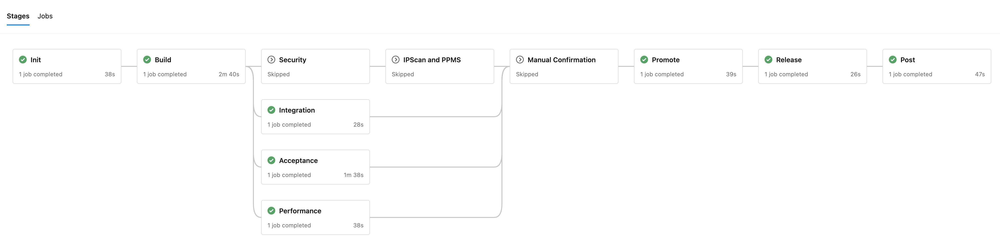

<!-- .slide: data-background-image="/EngineeringCulture/ase/AllLanguages/continuousIntegration-slides/images/TitleImage.jpg" data-background-opacity="0.4" -->

# Hyperspace and Azure Pipelines

---

## CI/CD Pipeline Challenges

- Infrastructure Cost
- CI/CD Expertise
- Product Standards
- Tools and Services

Notes:

Consider the followings tasks if teams would like to start CI/CD pipeline themselves:
- Infrastructure - JaaS vs. Azure
- CI/CD Expertise
  - Pipeline basic script syntax - Jenkins or Azure Pipelines
  - Job orchestration
  - Connection to different systems/services
- [Product Standards](https://wiki.one.int.sap/wiki/display/productstandards)<!-- .element target="_blank" -->. Some examples:
  - FC-1: Coding Rules - static code scan
  - FC-2: Test of new Requirements (Traceability) 
  - SLC-29: Productive Build Pipeline
  - Security: SAST (Static application security testing)
  - Licensing: Intellectual Property (IP) Scan
- Tools and Services at SAP. [Hyperspace Onboarding](https://hyperspace.tools.sap/home)<!-- .element target="_blank" --> lists 57 tools and services which are widely used in development. Some examples:
  - Static Code Checks: SonarQube
  - Security Testing: Fortify, Checkmarx
  - Open Source Security: Mend, BlackDuck
  - Compliance: PPMS, Cumulus
  - Deploy: Cloud Foundry, Kubernetes

Conclusion:
- Creating a productive CI/CD pipeline which meets SAP release criteria is not easy
- Learning curve is high
- If every team invests in the topic individually, consider the total amount of cost SAP spends
- Quick start and adoption is preferred

---

## Hyperspace Onboarding

- Pipeline creation with pre-defined templates
- Step by step wizards to complete the configuration
- Recommendations of tools and services at SAP
- Integration with the release system (Sirius)

Notes:

- [**Hyperspace**](https://sap.sharepoint.com/sites/124706)<!-- .element target="_blank" --> is SAP’s internal CI/CD (Continuous Integration / Continuous Delivery) platform
- [**Hyperspace Onboarding**](https://hyperspace.tools.sap/home)<!-- .element target="_blank" --> is one of the offerings from Hyperspace to help dev team create pipeline step by step

---

### Piper General Purpose Pipeline



Notes:

- Hyperspace Onboarding creates pipeline from Piper general purpose pipeline templates which fit most end-to-end development scenario
- The pipeline comprises a set of pre-defined stages, e.g.  Init, Build, Security, etc.

---

## Piper 

- Ready-made Pipelines
- Shared Library
- Configuration over Scripting

Notes:

- [Piper](https://github.wdf.sap.corp/pages/ContinuousDelivery/piper-doc/)<!-- .element target="_blank" -->
- Centrally maintained as [inner source](https://github.wdf.sap.corp/pages/ContinuousDelivery/piper-doc/)<!-- .element target="_blank" --> and [open source](https://www.project-piper.io)<!-- .element target="_blank" -->

---

## Piper

Script file: _azure-pipelines.yml_

```
trigger:
  - main

schedules:
  - cron: "0 6 * * *"

resources:
  repositories:
  - repository: piper-pipeline-azure
    endpoint: github.tools.sap
    type: githubenterprise
    name: project-piper/piper-pipeline-azure

extends:
  template: sap-piper-pipeline.yml@piper-pipeline-azure
```

Notes:

- Piper general purpose pipeline for Azure contains two files:
  - Script file: _azure-pipelines.yml_
  - Configuration file: _.pipeline/config.yml_
- After you complete the the step-by-step wizard in Hyperspace Onboarding, these two files will be committed to your GitHub repository as Pull Requests

---

## Piper

Configuration file: _.pipeline/config.yml_

```
general:
  buildTool: 'maven'
  productiveBranch: 'master'
  pipelineOptimization: true
  repository: '<your_github_repos>'
  owner: '<your_github_org>'
  vaultPath: 'piper/PIPELINE-GROUP-3774'
  ...
stages:
  Security:
    fortifyExecuteScan: true
  Acceptance:
    cfApiEndpoint: https://api.cf.eu12.hana.ondemand.com
    cfOrg: <cf_org>
    cfSpace: <cf_space>
  Release:
    ...
steps:
  sonarExecuteScan:
    serverUrl: 'https://sonar.tools.sap'
    sonarVaultSecretName: '<sonar_secret>'
  ...
```

Notes:

After Hyperspace Onboarding, you can modify it by yourself if something changes in the future, e.g. a new Cloud Foundry account

---

## Questions?
