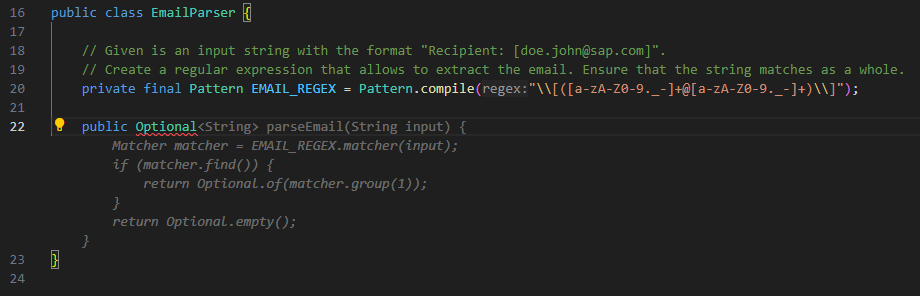

# GenAI Tooling

---

### LLM Offerings

Notes:

- SAP AI Launchpad: Grants access to everyone in SAP to experience, and benefit from pre-validated LLMs, such as GPT-35-Turbo, GPT-4, Falcon-40B-instruct. Note: LLM's are stateless, i.e., they do not remember interaction unless the history is included in the subsequent prompt.
- GitHub Copilot: Is a real copilot integrated into your IDE (VS code and IntelliJ) which makes test or code suggestions. SAP will rollout GitHub Copilot between October 2023 and June 2024. We are currently working with IT to enable all learners to access Copilot in their IDE
- GitHub Copilot Chat: Also integrated into your IDE (VS code only right now), Copilot chat can help understand code or make proposals. Right now Copilot chat is only available for early adopters but will be rolled out end 2023/start 2024 for a broader audience.
- SAP Digital Assistant: This service provides an interactive experience that echoes the functionality of ChatGPT. It uses the GPT4 model provided by the Azure OpenAI Service Proxy.

---

### Reasonable Use Cases

- Create code **snippets** (e.g. boilerplate, stubs, templates, naming things)
- Build on existing code (TDD, unit tests, refactoring)
- Explain existing code
- Convert data from one format to another (e.g. json to csv)
- Create Developer Documentation
- Help you learn (a new programming language, new technologies, etc.)

Notes:

Create code snippets (e.g. boilerplate, stubs, templates)
 - E.g. GitHub Copilot autocomplete, once you start typing
 - Create class stubs based on name or general structure in the project
 - Create deployment file examples (manifest.yml for CF or app.yml for K8s)
 - GitHub Copilot loves patterns! Writing regex, cron patterns, date formatting, CSS, SQL
 - You can also use Copilot to find an appropriate name for a file, class, object, function, method, etc.

Build on existing code
 - Generate new test cases based on the test case description/name
 - Generate tests based on existing code
 - Create missing production code based on test
 - Refactoring: Simple use cases only!
 - **Caution**: See slide "Use with caution"

Explaining existing code
 - GitHub Copilot loves patterns! Great for explaining cryptic stuff like regex, cron patterns, etc.

Documentation
 - Use with caution. Make sure the documentation provides extra value

Help you learn
- You need to make a deliberate effort to use Copilot as a learning tool/partner
- Copilot can help to lower the entry barrier to new technologies, topics, etc.
- Just prompting + Copy & Paste does not really help to understand new concepts

---

### How to use GitHub Copilot

- Start typing code, wait for auto-complete suggestion
- Write a prompt in the form of a comment
- Interact with GitHub Copilot chat, applying prompt engineering techniques
- Give Copilot time to adjust to your coding style and code base

Notes:

Auto-complete suggestion
- Start typing (code) to nudge Copilot is commonly referred to as using "leading words"
- Also known as 'Ghost Text'
- Have relevant tabs open to set a broader context for Copilot
- Give Copilot "time to think"

Comment
- E.g.: // The following method calculates the salary of an employee of type FULL_TIME
- Stick to 3 'S'
  - Single (responsibility) (one instruction)
  - Specific (prompt)
  - Short (response)
- As an alternative to Copilot Chat (if not available or for IntelliJ users)
  - Ask questions in a chat-like format using a comment followed by q:  
    // q: What does SOLID stand for in OO programming?  
  - Copilot will auto-complete with another comment containing the answer  
    // a: Single responsibility, Open-closed, Liskov substitution, Interface segregation and Dependency inversion  
  - To receive an answer, you may need to nudge Copilot by writing // a:
  - Note that the results will not be nearly as good as via "native" Copilot Chat, as the Copilot LLM is optimized for proposing and generating code, not for having conversations with humans.

Chat
- If available, no GA planned for SAP at the moment
- Use prompt engineering techniques 
  - Be specific and precise
  - Setting a context and role
  - One-Shot/Few-Shot prompting
  - Set Restrictions and boundaries
  - Use the LLM itself to refine the prompt

---

### Examples

<!-- .element data-tags="java" -->

<!-- .element data-tags="typescript" -->

Notes:

The screenshot shows two examples of how to nudge Copilot to produce usable output
- Prompt engineering via comments
  - This involves providing specific instructions or hints to Copilot through comments
  - In the screenshot, the result is a regular expression as shown

- Leading text 
  - By starting to type code and giving Copilot some 'time to think'
  - In the screenshot, an autocomplete suggestion by Copilot looks promising

---

### Use with Caution

- Hallucinations
- Not answering the question
- Inconsistent answers
- Returning an incorrect solution / code
- Providing a sub-optimal solution / code

Notes:

Hallucinations
- Hallucinations: when asked about information, instead of giving an answer like "no information available", LLMs tend to make up (missing) data
- Depending on the training data, the LLM has no access to newer/more current information and tends to hallucinate answers
- Hallucinations are sometimes difficult to identify as they can be very convincing

Not Answering
- It all depends on how an LLM is asked, the more specific the better

Inconsistent Answers
- Due to the seemingly non-deterministic behavior of LLMs, the same prompt, especially if formulated ambiguously, can lead to different answers

Incorrect Code
- An LLM is not a compiler -> no guarantee that code is syntactically correct
- Even if the syntax is ok, the semantics might not match, due to lack of context or an ambiguously formulated prompt
- Usage of deprecated libraries or APIs (data model of an LLM is not up to date)
- Do not let Copilot code everything

Sub-optimal Code
- Sub-optimal = non-clean code, performance issues, security issues, etc.
- LLMs, and Copilot specifically, dip into their training data to find a solution matching the specified requirements
  -> That means when the training data contained sub-optimal code, that code (or part of it) can make it into a prompt suggestion

---

### What affects suggestions?

- Cutoff date for the LLM's training data
- Context of your IDE
- The domain you ask your question in

Notes:

Cutoff date
- Most LLMs do not operate on up to date data

Context of IDE
- Copilot specific
- The more relevant tabs the better -> allows Copilot 'in context' learning

Domain
- E.g. less ABAP code available in training data, thus ABAP suggestions more limited

---

### Key Takeaways

- **Trust But Verify!**
- Context is everything
- It's not a magic silver bullet
- Iterate, iterate, iterate!

Notes:

Trust but verify
- Depending on which LLM (or even LLM version) is used, the outcome can be quite different, even for the same prompt
- Hallucinations are a thing, an LLM will gladly make up answers; it all depends on the available data
- The answer of an LLM can be very convincing; LLMs answer very confidently

Context is everything
- Providing context in form of source code, or other examples enables 'in context learning'
- Be precise in formulating your prompt

Iterate, iterate, iterate!
- Most of the time the first answer isn't quite what you were looking for
- Use the previous answer as input to refine the prompt

---

# Questions?
