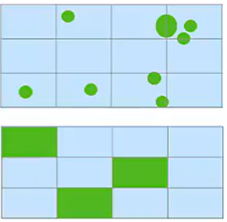

# Legacy Code

---

## What is "Legacy Code"?

> "To me, legacy code is simply code without tests." -- Michael C. Feathers

- **Old code** created by someone else (or sometimes yourself)
- Often **outdated**, but still **in productive use** as it continues to **meet business needs**.
- **Hard to maintain** due to **lack of tests**, outdated practices, or obsolete technologies.

---

## Scenarios

- Tactical (Short Term)
    - Code has been working without being touched for many years
    - We now need a "small" change in this code (e.g. new feature)
    - We don't expect any new feature requests for this code in the future

- Strategical (Long Term)
    - Work on codebase will re-start or continue
    - We have a "business need" which justifies investment into codebase

Notes:

---

## Tactical Scenario (Short Term)

Be minimally invasive, **only touch what you must**, but build a **safety net first**.

1. Create `Characterization Tests` as a safety net
1. Apply *Decoupling and Test Isolation* techniques
1. Implement new feature in TDD

Notes:

- Characterization tests are explained on next slide

- There are other patterns that can be used for this scenario e.g. "sprout pattern", but we will focus on Characterization tests here as we use this in the exercise

---

## Characterization Tests - What? (1/3)

> "... a characterization test is a means to **describe** the **actual behavior** of an **existing piece of software**, and therefore **protect existing behavior** of legacy code **against unintended changes** via **automated testing**."

[Source: Wikipedia](https://en.wikipedia.org/wiki/Characterization_test) <!-- .element class="text-xs" -->

Notes:

---

## Characterization Tests - How? (2/3)

1. Create an interface to the code in question (if there isn't one already)<!-- .element class="fragment" data-fragment-index="1" -->
1. Call the interface with an input and record the output<!-- .element class="fragment" data-fragment-index="2" -->
1. Write an automated test which verifies that the input above produces the expected output<!-- .element class="fragment" data-fragment-index="3" -->
1. Repeat above steps, until sufficient scenario coverage is achieved<!-- .element class="fragment" data-fragment-index="4" -->

Notes:

- We might use a unit test framework to achieve this, but the tests might be at a higher level (e.g. component, if this is the level at which the Interface/API is already exposed)

Step 2: How do we come up with scenarios to test?
  - Ideally there are scenarios/use cases documented somewhere (good joke, I know..)
  - If not then we could aim for getting a high branch coverage of the code in question
  - `All Pairs testing` can help in limiting number of input output combinations if there are many parameters involved

---

## Characterization Tests - Caveats (3/3)

- Characterization tests are only a crutch, while there are no tests at all
- They ensure you aren't breaking anything, but don't verify correctness
- Once the code is refactored and decoupled/isolated:
  - Unit tests should be added for the, now more testable, code
  - Characterization tests should be deleted

---

## Strategical Scenario (Long Term)

---

## When to invest into automated tests for Legacy code

**Investment follows business need!**

- Improve Development Efficiency
    - Reduce Manual (Test) efforts
    - Existing (high level) tests too slow, unstable or expensive
    - Technical debt (code structure/architecture) slows down development (No tests, no refactoring!)

- Manage Risk
    - High number of bugs/regressions
    - Business critical component without tests

Notes:

- Only invest if there is an actual business need, not only to make some KPI go up
- *If there is no business need to modify or improve the code, we should leave it as it is.*

- *Reduce Manual (Test) efforts*: Immediate return on investment, automation removes or reduces manual effort.
- *Existing (high level) tests too slow, unstable or expensive*: E.g. Selenium tests exist, but are expensive to run/maintain and are flaky
- *Technical debt (code structure/architecture) slows down development (No tests, no refactoring!)*:  Is development on this component super slow due to debt? Do I need tests as prep for a major refactoring or re-write?

- *High number of bugs/regressions* Am I constantly having issues with this component and are fixes/remediation expensive?
- *Business critical*: In the sense of, if something breaks there then this will cause huge financial or reputational damage

- Both categories become even more important in a cloud development scenario with short (daily, weekly) development cycles
- To deliver more features in shorter cycles (cloud)
    - Without automated tests there is no way you can deliver in short cycles as there is no time for "testing" or "stabilization" phases
    - Even when delivering bugfixes you need automated tests to ensure you are not introducing new bugs or regressions with the fix

---

## Strategies for Legacy Codebase cleanup

  

**Inside-out (At Unit level)**
- Add tests for every new enhancement/bug fix
- Creates "islands" of tested & clean code in the "sea of chaos"
- Over time "islands" merge

  

  

  

**Outside-in (At Component level)**
- Identify larger components
- Prioritize by
    - Saved manual effort
    - Business criticality/risks
    - Bug rate / Bug fix effort
    - Cost of technical debt
- Isolate them and add test coverage at component level

  

Notes:

---

## Comparison

|  | Inside-out | Outside-in |
|----------|-------------|------------|
| Pro     | Part of regular development cycle | Makes adding a test cheap |
| Cons     | - Follows no long term plan - Requires more effort in the long run | - Large Strategic investment - Only high-level test coverage |

Recommendation:<!-- .element class="fragment" data-fragment-index="1" --> **Use a combination of both** <!-- .element class="fragment" data-fragment-index="1" -->
- Inside out for nontrivial bug fixes and enhancements  <!-- .element class="fragment" data-fragment-index="1" -->
- Outside-in for "component level isolation" as strategic investment <!-- .element class="fragment" data-fragment-index="1" -->

Notes:

Pro Inside: No single big investment, iterative exercise. Is done as part of regular development following the "Boyscout Rule"
Con Inside: You don't know when you are "done". Requires more effort in the long run, as you are doing decoupling and test isolation work for everything you touch individually.

Pro Outside: If testing is cheap, then likelihood of test being added is higher. Remember, we are black box testing, we are not checking for impl details.
Con Outside: Large investment that need solid business justification. Component tests will still be less precise and slower than unit tests.

---

<!--
### Develop new code on an island

What if I need to add features / do a rewrite in a legacy application

- Write new code in a new class 'X' (Sprout class -> 'Grafting' new branch into an old tree)
- Use TDD for new code
- If not already the case through TDD, apply test isolation/decoupling
- integrate 'X' with the existing codebase
- test integration of 'X' with existing codebase

--- -->

<!-- ### Automated Acceptance tests on Component Level -->
<!-- Not sure if this topic belongs here... maybe some aspects like all pairs for the outside in approach...but this is mostly test isolation and BDD topics -->

<!-- - Integration level tests that serve as documentation  [[Well which one is it, component or integration?? ]] -->
<!-- - Tests are using the *semantic*  API - they can be understood by non-technical persons  [[Why?]] -->
<!-- - Make sure the component is isolated from other components -->

<!-- - Use All-Pairs testing (this usually results in a coverage of > 80% and finds 70%-90% of bugs)  -->
<!-- Teasing all-pairs topic...we don't really have anything on the subject anymore. Doesn't this one apply for the above slides as well? This is just a blanket recommendation -->
<!--
Notes:

- The numbers are based on empirical data (TODO: Source in Video?)

--- -->

### Questions?
