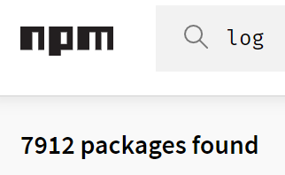

# Logging Node.js

---

## Why not console?

- only writes to `stdout` or `stderr`
- no ability to toggle logs
- no log levels (`info` and `debug` are aliases for `log`, `warn` for `error`) → misleading API
- calls to `console.log()` are [not consistently synchronous or asynchronous](https://nodejs.org/api/process.html#process_a_note_on_process_i_o) → performance

Notes:

- console can still be useful e.g. for debugging but it should not be used for logging

---

### Why a logging library?

- write logs in various logging levels
- define a root logging level for filtering purposes
- customizable logging formats
- define one or multiple destinations for the logs (e.g. file, console, db)
- customizable patterns

---

### Common logging libraries



[**winston**](https://www.npmjs.com/package/winston), [pino](https://www.npmjs.com/package/pino), [roarr](https://www.npmjs.com/package/roarr), ...

_Note_ that the goal is to learn logging - we're _not_ promoting/recommending this particular tool!

Notes:

- we decided to use winston because:
  - it is the most widely used logging framework
  - it is used by the SAP logging library
- all of the suggested frameworks have a similar feature set and usage, so it should be easy to transfer the examples

---

### Create a logger

```javascript
import winston from 'winston'

const { createLogger, format, transports } = winston
const { json } = format
const { Console } = transports

const logger = createLogger({
  level: 'info',
  format: json()
  transports: [
    new Console()
  ]
})

export default logger
```
<!-- .element class="code-xl" data-tags="javascript" -->

```typescript
import winston from 'winston'

export type { Logger } from 'winston'

const { createLogger, format, transports } = winston
const { json } = format
const { Console } = transports

const logger = createLogger({
  level: 'info',
  format: json()
  transports: [
    new Console()
  ]
})

export default logger
```
<!-- .element class="code-xl" data-tags="typescript" -->

Notes:

- see here for info: <https://github.com/winstonjs/winston#creating-your-own-logger>
- to create a logger with winston you can use createLogger function
- this method takes a configuration object as parameter and returns a logger instance
- config-attributes:
  - level: log only if logged level is equal of below this level (default: info)
  - format: formatting for info (log??) messages (default: json)
  - transports: set of logging targets
  - refer to the documentation for more config-attributes

---

### A simple log statement

```typescript
  logger.info('The application started successfully.')
  logger.log({
    level: 'info',
    message: 'The application started successfully.'
  })
  logger.log('info', 'The application started successfully.')
```

```shell
{"message":"The application started successfully.","level":"info"}
```

---

### Error logging

```typescript
  logger.error('A severe error has ocurred.')
  logger.log({
    level: 'error',
    message: 'A severe error has ocurred.'
  })
  logger.log('error', 'A severe error has ocurred.')
```

```shell
{"message":"A severe error has ocurred.","level":"error"}
```

---

### Avoid string concatenation

- What's wrong with String concatenation in log statements?

```typescript
logger.info("Participant Nr. : " + i + " has id " + participantId)
logger.info(`Participant Nr. :${i} has id ${participantId}`)
```

- regardless of whether the message is logged or not, the whole String is constructed
- this is also the case for template literals
- this puts up performance costs
- better yet -> parameterized logs

---

### Parameterized logging

- enable String interpolation by using `winston.format.splat()`

```javascript
import winston from 'winston'

const { createLogger, format, transports } = winston
const { combine, splat, simple } = format
const { Console } = transports

const logger = createLogger({
  format: combine(
    splat(), // enable string interpolation
    simple()
  ),
  transports: [
    new Console()
  ]
})

logger.info('Participant No. %d has id %s', 15, 'Luke Skywalker')
```
<!-- .element class="code-xl" data-tags="javascript" -->

```typescript
import winston from 'winston'

export type { Logger } from 'winston'

const { createLogger, format, transports } = winston
const { combine, splat, simple } = format
const { Console } = transports

const logger = createLogger({
  format: combine(
    splat(), // enable string interpolation
    simple()
  ),
  transports: [
    new Console()
  ]
})

logger.info('Participant No. %d has id %s', 15, 'Luke Skywalker')
```
<!-- .element class="code-xl" data-tags="typescript" -->

```shell
info: Participant No. 15 has id Luke Skywalker
```

Notes:

- the `splat`-format allows us to use c language printf-style string interpolation using [node's util.format](https://nodejs.org/dist/latest/docs/api/util.html#util_util_format_format_args)
- the string is only constructed if the log is actually written and not filtered due to the log-level
- the order of formats matters!
- `format.simple` is one out of 5 _finalizing formats_. Without one, the log would simply be "undefined". [Read more](https://github.com/winstonjs/logform/blob/master/README.md#info-objects)

---

## Formats

---

### Why JSON? (human-readable vs machine-friendly)

- machine-readable (JSON, XML)
- structured format: parse easily and robustly
- allow additional analytics: e.g. filtering
- It is common to look at logs with the help of a GUI-tool (e.g. kibana)

Notes:

- it could be discussed, that json is also human-friendly. well formatted json might be better to read than a single line of log-string
<!-- Eventually this should be in the technology agnostic part -->

---

### Combining formats

```javascript
import winston from 'winston'

const { createLogger, format, transports } = winston
const { combine, timestamp, label, prettyPrint } = format
const { Console } = transports

const logger = createLogger({
  format: combine(
    label({ label: 'Joker' }),
    timestamp(),
    prettyPrint()
  ),
  transports: [
    new Console()
  ]
})
logger.info('Why so serious?')
```
<!-- .element class="code-xl" data-tags="javascript" -->

```typescript
import winston from 'winston'

export type { Logger } from 'winston'

const { createLogger, format, transports } = winston
const { combine, timestamp, label, prettyPrint } = format
const { Console } = transports

const logger = createLogger({
  format: combine(
    label({ label: 'Joker' }),
    timestamp(),
    prettyPrint()
  ),
  transports: [
    new Console()
  ]
})
logger.info('Why so serious?')
```
<!-- .element class="code-xl" data-tags="typescript" -->

```shell
{ message: 'Why so serious?', level: 'info', label: 'Joker', timestamp: '2020-06-24T08:46:41.237Z' }
```

Notes:

- The combine format allows to combine multiple formats
- label():  adds the specified label before the message
- timestamp(): adds a timestamp to the log
- prettyPrint(): finalizes the message using util.inspect (not suited for prod environments)

---

## Transports

```javascript
import winston from 'winston'

const { createLogger, transports } = winston
const { Console, File } = transports

const logger = createLogger({
  transports: [
    new Console()
  ]
})

logger.add(new File({
  filename: 'errors.log',
  level: 'error'
}))
```
<!-- .element class="code-xl" data-tags="javascript" -->

```typescript
import winston from 'winston'

export type { Logger } from 'winston'

const { createLogger, transports } = winston
const { Console, File } = transports

const logger = createLogger({
  transports: [
    new Console()
  ]
})

logger.add(new File({
  filename: 'errors.log',
  level: 'error'
}))
```
<!-- .element class="code-xl" data-tags="typescript" -->

Notes:

- Can also be added after creation -> `logger.add`
- Built-ins are Console, File, Http and Stream
- Many more third-party transports available

---

### Piping stdout

- Some frameworks (e.g. pino) suggest only logging to stdout in order to move tasks like formatting and writing to files into other processes
- This is achieved by piping stdout into other programs or files

```console
node server.js | pino-pretty --messageKey message
```

Notes:

- In order to pipe to stdout the required winston transport is `transports.Console`
- `pino-pretty` is a library maintained by (_drum-roll_) pino. There are of course alternatives which achieve the same

---

## Context information

- In some cases it might be helpful to trace different log statements per context (e.g. to know which log statements belong to a request-response cycle).
- Sometimes it might be helpful to know which class or method has logged a specific statement

---

- In winston, you can pass meta information to a logger instance in several ways
- One way is to pass it via an `info`, `debug`, ... statement
- Alternatively, you can create a child logger

```typescript
logger.info('User has authenticated.', { userId: 42 })
const child = logger.child({ service: 'user-service' })
child.log('User has authenticated.')
```

```shell
info: User has authenticated. {"userId":42}
info: User has authenticated. {"service":"user-service"}
```

Notes:

- it is possible to append arbitrary meta information to a log message
- it is also possible to assign meta information to a logger at creation
- children inherit all configuration and meta information

---

# Questions?
