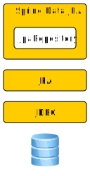
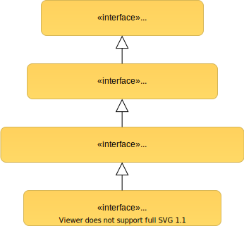

# JPA and Spring Data JPA

---

## Object-Relational Mapping (ORM)

- How to map Java Objects to SQL and vice versa?

Notes:

- ORM is the idea of being able to write/generate SQL queries using the object-oriented paradigm (e.g. Java)
- in short: interact with the database via OO-language (Java) instead of SQL

---

## Java Persistence API (JPA)

- De-facto ORM standard for Java
- Storing, accessing and managing objects in relational DB
- Lets you define which objects are going to be persisted and how
- JPA is NOT a tool or framework
    - It's a specification
    - JPA Providers: e.g. Hibernate, EclipseLink, etc.


Notes:
- notice that JPA is just the specification, in order to make it work, a JPA provider is needed (e.g. Hibernate, EclipseLink)
- see: https://docs.oracle.com/javaee/5/tutorial/doc/bnbqa.html
- JPA is designed for RDBMS, and looking at the API. It is possible to apply JPA to other datastores,
  but approximations have to be made for some concepts, particularly when querying.

---

### Java Persistence API (JPA)

 <!-- .element height="450rem" -->

Notes:

- illustration what the OR-Mapping (JPA) does roughly
- @ManyToOne means that 'many books' - 'one author', book has only one author, author owns many books
- notice how the title and name of the entities have been mapped automatically without annotation

---

## JPA - Entities

- POJOs representing data that can be persisted
- An entity represents a table in a database
- An instance of an entity represents a row in the table

```Java
import jakarta.persistence.*;

@Entity
public class Book {

//...
}
```

Notes:

- the entity name defaults to the name of the class, but can be specified through the `name` element in the annotation
- the entity must have a no-arg constructor (may have other constructors)
- various JPA implementations work by subclassing entities, so entity classes must not be final

---

## JPA - Entity Fields

- Fields of an entity class translate to table columns
- Use `@Transient` to exclude a field from persistence

```Java
@Column(name="book_title", length=50, nullable=false, unique=false)
private String title;

// getters and setters
```

Notes:

- The table columns can be further specified through the `@Column`-annotation
- Getters and setters should be provided
- https://docs.oracle.com/javaee/5/tutorial/doc/bnbqa.html#bnbqd

---

## JPA - IDs

- The `@Id`-annotation defines the primary key

```Java
@Id
@GeneratedValue(strategy=GenerationType.AUTO)
private Long id;
```

Notes:

- Each JPA entity must have a primary key which uniquely identifies it
- Can be generated in different ways, which are specified by the `@GeneratedValue`-annotation
- Possible values are:
    - AUTO - the JPA provider will use any strategy it wants to generate the identifiers (this is default)
    - TABLE - Uses an underlying database table that holds segments of identifier generation values.
    - SEQUENCE - Uses sequences if they are supported by the database, else switches to table generation
    - IDENTITY - relies on the IdentityGenerator which expects values generated by an identity column in the database, meaning they are auto-incremented (Note: this disables batch updates)
    - further reading link provided

---

## JPA - Relations

---

## JPA - Relations Multiplicities

- There are four types of multiplicities in `jakarta.persistence.*`
    - `@OneToOne`
    - `@OneToMany`
    - `@ManyToOne` 
    - `@ManyToMany`

Notes:

- one-to-one: Each entity instance is related to a single instance of another entity
- one-to-many: An entity instance can be related to multiple instances of the other entities
    - e.g.: Order - LineItem
- many-to-one: Multiple instances of an entity can be related to a single instance of the other entity
    - e.g.: LineItem - Order
- many-to-many: The entity instances can be related to multiple instances of each other
    - e.g.: Student - Course

---

### @OneToOne Relation

- Author has one Address, and Address has one Author tied to it

 <!-- .element height="600rem" -->

Notes:

- use @JoinColumn to configure the name of the column in the Author table that maps to the PK in the Address table

---

### @ManyToOne Relation

- An Author owns many Books, each Book is related to one Author

 <!-- .element height="500rem" -->

Notes:

- @OneToMany is the opposite
    - uni-directional: using it without JoinColumn will produce a join-table
    - use `@JoinColumn(name = "author_id")`, to achieve the same result like @ManyToOne on the db

---

### @ManyToMany Relation

- An Author owns many Books, each Book is related to multiple Authors

 <!-- .element height="500rem" -->

Notes:
- minimal setup
- use @JoinColumn, @JoinTable annotations to configure your relationship on the database e.g.:
    - to select a custom name for the join-table use `@JoinTable(name= "my_join_table")`
- bi-directional: use @ManyToMany annotation on both entities, one of them must set the `mappedBy` property

---

## JPA - Relations Directions

- Unidirectional
- Bidirectional

Notes:

- a relation in JPA can be bi- or unidirectional
- for the upcoming exercise you'll need only the unidirectional and thus we will only show the unidirectional here
- information for bidirectional relations is provided in the `Further Reading` slide

---

## JPA - Unidirectional Relations

```Java
public class LineItem {
    private int id;
    @ManyToOne
    private Order order;
}

public class Order {
    private int id;
}

```

Notes:

- only one entity has a relationship field
- order does not know about the relationship to LineItem

---

## JPA - Cascade Operations

- Relationships between entities often have a dependency on the existence of the other entity
- E.g. Order - LineItem
    - Without the Order, the LineItem has no meaning on its own
    - Wanted behavior: when Order gets deleted, delete LineItem too

```Java
@Entity
public class Order {
    //other attributes
    @OneToMany(mappedBy = "order", cascade = CascadeType.REMOVE)
    private List<LineItem> lineItems;
}
```

Notes:
- When we perform some action on the target entity, the same action will be applied to the associated entity.
- for more information see: https://docs.oracle.com/javaee/6/tutorial/doc/bnbqa.html#bnbqm

---

### Schema Management (Hibernate Schema Generation)

- Hibernate can generate a database schema based on your entity classes
- **Not suited for production! Data can be lost whenever the schema changes**

Notes:

- Allows for quick iterations on the schema early in development
- Can be useful for early tests
- The schema generated by Hibernate is a "best guess" based on your entity classes. It might not necessarily be what you actually want or need for your application.
- Not suited for production -> When the schema changes, Hibernate makes a "best guess" on how to apply schema changes to an existing database. This can lead to data loss as Hibernate might not handle all cases correctly.

---

### Schema Management

- Your database schema is tightly coupled to your application, if they deviate, things will break
- Schema setup should be reproducible across builds and landscapes


Use proper tools such as [Flyway](https://flywaydb.org/) or [Liquibase](https://www.liquibase.org/), and put your schema under version control


---


### Schema Management (Liquibase)


 <!-- .element height="400rem" -->

- Liquibase reads **Changelog(s)** files which contain **Changeset(s)** each describing changes to the DB
- Liquibase tracks which changeset(s) have been executed on the targeted instance
- Integrated with Spring Boot

Notes:

- We use Liquibase in the exercise, this is not a recommendation for Liquibase over Flyway, but simply a choice we made.
- Liquibase could fill a separate module, we will guide you on basic usage in the exercise but give more links in further reading

- Changeset(s)
    - Describe DB changes explicitly via sql/ddl statements **OR** via liquibase syntax, which then generates sql statements for the target DB
    - Changesets encapsulate a set of updates that will be applied in the same database transaction

- Changelogs are file(s) containing changesets
    - A Changelogs file type depends on the format of the changesets inside (e.g. xml, yml, sql etc.)
    - It is sufficient to have one changelog, but at some point it may become easier to start a new one to keep things organized

- Tracking is done via Liquibase's own "databasechangelog" DB table, which it auto creates if missing
- The tracking is awesome, as it ensures that all used databases (e.g. new DB instance or DBs on different landscapes) all have the exact same DB setup (unless they are manually modified, which is a big No-No)
- Spring Boot supports liquibase out of the box and will execute the liquibase changes at application startup, while initializing the Spring Context
    - be careful, the application won't continue starting up until all statements have been executed, so don't try to run e.g. data migration scripts that run x minutes or hours via liquibase, there are other tools and strategies for that

---


## Spring Data JPA

 <!-- .element height="400rem" -->

Notes:

- The application code talks to the database through the use of the `JpaRepository` interface
- Its implementation is provided by Spring Data JPA and uses JPA functionality internally (which has to be provided by a JPA provider (e.g. Hibernate))
- The JPA provider talks to the database using the Java Database Connectivity (JDBC) API

---

### What is a Repository

- An interface
- Defines methods to access the db
- `Repository<T, ID extends Serializable>`
    - Captures the managed domain entity `T` and entity's `ID`


Notes:

- Who implements the interface?
- Primarily a marker interface
- Persistence technology specific sub-interfaces to include additional technology specific methods
- Repository per domain object

---

### Creating the Repository

```Java
import org.springframework.data.jpa.repository.JpaRepository;

public interface BookRepository extends JpaRepository<Book, Long> {
}
```


---

### Inject and Start Using the Repository

```Java
@Service
public class BookService {

    private final BookRepository bookRepository;

    public BookService(BookRepository bookRepository) {
        this.bookRepository = bookRepository;
    }

    public List<Book> getAllBooks() {
        return bookRepository.findAll();
    }
}
```

---

#### Standard Repository Methods

```Java
public interface BookRepository extends JpaRepository<Book, Long> {

/* These methods are generated automatically by Spring Data JPA (and a lot more)

    T save(T entity)
    
    T update(T entity)

    long count()

    boolean existsById(ID id)

    Optional<T> findById(ID id)
    List<T>	findAllById(Iterable<ID> ids) 
    List<T>	findAll()

    void delete(T entity)
    void deleteById(ID id)
    void deleteAll()

    ...
*/

}
```

---

#### Custom Repository Methods

```Java
public interface BookRepository extends JpaRepository<Book, Long> {

    Book findByTitle(String title);

    List<Book> findByReleaseAfterOrderByTitleDesc(Date release);

}
```
- Spring Data JPA can derive queries from the method name
- See [table of supported keywords inside method names](https://docs.spring.io/spring-data/jpa/docs/current/reference/html/#jpa.query-methods.query-creation)
- Other return types are possible: `Optional`, `Iterable`, `Collection`, ...

Notes:

- `findBy`, `OrderBy` and `After` are keywords
- `title` and `release` are fields of the entity

---

### Other Repository Classes

 <!-- .element height="400rem" -->

Notes:

- The Repository<T, ID extends Serializable> interface is a marker interface the purpose:
    - to capture the type of the managed entity and the type of the entity’s id.
- The CrudRepository<T, ID extends Serializable> interface provides CRUD operations for the managed entity.
- The PagingAndSortingRepository<T, ID extends Serializable> interface declares the methods that are used to sort and paginate entities that are retrieved from the database.
- The JpaRepository<T, ID extends Serializable> interface is a JPA specific repository interface that combines the methods declared by the common repository interfaces behind a single interface.

---

### Further Reading

- JPA 
    - [Cascading](https://docs.oracle.com/javaee/6/tutorial/doc/bnbqa.html#bnbqm)
    - Bidirectional relation: [doc](https://docs.oracle.com/javaee/6/tutorial/doc/bnbqa.html#bnbqi), [example](https://dzone.com/articles/introduction-to-spring-data-jpa-part-4-bidirection)
    - [ID generation strategies](https://medium.com/@madhur25/id-generation-strategies-7f8e0cc6a235)

---

# Questions?
