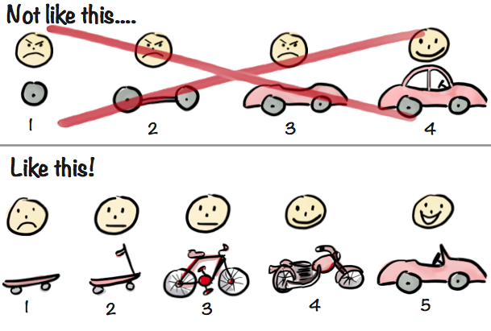

# Release Toggles

---

### Motivation - Problem

- How to deal with unfinished work when deploying weekly or even daily?
- Holding back changes on feature branches means late integration, leading to difficult merges, "big bang" deployments, ...

 <!-- .element height="300rem" -->

Notes:
- When doing Continuous Delivery, we may deploy every day, but features don't get finished within one day
- Need to find a way to deal with the unfinished work - we don't want users to see half-finished features
- Holding back code changes locally, or on long-running feature branches, delays integration
- Conflicting changes accumulate, merges become more difficult, risk for incorrect merges increases
- Likewise, integration testing gets delayed, and a lot of integration issues might be undetected for a long time

---

### Motivation - Solution

- Release toggles allow us to hide unfinished work at runtime
- Changes can be merged immediately into main line, integration of work-in-progress can be tested early

 <!-- .element height="300rem" -->

Notes:
- a release toggle is essentially an "if" in the code
- this allows us to "toggle off" unfinished work at runtime and make sure users cannot see or use it yet
- by this, we can integrate our work early and continuously and avoid big merge conflicts
- likewise, we can detect integration issues earlier, e.g. by toggling our unfinished features on in a test system

---

### Decouple Deploy and Release

Modify system behavior without changing code

 <!-- .element height="500rem" -->

From Itay Gabbay’s [Feature Toggles article on medium.com](https://medium.com/@itaygabbay/feature-toggles-or-why-you-should-take-risks-in-production-cad9f22565f1)<!-- .element target="_blank" -->, with consent of the author. No modifications have been made.
<!-- .element style="font-size: small" -->

Notes:
- using this approach, we decouple the deployment from the release - we deploy continuously, but "release" a new feature once we're completely done with all the work, by switching the release toggle to "on"
- think about it - in traditional development, such as on-premise development, it used to be the other way around: we released our features, and then later they get deployed (at the customer's site)
- in the picture you can see a visualization where code gets deployed every week, and some of the deployments contain code of unfinished features, which is then hidden (related toggle is "off")

---

### Terminology

- "Feature toggle" is a broader term
  - Technical implementation is often similar
- Release toggle ≠ business toggle
  - Release toggles have a very limited lifetime
- Business toggle "flavors"
  - Experiment toggles (e.g. A/B testing)
  - Ops toggles (provide control to ops features)
  - Permission toggles (feature access based on role)

Notes:
- Find more information in [this article](https://martinfowler.com/articles/feature-toggles.html)

---

### Static vs Dynamic Toggles

  <!-- .element height="500rem" -->

From Pete Hodgson's [feature toggles article on martinfowler.com](https://martinfowler.com/articles/feature-toggles.html)<!-- .element target="_blank" -->, with consent of the author. No modifications have been made.
<!-- .element style="font-size: small" -->

Notes:
- In this diagram you see the different kinds of toggles
- This picture separates more static toggles on the left (dark green), and more dynamic toggles on the right (light green)
- Release toggles are very static in their nature. The state of the toggle is the same for everyone, and remains like this, until the feature will get released
- Other toggles such as permission toggles are more dynamic, e.g. one user of a particular role can see and use a feature, which another user, in the same system, cannot see or use

---

### Long-Lived vs Transient Toggles

  <!-- .element height="500rem" -->

From Pete Hodgson's [feature toggles article on martinfowler.com](https://martinfowler.com/articles/feature-toggles.html)<!-- .element target="_blank" -->, with consent of the author. No modifications have been made.
<!-- .element style="font-size: small" -->

Notes:
- This diagram separates short-lived/transient toggles on the bottom (dark green), and long-lived toggles on the top (light green)
- Release toggles, as well as experiment toggles, are typically more transient, they should be removed after the feature is completed or the experiment is finished
- Ops or permission toggles, in contrast, stay in the system for a long time if not forever

---

### Implementation Choices

- UI choices
  - as part of the server-side rendering
  - HTTP requests to the server
  - URL-based toggles
- Server choices
  - environment variables
  - database

_Although a static (hard-coded) toggle is easy to get started, it usually won't suffice all needs, e.g. testability!_

Notes:
- UI choices
  - Server-side rendering such as JSPs, e.g. exclude UI button for new feature based on the toggle configuration
  - UI makes HTTP API call to the server to get the toggle state, and e.g. hides UI button for the new feature based on this
  - URL-based toggles e.g. using hash `#featureA=true`, or request path `/index-new.html`
- Server choices
  - Environment variables are easy to work with, check if they are "dynamic enough", e.g. do you need to change the toggle state at runtime w/o restarting the app?
  - While a database is more heavyweight, it has the benefit of giving you more control over state as well as more monitoring options
  - When you manage your toggles using some (third-party) toggle service, they will also typically persist the state in a database

---

### Activation Strategy

- Pre-activation: Need to test with toggles on and off
- Activation: Consider only subset of users first (canary)
- Post-activation: Monitoring

Notes:
- Before you activate a feature, you should have tested it, which requires that in some internal, pre-production system, you toggled it on
- When you activate a feature, it's often a good idea to release it to a subset of users first, this is called a "Canary release", and helps you to catch unforeseen issues without impacting all users
- Even when you did a careful canary release, and all seems good, you should generally have logging, monitoring and alerting in place, and have a look in particular to all logs and monitors of your new feature, you might still run into unforeseeable issues, as more people are using your new feature

---

### Things to Consider

- Short life time: remove when not needed anymore
- Testability & fast rollback: make sure switching is easy
- Compliance: [SLC-36 Switchable Features](https://wiki.one.int.sap/wiki/display/pssl/SLC-36)
- Architecture: [need reasonable service partitioning](https://video.sap.com/media/t/1_44od5030)
- Tools: [Delivery Management (Sirius)](https://wiki.one.int.sap/wiki/display/DevFw/Documentation%253A+Sirius)

Notes:
- Generally, toggles should be short lived, as you could see in the previous diagram. If toggles stay in the system too long, there is a risk that toggles for features that build upon each other, start to "overlap", and this becomes a mess quickly
- No matter which toggle implementation strategy you use, make sure switching is easy, to support testing as well as a smooth rollback in case you run into unforeseeable issues
- There is more to consider regarding compliance - have a check on the Software Lifecycle Wiki
- If your services are too small or too coupled, you need to orchestrate toggles often over multiple services, this will make everything harder

---

### Toggles Are Not the First Choice

- Toggles have advantages, but they add complexity
- Prefer breaking down features [_right_](https://blog.crisp.se/2016/01/25/henrikkniberg/making-sense-of-mvp)
- Implement & deploy in compatible & safe manner
- Only hide UI parts, toggle in a lightweight way

  <!-- .element height="400rem" -->

From Henrik Kniberg's [blog on blog.crisp.se](https://blog.crisp.se/2016/01/25/henrikkniberg/making-sense-of-mvp)<!-- .element target="_blank" -->, with consent of the author. No modifications have been made.
<!-- .element style="font-size: small" -->

Notes:
- Toggles have a drawback: they add complexity to code and ops, so don't use them if it's not necessary
- Instead, break down features in a way that allows you to actually _release_ it
- Breaking down into "Frontend Part" and "Backend Part" is _not_ helpful, you cannot release either of it alone, they only make sense together
- If you pick a poor breakdown strategy, you still need to keep your toggles in the system until "everything" is finished; you're _not really_ doing Continuous Delivery
- To develop & deploy in a "safe manner", e.g.
  - add your new business logic and write tests for it, but don't expose it to the HTTP endpoint yet: you can release without a toggle
  - then expose to the HTTP endpoint, test it to ensure it's secure and not breaking, just don't use it in the UI yet: you can release without a toggle
  - hide only the UI parts using a lightweight toggle mechanism, which limits the usage of your toggle to only very, very few sections of your code

---

### Questions?

[Stack@SAP](https://sap.stackenterprise.co/questions/ask?tags=devops)
